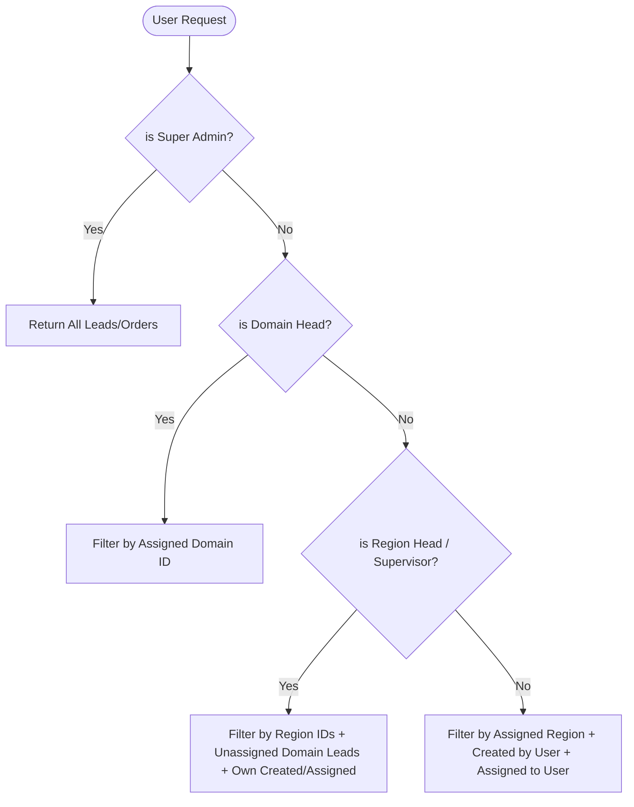

# Marketing CRM - Role Scoping & Visibility Matrix

This document serves as the single source of truth for all hardcoded role-based visibility and access rules across the frontend and backend systems.

---

## 👥 Overview of System Roles

The system determines a user's access boundaries using the primary role mapped from the HRMS scope API:

1. **`super_admin` (Superuser / Staff)**: Full database access; bypasses all scope filters.
2. **`domain_head`**: Scoped to one or more entire markets (e.g., Domestic, Export).
3. **`region_head`**: Scoped to specific geographical regions (e.g., North America, Europe).
4. **`supervisor` / `region_coordinator`**: Mid-level access with region-wide visibility but restricted actions.
5. **`employee` (Salesperson)**: Strictly isolated to their own records or assigned workspace.

---

## 🌐 1. Domain & Region Visibility Matrix

Determines what elements are visible on the **Domains & Targets** dashboard as defined by the [DomainsPage.tsx](file:///Users/ady/Documents/au-marketing-fe/pages/DomainsPage.tsx) schema.

> [!NOTE]
> Visibility toggles marked as **Configurable** can be modified dynamically by an Administrator using Global Settings Presets (*Strict Isolation*, *Balanced*, *Open Team*, *Coordinator-Led*).

| Role | What They Can See | What is Hidden | Actions & Permissions |
| :--- | :--- | :--- | :--- |
| **Super Admin** | • All domains & region nodes. • All targets & actuals. • All assignee names. | • *None.* | • Create, edit, delete domains & regions. • Assign Domain & Region Heads. • Create region assignments. • Set all targets. |
| **Domain Head** | • Assigned domain & its regions. • Domain-level targets. • Region-level targets. | • Other domains *(Configurable)*. • Regions outside their domain *(Configurable)*. | • View-only. |
| **Domain Coordinator** | • Regions under their domain. • Region-level targets *(Configurable)*. • Employee targets *(Configurable)*. | • Other domains. • Structural editing options. | • View-only. |
| **Region Head** | • Assigned region(s). • Team members & targets in region. • Domain Head's name. | • Sibling regions *(Configurable)*. • Domain-level total target *(Configurable)*. | • View-only. |
| **Region Coordinator** | • Sibling regions. • Domain Head's name. • Employee targets in region. | • Domain-level target. • Sibling region targets. | • View-only. |
| **Employee** | • Assigned region. • Region Head and Domain Head names. • Own sales target. | • Teammates' targets *(Configurable)*. • Region total target *(Configurable)*. | • View-only. |

---

## 📈 2. Leads & Orders Scoping Rules

Rules applied at the API query level in [leads.py](file:///Users/ady/Documents/au-marketing-fe/au-marketing-api/app/routers/leads.py) and [orders.py](file:///Users/ady/Documents/au-marketing-fe/au-marketing-api/app/routers/orders.py):

### Access Scope Breakdown:
* **Super Admin**: 
  * Full read/write access to all leads, quotations, and orders across all domains.
* **Domain Head**:
  * Sees **all** leads in their assigned domain(s).
  * Can view statistics and status pipelines for the entire domain.
* **Region Head / Supervisor**:
  * Sees **all** leads in their assigned region(s).
  * Can see leads in the same domain with **no region** assigned (`region_id IS NULL`).
  * Can see any lead where they are the creator or assignee.
* **Employee**:
  * Sees leads in their assigned region(s).
  * Sees any lead they created or are explicitly assigned to (`assigned_to_employee_id == user_id`).
  * *Creation Restriction*: Can only select their assigned domain/region when creating a lead.

---

## 🗄️ 3. Database Scoping Rules (Organizations, Customers, Contacts)

Scoping rules applied in [contacts.py](file:///Users/ady/Documents/au-marketing-fe/au-marketing-api/app/routers/contacts.py) and [customers.py](file:///Users/ady/Documents/au-marketing-fe/au-marketing-api/app/routers/customers.py) to manage CRM directory data.

### 📞 Contacts & Customers (Strict Isolation)
Contacts (cold directory records) and Customers (active business accounts) are strictly row-level isolated:

* **Super Admin**: Sees **all** contacts and customers.
* **Domain Head / Domain Coordinator**: Sees **only** contacts and customers belonging to their assigned domain(s). Strictly blocked from other domains.
* **Region Head / Region Coordinator**: Sees **only** contacts and customers belonging to their assigned region(s). Strictly blocked from other regions, even within the same domain.
* **Employee**: **Isolated.** Can ONLY see contacts and customers they personally created (`created_by_employee_id == user_id`) or are explicitly assigned to.

### 🏢 Organizations & Plants (New Scoping Rules)
> [!IMPORTANT]
> **Strict Scoping Applied.**
> Organizations and Plants are no longer globally shared. They are now filtered based on the user's scope to prevent unauthorized browsing of the corporate directory.

* **Super Admin**: Full access to all organizations and plants.
* **Domain Head / Domain Coordinator**: Sees organizations/plants that are either linked to a contact/customer in their domain or were created by a user in their domain.
* **Region Head / Region Coordinator**: Sees organizations/plants linked to contacts/customers within their specific region(s).
* **Employee**: Sees organizations/plants they personally created or those linked to their own contacts/customers.

### 🔄 Contact-to-Customer Promotion
* Promote contact requires `marketing.create_customer` permission.
* On conversion, the contact is marked as `is_converted = True` and links to the new `Customer` record.
* **Hardcoded Constraint**: Converted contacts **cannot be deleted**.

---

## 🛠️ Code References

* **Backend Scoping Logic**: [app/scope.py](file:///Users/ady/Documents/au-marketing-fe/au-marketing-api/app/scope.py)
* **Backend Routers**:
  * Leads: [app/routers/leads.py](file:///Users/ady/Documents/au-marketing-fe/au-marketing-api/app/routers/leads.py)
  * Contacts: [app/routers/contacts.py](file:///Users/ady/Documents/au-marketing-fe/au-marketing-api/app/routers/contacts.py)
  * Customers: [app/routers/customers.py](file:///Users/ady/Documents/au-marketing-fe/au-marketing-api/app/routers/customers.py)
  * Organizations: [app/routers/organizations.py](file:///Users/ady/Documents/au-marketing-fe/au-marketing-api/app/routers/organizations.py)
* **Frontend Rules Config**: [pages/DomainsPage.tsx](file:///Users/ady/Documents/au-marketing-fe/pages/DomainsPage.tsx)
