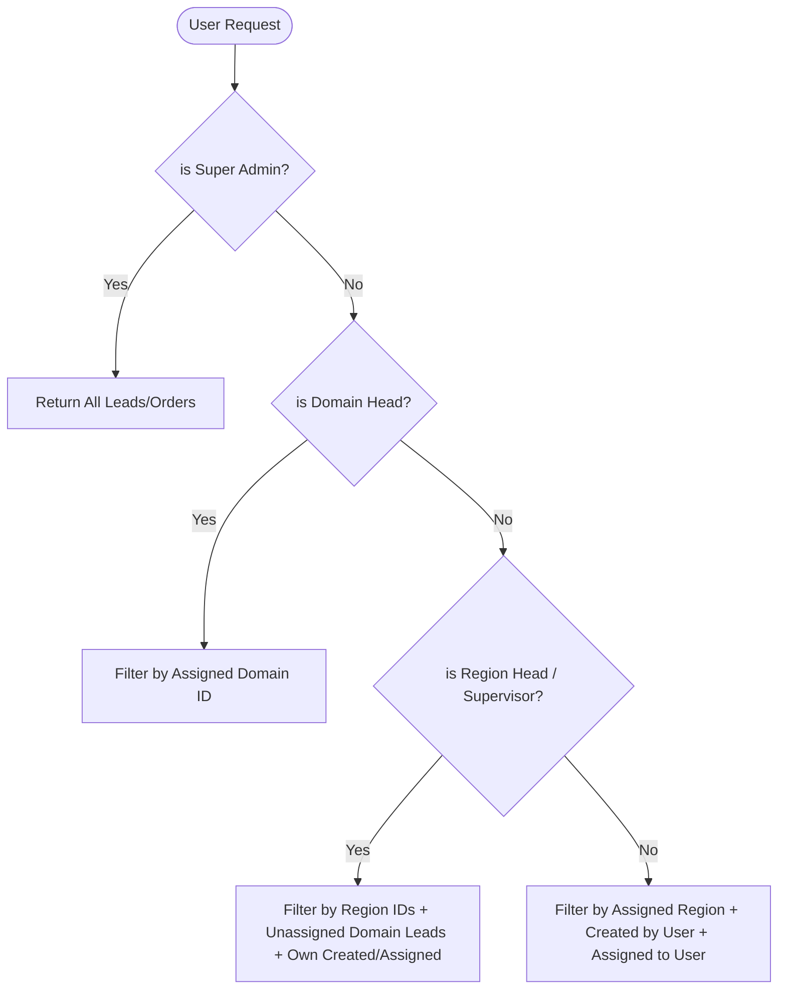

# Marketing CRM - Role Scoping & Visibility Matrix

This document serves as the single source of truth for all hardcoded role-based visibility and access rules across the frontend and backend systems.

---

## 👥 Overview of System Roles

The system determines a user's access boundaries using the primary role mapped from the HRMS scope API:

1. **`super_admin` (Superuser / Staff)**: Full database access; bypasses all scope filters.
2. **`domain_head`**: Scoped to one or more entire markets (e.g., Domestic, Export).
3. **`domain_coordinator`**: Assigned to a domain as its coordinator; resolves to `domain_head` scope with `is_domain_coordinator = true` — domain-wide visibility but view-only actions.
4. **`region_head`**: Scoped to specific geographical regions (e.g., North America, Europe).
5. **`supervisor` / `region_coordinator`**: Mid-level access with region-wide visibility but restricted actions.
6. **`employee` (Salesperson)**: Strictly isolated to their own records or assigned workspace.

> [!IMPORTANT]
> **`marketing.admin` HRMS permission = super-admin *visibility***. A user holding the `marketing.admin` permission (e.g. a CEO) is resolved to `super_admin` scope in `app/scope.py` (`is_super_admin()`), so they see all domains/targets/leads and every employee in the Leads "Assigned:" filter — exactly like a superuser. This grants **data visibility only**: per-route action permissions (`marketing.create_lead`, `marketing.edit_lead`, `marketing.delete_lead`, etc.) are still enforced individually against HRMS, and the superuser/staff bypass inside `require_permission()` does NOT apply to `marketing.admin`. Grants/revokes take effect after the RBAC cache TTL (`RBAC_CACHE_TTL_SECONDS`, default 60s) or a profile/refresh-permissions call.
>
> The Leads "Assigned:" filter (backed by `GET /reports/scope`) also unions in every employee who is the assignee on at least one lead the user can see per their role scope, so real assignees are always filterable even without an active region assignment.

---

## 🌐 1. Domain & Region Visibility Matrix

Determines what elements are visible on the **Domains & Targets** dashboard as defined by the [DomainsPage.tsx](file:///Users/ady/Documents/au-marketing-fe/pages/DomainsPage.tsx) schema.

> [!NOTE]
> Visibility toggles marked as **Configurable** can be modified dynamically by an Administrator using Global Settings Presets (*Strict Isolation*, *Balanced*, *Open Team*, *Coordinator-Led*).

| Role | What They Can See | What is Hidden | Actions & Permissions |
| :--- | :--- | :--- | :--- |
| **Super Admin** | • All domains & region nodes. • All targets & actuals. • All assignee names. | • *None.* | • Create, edit, delete domains & regions. • Assign Domain & Region Heads. • Create region assignments. • Set all targets. |
| **Domain Head** | • Assigned domain & its regions. • Domain-level targets. • Region-level targets. | • Other domains *(Configurable)*. • Regions outside their domain *(Configurable)*. | • View-only. |
| **Domain Coordinator** | • Regions under their domain. • Region-level targets *(Configurable)*. • Employee targets *(Configurable)*. | • Other domains. • Structural editing options. | • View-only. |
| **Region Head** | • Assigned region(s). • Team members & targets in region. • Domain Head's name. | • Sibling regions *(Configurable)*. • Domain-level total target *(Configurable)*. | • View-only. |
| **Region Coordinator** | • Sibling regions. • Domain Head's name. • Employee targets in region. | • Domain-level target. • Sibling region targets. | • View-only. |
| **Employee** | • Assigned region. • Region Head and Domain Head names. • Own sales target. | • Teammates' targets *(Configurable)*. • Region total target *(Configurable)*. | • View-only. |

---

## 📈 2. Leads & Orders Scoping Rules

Rules applied at the API query level in [leads.py](file:///Users/ady/Documents/au-marketing-fe/au-marketing-api/app/routers/leads.py) and [orders.py](file:///Users/ady/Documents/au-marketing-fe/au-marketing-api/app/routers/orders.py):

```mermaid
graph TD
    User([User Request]) --> isSuper{is Super Admin?}
    isSuper -- Yes --> AllLeads[Return All Leads/Orders]
    isSuper -- No --> DomainHead{is Domain Head?}
    DomainHead -- Yes --> DomainLeads[Filter by Assigned Domain ID]
    DomainHead -- No --> RegionHead{is Region Head / Supervisor?}
    RegionHead -- Yes --> RegionLeads[Filter by Region IDs + Unassigned Domain Leads + Own Created/Assigned]
    RegionHead -- No --> EmployeeLeads[Filter by Assigned Region + Created by User + Assigned to User]
```

### Access Scope Breakdown:
* **Super Admin**: 
  * Full read/write access to all leads, quotations, and orders across all domains.
* **Domain Head**:
  * Sees **all** leads in their assigned domain(s).
  * Can view statistics and status pipelines for the entire domain.
* **Region Head / Supervisor**:
  * Sees **all** leads in their assigned region(s).
  * Can see leads in the same domain with **no region** assigned (`region_id IS NULL`).
  * Can see any lead where they are the creator or assignee.
* **Employee**:
  * Sees leads in their assigned region(s).
  * Sees any lead they created or are explicitly assigned to (`assigned_to_employee_id == user_id`).
  * *Creation Restriction*: Can only select their assigned domain/region when creating a lead.

---

## 🗄️ 3. Database Scoping Rules (Organizations, Customers, Contacts)

Scoping rules applied in [contacts.py](file:///Users/ady/Documents/au-marketing-fe/au-marketing-api/app/routers/contacts.py) and [customers.py](file:///Users/ady/Documents/au-marketing-fe/au-marketing-api/app/routers/customers.py) to manage CRM directory data.

### 📞 Contacts & Customers (Strict Isolation)
Contacts (cold directory records) and Customers (active business accounts) are strictly row-level isolated:

* **Super Admin**: Sees **all** contacts and customers.
* **Domain Head / Domain Coordinator**: Sees **only** contacts and customers belonging to their assigned domain(s). Strictly blocked from other domains.
* **Region Head / Region Coordinator**: Sees **only** contacts and customers belonging to their assigned region(s). Strictly blocked from other regions, even within the same domain.
* **Employee**: **Isolated.** Can ONLY see contacts and customers they personally created (`created_by_employee_id == user_id`) or are explicitly assigned to (`assigned_to_employee_id == employee_id` or `assigned_to_employee_id == user_id`).

### 🏢 Organizations & Plants (New Scoping Rules)
> [!IMPORTANT]
> **Strict Scoping Applied.**
> Organizations and Plants are no longer globally shared. They are now filtered based on the user's scope to prevent unauthorized browsing of the corporate directory.

* **Super Admin**: Full access to all organizations and plants.
* **Domain Head / Domain Coordinator**: Sees organizations/plants that are either linked to a contact/customer in their domain or were created by a user in their domain.
* **Region Head / Region Coordinator**: Sees organizations/plants linked to contacts/customers within their specific region(s).
* **Employee**: Sees organizations/plants they personally created or those linked to their own contacts/customers.

### 🔄 Contact-to-Customer Promotion
* Promote contact requires `marketing.create_customer` permission.
* On conversion, the contact is marked as `is_converted = True` and links to the new `Customer` record.
* **Hardcoded Constraint**: Converted contacts **cannot be deleted**.

---

## 🎪 4. Exhibition & Roadshow Events Scoping Rules

Rules governing who can see and modify Exhibition/Roadshow events and visitors:

### 📅 Events Access boundaries:
* **Super Admin**: Full access to view, create, edit, and delete all events.
* **Domain Head / Domain Coordinator**: Full access to events scoped to their assigned domain(s).
* **Region Head / Region Coordinator**: Full access to events scoped to regions under their domain(s) or assigned region scope.
* **Employee**: Can view events they are explicitly selected for (i.e. listed in `selected_employee_ids`, `travel_employee_ids`, or `hotel_employee_ids`).

### 👥 Visitor Allocation & Sharing Rules:
* **Unique Links**: When linking a visitor to an existing contact, the contact's pre-existing assignment is preserved and displayed in the UI (*"Allocated to: [Employee Name]"*).
* **Direct Assigned Scoping**: Allocating a visitor to an employee sets the `assigned_to_employee_id` and `assigned_to_username` on the CRM Contact. The assigned employee immediately gains visibility to view and access that contact under their employee directory scope.
* **Unallocation cleanup**: If a visitor allocation is removed (reset to "Not allocated"), the CRM Contact's assignment fields are cleared, revoking the employee's visibility.
* **Assignment Notifications**: Allocating or re-allocating a visitor to an employee triggers a real-time push and in-app notification to the assignee.

---

## 📊 5. Dashboard Scoping Rules (Widgets)

Rules governing what each role sees on the Home/Dashboard page ([DashboardPage.tsx](file:///Users/ady/Documents/au-marketing-fe/pages/DashboardPage.tsx)) and how the data inside each widget is scoped. Two independent layers apply to every widget:

1. **Widget visibility** — which widgets a role may add (Add Widget catalog) and have rendered in their layout. Widgets a user is not privileged to see are **removed entirely** from their view (they do not appear in the rendered layout or the Add Widget picker).
2. **Data scoping** — the numbers inside each widget are filtered server-side to the user's scope (same `get_user_scope` used everywhere else).

### Widget visibility by role

| Widget | Super Admin | Domain Head / Coordinator | Region Head / Coordinator / Supervisor | Employee |
| :--- | :--: | :--: | :--: | :--: |
| Head Summary | ✅ | ✅ | ❌ hidden | ❌ hidden |
| Leads by Region | ✅ | ✅ | ❌ hidden | ❌ hidden |
| Quotations Submitted | ✅ | ✅ | ❌ hidden | ❌ hidden |
| Audit Logs | ✅ (admin only) | ❌ hidden | ❌ hidden | ❌ hidden |
| All other ready-made widgets & charts | ✅ | ✅ | ✅ | ✅ |
| Custom builders (SQL / Code) | ✅ | ✅ | ✅ | ✅ |

- **Head-only widgets** (`head-summary`, `leads-by-region`, `quotation-submitted-chart`) render only when the dashboard role is `domain_head`/`super_admin` or `is_domain_coordinator === true` (frontend `isHeadRole`).
- **Audit Logs** renders only for users holding `marketing.admin` or `marketing.view_reports` — mirroring the backend gate in `audit_logs.py` (the widget would otherwise 403 into an empty state).
- **Dashboard role resolution**: `supervisor` and `region_coordinator` are presented as `region_head` (regional view, no head widgets); `domain_coordinator` is presented as `domain_head` with `is_domain_coordinator = true` (domain-wide view including head widgets).

### Data scoping per widget
- **Stat cards (Leads / Contacts / Customers)** — server-scoped via `getLeads`/`getContacts`/`getCustomers`; the card subtitle reflects scope ("In my scope" / "Region scope" / "Domain scope" / "All") instead of the misleading "Total in system".
- **Monthly Target Progress / Target vs Achieved / Won vs Lost** — `getScopeTargetStats`, role-scoped with `scope_label` ("My" / "Region" / "Domain" / "All"). Employee sees their own target (`employee_count = 1`); heads see their team's aggregated target.
- **Recent Leads + status / revenue / goal / inquiries-quotations charts** — computed from role-scoped leads and the scoped reports summary.
- **Performer of the Month** — top 5 ranking **scoped to the caller's team**: super admin = all domains/regions; domain head/coordinator = their domains; region head/supervisor/employee = their regions. No org-wide leaderboard leaks.
- **Custom SQL builders** — SQL is compiled server-side with scope placeholders (`{{employee_id}}`, `{{domain_id}}`, `{{region_id}}`, `{{role}}`) filled from the viewer's scope, so hand-written queries only return rows inside the viewer's scope.

---

## 🛠️ Code References

* **Backend Scoping Logic**: [app/scope.py](file:///Users/ady/Documents/au-marketing-fe/au-marketing-api/app/scope.py)
* **Backend Routers**:
  * Leads: [app/routers/leads.py](file:///Users/ady/Documents/au-marketing-fe/au-marketing-api/app/routers/leads.py)
  * Contacts: [app/routers/contacts.py](file:///Users/ady/Documents/au-marketing-fe/au-marketing-api/app/routers/contacts.py)
  * Customers: [app/routers/customers.py](file:///Users/ady/Documents/au-marketing-fe/au-marketing-api/app/routers/customers.py)
  * Organizations: [app/routers/organizations.py](file:///Users/ady/Documents/au-marketing-fe/au-marketing-api/app/routers/organizations.py)
  * Events: [app/routers/events.py](file:///Users/ady/Documents/au-marketing-fe/au-marketing-api/app/routers/events.py)
* **Frontend Rules Config**: [pages/DomainsPage.tsx](file:///Users/ady/Documents/au-marketing-fe/pages/DomainsPage.tsx)
* **Dashboard Widgets**: [pages/DashboardPage.tsx](file:///Users/ady/Documents/au-marketing-fe/pages/DashboardPage.tsx) / [app/routers/dashboard.py](file:///Users/ady/Documents/au-marketing-fe/au-marketing-api/app/routers/dashboard.py)
