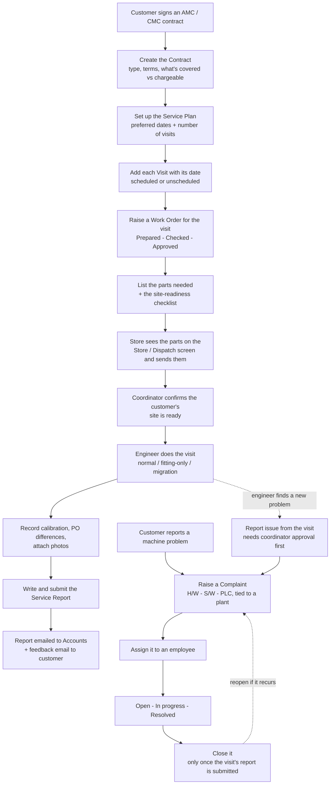
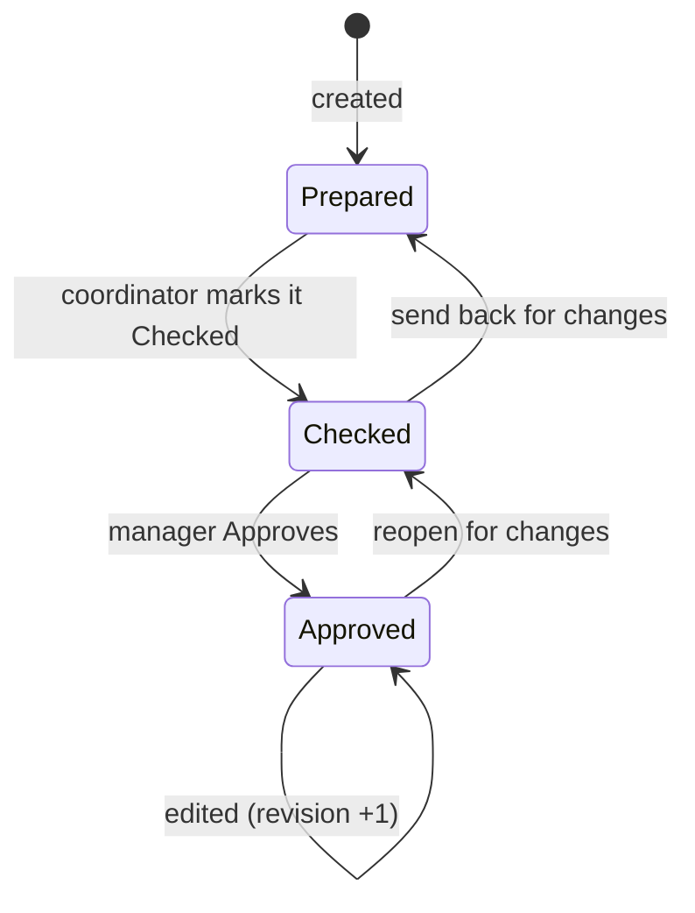
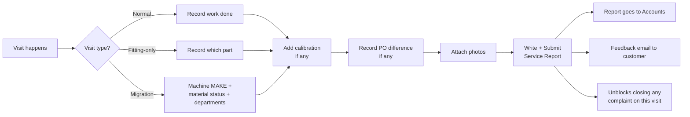
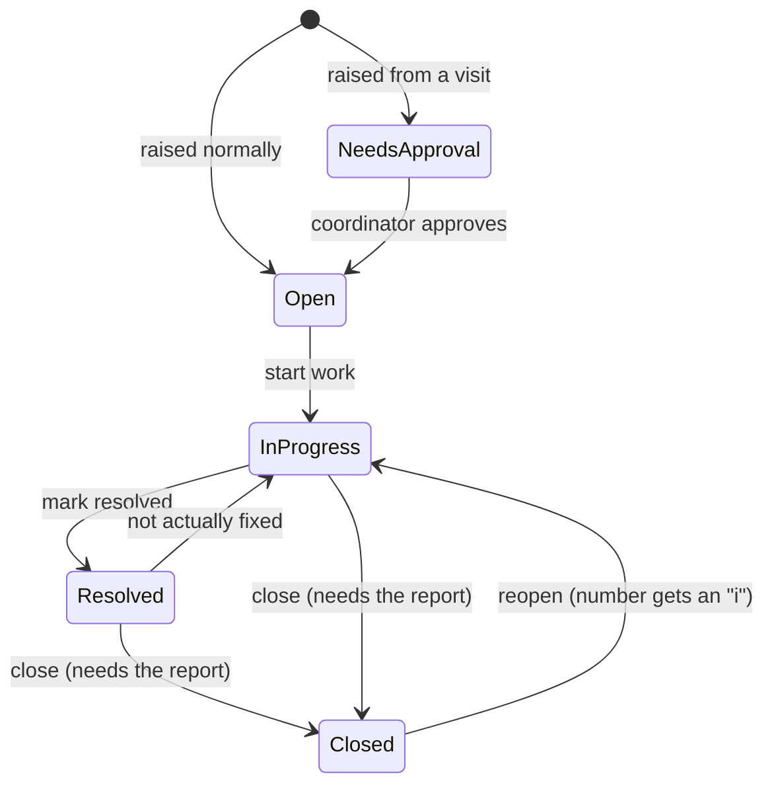
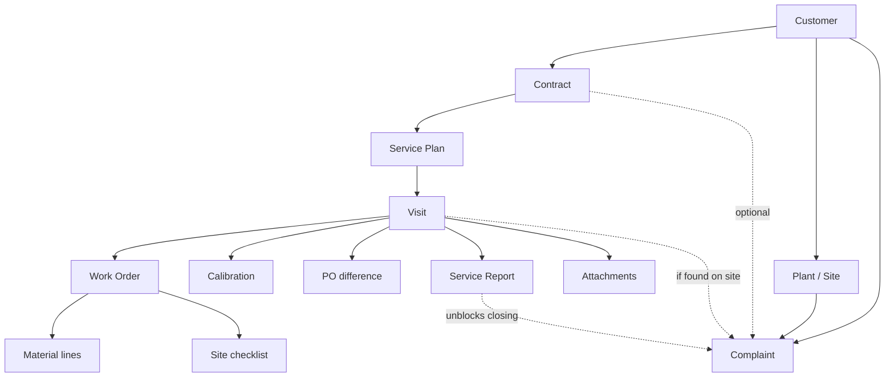

# Service Module — How It Works

*A plain-language guide to the Service section of the S&M Hub. Written for both the client and the team.*

Last updated: 9 September 2026

---

## 1. What this is

The S&M Hub used to stop at the sale — leads, quotations, orders. The **Service module** covers everything that happens **after** a machine is sold and installed:

- the **maintenance contract** (AMC / CMC) with the customer
- the **service visits** your engineers make
- the **work order** and the **spare parts** the store has to send
- **calibration / validation** done on site
- the **service report** for every visit
- customer **complaints** about machines

It's a new section in the left-hand menu called **"Service"**, and it does not touch the existing "Support & Tickets" page (that one is an internal bug tracker — unrelated).

---

## 2. The whole flow at a glance



The two halves — **planned servicing** (contracts → visits → reports) and **complaints** (customer-reported problems) — meet in the middle: a complaint usually gets resolved on a visit, and that visit needs a report before the complaint can be closed.

---

## 3. Navigating — the Service menu

Click **"Service"** in the sidebar to expand it:

| Menu item | What it's for |
| :--- | :--- |
| **Contracts** | The AMC / CMC contracts. Start here. |
| **Service Plan** | One list of every visit across every contract, filterable. |
| **Work Orders** | Every work order, and its Prepared → Checked → Approved status. |
| **Store / Dispatch** | The storekeeper's worklist — parts to send, most urgent first. |
| **Complaints** | Every customer machine complaint, with full history. |

The whole group only appears for people who have "view service" access.

---

## 4. Step by step

### 4.1 Contracts

**Where:** Service → Contracts → **New Contract**

You record:

- The **customer** and their **plant / site**. If the customer isn't in the system yet, you can create them right here — company, contact person, and a site. (A single-location customer just gets a "Main site" at their address.)
- The **contract type**: **AMC**, **AMC-I**, **CMC**, or **CMC-I**
- **Start** and **end** dates, and the **terms & conditions**
- **What's covered vs chargeable** — a line-by-line list. For example, under a CMC: spare parts are usually included, but compressor / PLC / HMI / sensors are chargeable. If you agreed something different for this customer, you flip that line to "included".
- A tick-box for the case where **everything is inclusive but extra charges are already built into the contract**

The contract gets an automatic reference number.

### 4.2 Service Plan & Visits

**Where:** Contracts list → the **calendar icon** on a contract row → its Service Plan

- Enter the customer's **preferred service dates** (free text) and how many **scheduled visits** the contract includes.
- **Add each visit with its date** — one at a time. Or use "Quick-add blank slots" to create empty rows and fill dates later.
- Add **unscheduled visits** any time the customer asks for an extra one — no limit.

**Rescheduling:** moving a visit's date **requires a reason**. Every move is kept as history, shown as "rescheduled ×N" — hover to see the old date and why.

**Marking done:** when the engineer's been, the visit is marked **Done** and turns green.

**Reminders:** the system automatically reminds the people involved **15, 7, 3 and 1 days before** each visit (in-app notification + phone push). Changing the date restarts those reminders.

### 4.3 Work Orders

**Where:** any visit row → **Work order**

The work order is the internal "here's what needs doing" document for a visit. It moves through three stamps:



- **Prepared** and **Checked** are done by the service coordinator.
- **Approved** is a **separate permission** — only a manager can do it. The person who checks a work order cannot approve their own.
- Even after approval, the work order can still be edited — it just records "edited 2× after approval" so there's a trail.

Each work order also carries:

- **The parts & materials list** — item, quantity, and a "needed by" date. That date fills in automatically as the *visit date minus the store's lead time* (default 3 days), so the store gets a head start. You can change any date.
- **The site-readiness checklist** — what the customer must have ready (power at the machine, access, cleared space, an operator on site…). You add the items, hit **"Send list to customer"**, and tick each one off as the customer confirms it's ready.

### 4.4 Store / Dispatch

**Where:** Service → Store / Dispatch

The storekeeper's worklist. It shows every **approved** work order that still needs parts, **sorted by urgency** — overdue dates in red, due-tomorrow in amber.

For each part the storekeeper:

- picks **Not sent yet / Partly sent / Fully sent**
- types **what actually went out** (a note)
- attaches **proof** — a challan photo, packing slip

That status flows straight back onto the work order, so the coordinator can see it without asking. If parts are due within a day and not sent, the work order's creator gets a nudge.

### 4.5 The Visit & Visit Report

**Where:** any visit row → **Report**

After the engineer's been, this one page captures everything about the visit, in five numbered sections:

1. **What was done** — the visit type:
   - **Normal** service visit
   - **Fitting-only** — sent just to fit one part (records which part)
   - **Migration** — records the **machine MAKE** being moved, whether the required material was sent, and which departments were involved
   - plus a note on what the engineer actually did
2. **Calibration / validation** *(optional)* — any number of entries, each **With Load (WL)** or **Without Load (WOL)**, the duration in hours, and the number of compressors.
3. **PO difference** *(optional)* — when the customer's PO said one thing but the site needed another. You record "PO says X / actually needed Y" and any extra charge. Mark whether the customer **accepted or rejected** it — **the extra charge only counts once accepted**.
4. **Photos & documents** *(optional)* — upload anything from the visit.
5. **Service report** *(required)* — a summary of the work, plus an optional box to paste in data exported from the customer's own machine software. Save as a draft, then **Submit**.



### 4.6 Complaints

**Where:** Service → Complaints → **New Complaint**

A complaint is a customer machine problem. You record:

- The **customer** and **plant / site** (a single-location customer can leave this as "None" — it uses the company address)
- Optionally, **which contract** it falls under (or "not under a contract — chargeable")
- The **issue type**:
  - **H/W** — hardware
  - **S/W** — software (installs, reinstalls, licence keys, connecting equipment to a PC)
  - **PLC** — PLC faults **and** modification requests
- A **title** and a description
- Optionally, the **planned time** to resolve it

**Assigning:** the complaint is assigned to an employee (searchable). They get a notification. It can be reassigned later.

**Lifecycle:**



- **Found on a visit:** if an engineer spots a *different* problem while on site, they hit "Report issue". That complaint starts as **"Needs approval"** and **no work can start** until a coordinator approves it (your Step 14).
- **Closing:** a complaint tied to a visit **cannot be closed** until that visit's **service report is submitted**. Submitting the report unblocks it automatically.
- **Reopening:** if a solved problem comes back, hit **Reopen** (you must say why). The complaint's number gets an **"i"** added each time — `CMP-1` → `CMP-1i` → `CMP-1ii` — so repeat problems stand out.
- **Time:** planned vs actual hours are shown on every complaint.
- **History:** every action — raised, assigned, reassigned, status change, approved, reopened, closed, every comment — is on the complaint's timeline with who did it and when. The complaints list filters by status, type and text, so it doubles as the searchable history.

---

## 5. How the pieces connect



In words: a **customer** has one or more **plants**. A **contract** covers a plant. A contract has one **service plan**, which holds many **visits**. Each visit can have one **work order** (with parts and a checklist), plus calibration records, PO differences, attachments, and one **service report**. A **complaint** is tied to a customer and plant, optionally to a contract, and — if found on site — to a visit.

---

## 6. Notifications & reminders

The system sends notifications automatically (in-app bell + phone push where the person has it enabled):

| When | Who gets told |
| :--- | :--- |
| A visit is **15 / 7 / 3 / 1 days away** | the visit's creator and the plan owner |
| A work order is **approved** and material is **due within a day** but not sent | the work order's creator |
| A complaint is **assigned or reassigned** to someone | the new assignee |
| An engineer-found issue is **approved** | the person who reported it |
| A complaint is **reopened** | the current assignee |

These run on a background worker that checks every few minutes.

---

## 7. Who can do what

Everyone with **"view service"** can see everything in the Service section. Every *action* is a separate permission, so you can hand out exactly what each role needs:

| Role | Typically can |
| :--- | :--- |
| **Engineer** | View, raise complaints, fill in visit details / calibration, write service reports |
| **Service Coordinator** | All of the above + create contracts & plans, manage visits, prepare/check work orders, assign & close complaints |
| **Store keeper** | View + update material dispatch and upload proof |
| **Service Manager** | Everything, including **approving** work orders and **deleting** records |
| **Accounts** | View + receives the service reports by email |

Two hard rules (from the requirement):

- Whoever **prepares/checks** a work order should **not** also be able to **approve** it.
- Whoever **manages** a complaint day-to-day does **not** automatically get to **close** or **reopen** it.

A full permission → role checklist is kept in `au-marketing-api/REQUIRED_PERMISSIONS.md` for whoever sets up the login system.

---

## 8. What isn't finished yet

| Item | Status |
| :--- | :--- |
| **Sending emails** — PO difference to the customer, service report to Accounts, feedback email to the customer | The system **records everything** and has "send" buttons, but the buttons are **disabled**. A mail service still has to be chosen and connected. Nothing is lost — only the actual sending is missing. |
| **Work order approval routing** | Right now approval is a single permission. It's planned to route through the company's HRMS approval template (multi-step sign-off) once that's defined. |
| **Tighter visibility** | Currently anyone with "view service" sees all service records regardless of region. This can be narrowed to region/domain later if needed. |

---

## 9. Getting it live (for the technical team)

1. **Deploy** the current `au-marketing-api` code to the backend container.
2. **Run the database migration** — one command picks up every new table and column:
   ```bash
   sudo docker compose exec web alembic revision --autogenerate -m "service module"
   sudo docker compose exec web alembic upgrade head
   ```
   New tables: `service_contracts`, `service_contract_items`, `service_plans`, `service_visits`, `service_visit_reschedules`, `service_work_orders`, `service_work_order_materials`, `service_work_order_material_attachments`, `service_work_order_prerequisites`, `service_complaints`, `service_complaint_activities`, `service_visit_attachments`, `service_visit_calibrations`, `service_po_variances`, `service_reports`. Plus new columns on `service_visits`.
3. **Create the permission codes** in HRMS (list + role matrix in `REQUIRED_PERMISSIONS.md`) and assign them to roles.
4. **Restart** the backend and the frontend.
5. Log in as a superuser to test (superusers bypass the permission checks), then hand normal roles their permissions.

### Behind the scenes

- **Frontend:** `pages/Service*.tsx`, menu in `constants.tsx`, routes in `App.tsx`.
- **Backend:** five routers — `service_contracts.py`, `service_plans.py`, `service_work_orders.py`, `service_complaints.py`, `service_reports.py`. Models and request/response shapes are appended to `models.py` / `schemas.py`. Background reminders live in `scheduler.py`.
- **Email:** search `EMAIL_NOT_CONFIGURED` in `service_reports.py` for the three spots to wire up once a mail transport is chosen.
- **Demo data:** `au-marketing-api/scripts/clear_and_seed_india.py` seeds a full sample Service pipeline (contracts, plans, visits, work orders, calibration/PO-variance/reports, and complaints) alongside the leads/orders demo data. It is destructive — it truncates and re-seeds every marketing and service table.
- **Change history:** `CHANGES.md` → "Service Module" section (revisions 1.4.0 – 1.4.6).
