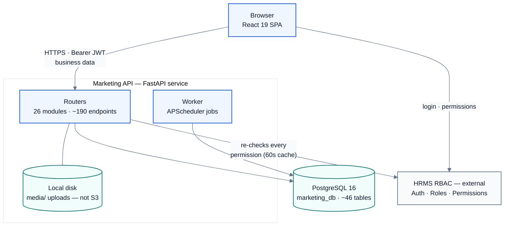
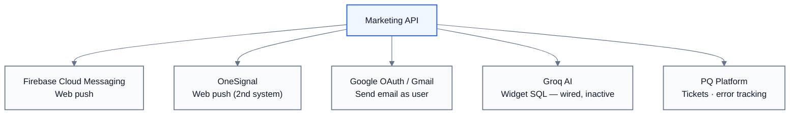
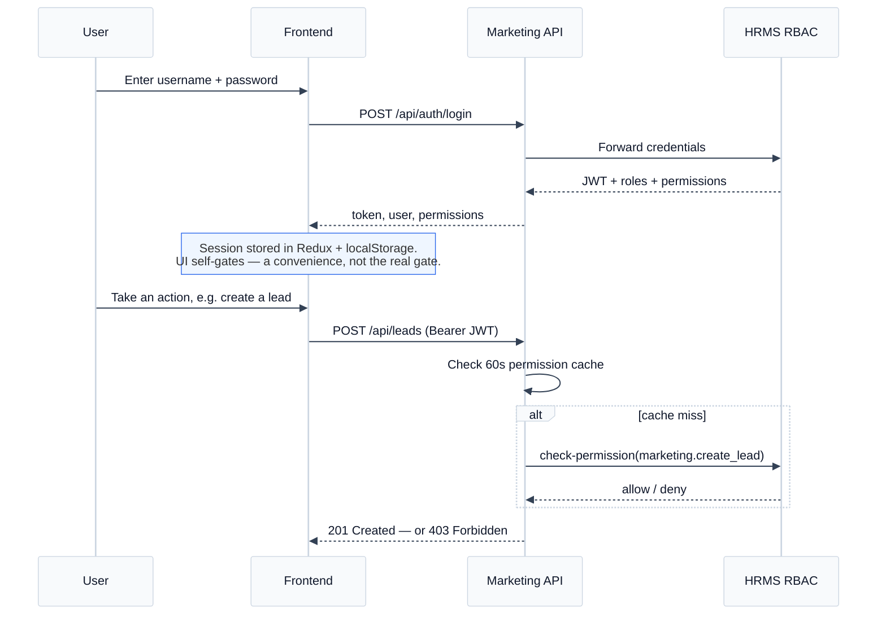
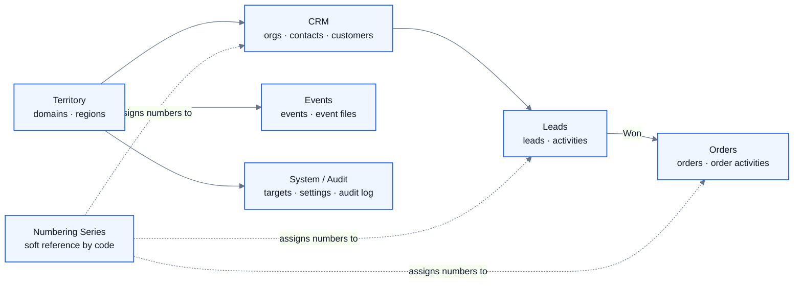
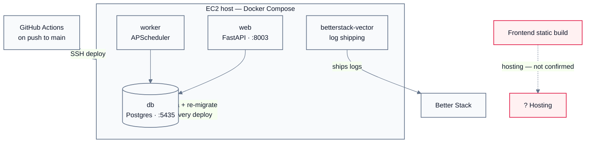

# S&M Hub — System Architecture

What connects to what, and why. This is a diagram-first companion to [`README.md`](./README.md) and [`DEVELOPER_GUIDE.md`](./DEVELOPER_GUIDE.md) — those cover setup, the full API, and the full schema; this one is for understanding the shape of the system before you go read code.

## Contents

1. [Executive summary](#1-executive-summary)
2. [System landscape](#2-system-landscape)
3. [Component directory](#3-component-directory)
4. [External integrations](#4-external-integrations)
5. [Request & auth flow](#5-request--auth-flow)
6. [Data layer](#6-data-layer)
7. [Deployment & infrastructure](#7-deployment--infrastructure)
8. [Integration reference table](#8-integration-reference-table)
9. [Tech stack](#9-tech-stack)
10. [Glossary](#10-glossary)

---

## 1. Executive summary

S&M Hub is Aureole Group's internal Sales & Marketing platform — leads, quotations, orders, contacts, territory management, exhibitions, and team performance, in one tool.

The defining architectural fact about this system: **the browser talks to two independent backends directly.** There is no proxy or "backend for frontend" layer in between. The frontend calls the Marketing API for all business data, and separately calls an external HRMS system for login and permissions. Neither backend trusts the other's word on authorization — the Marketing API independently re-checks every permission against HRMS on every request.

Around that core sits a small set of external services — two push-notification providers, a Gmail-sending integration, an AI service for report generation, an error-tracking/support platform, and a log-shipping sidecar — each connected for one specific job, not as general-purpose infrastructure.

| | |
|---|---|
| Independent backends called from the browser | **2** |
| API endpoints across 26 router modules | **~190** |
| Database tables in the Marketing API | **~46** |
| External third-party services connected | **6** |

> **Read this first if you only read one thing:** permissions are not owned by this application. HRMS decides who can do what; the Marketing API decides the shape of the data. Confusing "what the interface shows" with "what the server allows" is the most common source of access-related bugs here — see [§5](#5-request--auth-flow).

This document was compiled by reading the running codebase directly — route tables, ORM models, environment configuration, and CI/deploy definitions — and corrects an inaccuracy found in earlier diagrams elsewhere in this repo: file storage was previously documented as AWS S3; it is local disk (see [§3](#3-component-directory)).

---

## 2. System landscape

One browser session, and the two backends it calls directly. Blue = this application's own services. Grey/external = systems it depends on but doesn't own.

**Fig. 1** — The core request path. Both connections the browser makes directly (Browser → Marketing API, Browser → HRMS) are drawn from the same source: the browser does not go through the Marketing API to reach HRMS.

---

## 3. Component directory

Every node from Figure 1, explained.

| Component | Role | What it is |
|---|---|---|
| **Frontend (SPA)** | Core | React 19 + TypeScript + Vite single-page app. Holds no business logic of its own — every read/write goes to the Marketing API; login/permissions come from HRMS directly. Session lives in Redux + `localStorage`. |
| **Marketing API** | Core | FastAPI service, ~190 endpoints across 26 routers. Owns all business data (leads, orders, contacts, events, etc.) and enforces both RBAC permissions and row-level territory scope on almost every query. |
| **Background Worker** | Core | A separate container running the same codebase's APScheduler jobs — follow-up reminders and travel-date alerts — against the same database. Can be folded into the web process for local dev via `RUN_SCHEDULER_IN_WEB`. |
| **PostgreSQL 16** | Core | Single database, ~46 tables. The only place business state lives — see [§6](#6-data-layer) for how the tables group. |
| **Local disk storage** | Core | Quotation files, event photos, and other uploads are written to a local `media/` directory and served back only through authenticated download endpoints — never a public static URL. **Not** Amazon S3, despite that appearing in an earlier architecture diagram elsewhere in this repo. |
| **HRMS RBAC** | External · required | A separate, company-wide system. Issues the JWT on login and is the sole source of truth for roles and permissions — the Marketing API does not maintain its own user or permission store, only a 60-second cache of HRMS's answers. If HRMS is unreachable, no one can log in or take any permission-gated action. |

---

## 4. External integrations

Five services the Marketing API reaches outward to, each wired in for one specific job.

**Fig. 2** — Firebase and OneSignal are also reached directly by the browser for the push-permission prompt itself (not just via the API) — the two systems currently run in parallel rather than one having replaced the other.

- **Firebase Cloud Messaging** — Web push notifications. Degrades gracefully if unconfigured.
- **OneSignal** — A second, independently active push system, loaded via a script tag in `index.html`.
- **Google OAuth / Gmail** — "Connect email" in Settings lets a user link Gmail so the app can send follow-ups as them. Per-user, off by default.
- **Groq AI** — Turns natural-language prompts into scoped SQL for dashboard widgets. The generation endpoint is fully written but currently commented out — the integration point is live, the feature isn't switched on.
- **PQ Platform** — External error tracking and support-ticket sync. If sync fails, the ticket is still saved locally and the team follows up manually.

---

## 5. Request & auth flow

The same JWT is used against both backends — but each one decides access independently.

**Fig. 3** — Login establishes the session; every subsequent write is independently re-authorized server-side, regardless of what the UI already decided to show.

**Two authorization layers, not one:**
- **RBAC permissions** (`marketing.create_lead`, etc.) gate *actions* — enforced identically on frontend (hides the button) and backend (rejects the request).
- **Row-level scope** further filters *which records* a permitted action can touch — a Region Head with `edit_lead` can still only edit leads in their own region, resolved per-request in `app/scope.py`.

**A distinction worth memorizing:** a separate, admin-curated **Visibility Settings** list controls only whether already-recorded *historical* figures are *displayed* on a dashboard. It has been mistaken for a permission gate once before — a backend check on backdated deal dates wrongly required presence on this list and had to be reverted. It should never authorize a write.

> **Debugging tip:** if the frontend didn't predict a 403, check both sides — the RBAC permission code *and* the requesting user's territory scope. They fail independently.

---

## 6. Data layer

Full column-level schema lives in [`DEVELOPER_GUIDE.md`](./DEVELOPER_GUIDE.md#database-schema). This is the shape of it — how ~46 tables group into six domains.

**Fig. 4** — Solid arrows are real foreign keys. The dashed arrows from Numbering Series are intentionally soft — other tables store a series *code*, not a foreign key, so a series can be renamed without touching historical records. Leads and Orders also write into System / Audit, omitted here to keep the diagram legible.

| Term | Meaning |
|---|---|
| **Domain** | A broad market/territory (e.g. Domestic, Export) — the top of the org hierarchy. |
| **Region** | A sub-territory inside one Domain, with its own Head/Coordinator/employees. |
| **Lead** | A sales opportunity in progress — the central pipeline entity, one per enquiry. |
| **Order** | Created from a Lead once it's marked Won; tracks post-sale fulfilment. |
| **Series** | A configurable auto-numbering pattern (e.g. `LEAD-{YYYY}{MM}-{0:4}`) reused across leads, orders, quotations, contacts, and customers. |

---

## 7. Deployment & infrastructure

The backend ships as four Docker Compose services on a single EC2 host; the frontend ships as a static build.

**Fig. 5** — Confirmed from `.github/workflows/deploy-marketing-api.yml`. Frontend hosting is **not confirmed** — a `vercel.json` SPA rewrite exists in the repo, but no deploy workflow is checked in.

> ⚠️ **Notable behavior:** every push to `main` drops the entire database schema and reseeds it (`reset_db_and_migrate.py` + `populate_data.py`) as part of the deploy. Confirm this is intended for your environment before relying on data persisting across a backend deploy.

---

## 8. Integration reference table

A flattened view of Figures 1, 2, and 5 for quick lookup.

| Service | Direction | Purpose | Triggered by | Status |
|---|---|---|---|---|
| HRMS RBAC | FE → HRMS, API → HRMS | Login, permission checks, employee directory | Every login; every write | 🟢 Required |
| PostgreSQL | API → DB, Worker → DB | All persistent application state | Every request | 🟢 Required |
| Local disk | API → Disk | Quotation files, event uploads | File upload/download | 🟢 Required |
| Firebase Cloud Messaging | FE ↔ Firebase, Worker → Firebase | Web push notifications | Follow-up reminders, alerts | 🟡 Optional |
| OneSignal | FE ↔ OneSignal | Web push (2nd system) | Login (permission prompt) | 🟡 Optional |
| Google OAuth / Gmail | API ↔ Google | Send follow-up emails as the user | User opts in via Settings | 🟡 Per-user |
| Groq AI | API → Groq | Natural-language → SQL for widgets | Widget generation (disabled) | 🔴 Wired, inactive |
| PQ Platform | API → PQ | Error tracking; ticket sync | Bug/feature reports, errors | 🟡 Optional |
| Better Stack | Vector → Better Stack | Centralized log shipping | Continuous (infra-level) | 🔵 Infra only |
| GitHub Actions → EC2 | GH → EC2 (SSH) | Build, migrate, reseed, restart | Push to `main` | 🔵 CI/CD |

**Legend** — 🟢 Required: system doesn't function without it · 🟡 Optional: degrades gracefully if unset · 🔴 Wired, inactive: integration point exists in code, feature switched off · 🔵 Infra: not part of the application request path.

---

## 9. Tech stack

| Frontend | | Backend | |
|---|---|---|---|
| Framework | React 19 + TypeScript 5.7 | Framework | FastAPI 0.115 (Python 3.11) |
| Build | Vite 6 | ORM | SQLAlchemy 2.0 + Alembic 1.14 |
| Styling | Tailwind CSS 3.4 | Validation | Pydantic v2.9 |
| State | Redux Toolkit 2.5 + Zustand 5 | Database | PostgreSQL 16 |
| Routing | React Router 6.28 | Jobs | APScheduler 3.10 |
| Testing | Vitest 4.1 + RTL | Testing | pytest 8.3 + pytest-asyncio |

---

## 10. Glossary

| Term | Meaning |
|---|---|
| **RBAC** | Role-Based Access Control — the permission model, owned entirely by HRMS. |
| **Scope** | The row-level filter applied on top of RBAC — which specific records a permitted user can see/touch, based on their territory. |
| **Series** | A numbering-pattern config (§6) — not related to "series" in a charting sense. |
| **Activity** | A single timestamped log entry on a Lead or Order (a call, email, note, or status change), optionally with a file attached. |
| **Visibility Settings** | An admin-curated display filter for historical figures — not a permission system. See §5. |

---

*Go deeper: [`DEVELOPER_GUIDE.md`](./DEVELOPER_GUIDE.md) has the full API reference, complete schema, coding conventions, and "how to add a feature" checklists. [`USER_GUIDE.md`](./USER_GUIDE.md) has a screen-by-screen walkthrough for end users.*
