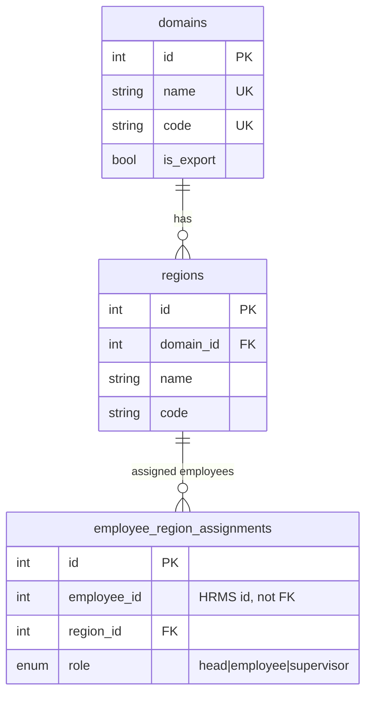
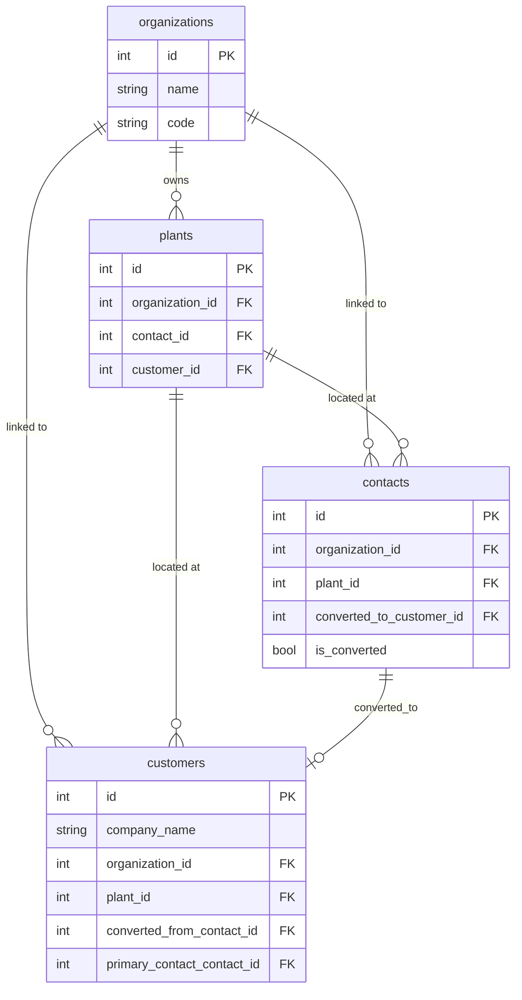
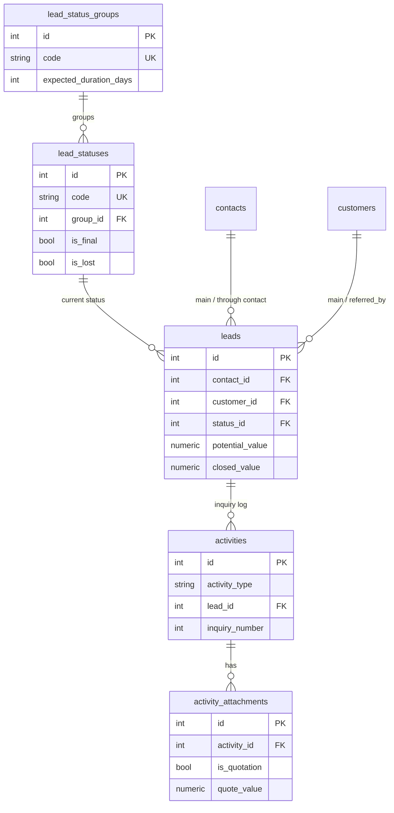

# S&M Hub — Developer Guide

This guide is for engineers working on the codebase. It assumes familiarity with React/TypeScript and Python/FastAPI, but not with this specific repo. For a non-technical walkthrough of what the app does, see the [User Guide](./USER_GUIDE.md).

**Repo shape:** this is two coupled repos. `au-marketing-fe` (this repo) is the frontend. `au-marketing-api/` is the backend, embedded as a **nested git repo** (gitlink, own commit history and remote) — always use `git -C au-marketing-api ...` (not plain `git`) to inspect or commit backend changes; a `git log`/`git status` run from the frontend repo root does not cover it.

---

## Local setup

### Prerequisites
- Node.js (for the Vite/React frontend)
- Python 3.11 + Docker & Docker Compose (for the backend — Docker is the supported path; see below for running without it)
- Access to an HRMS RBAC instance (the Marketing API cannot authenticate anyone without one — see [Auth flow](#auth--permission-flow))

### Environment variables

**Frontend** (`.env`, copy from `.env.example`):

| Variable | Purpose |
|---|---|
| `VITE_API_BASE_URL` | Marketing API base URL (default `http://localhost:8003`) |
| `VITE_HRMS_RBAC_API_URL` | HRMS RBAC API URL |
| `VITE_FIREBASE_API_KEY`, `VITE_FIREBASE_AUTH_DOMAIN`, `VITE_FIREBASE_PROJECT_ID`, `VITE_FIREBASE_STORAGE_BUCKET`, `VITE_FIREBASE_MESSAGING_SENDER_ID`, `VITE_FIREBASE_APP_ID`, `VITE_FIREBASE_VAPID_KEY` | Firebase web push (optional — push notifications degrade gracefully if unset) |

**Backend** (`au-marketing-api/.env`, copy from `.env.example`):

| Variable | Purpose |
|---|---|
| `DATABASE_URL` | Postgres connection string (Docker Compose overrides this for containers) |
| `HRMS_RBAC_API_URL`, `HRMS_API_TIMEOUT` | HRMS RBAC service location + request timeout |
| `SECRET_KEY` | **Must** be set to a strong value in production (default is a placeholder) |
| `ACCESS_TOKEN_EXPIRE_MINUTES` | Token lifetime |
| `DEBUG`, `LOG_LEVEL` | App/log verbosity |
| `LEAD_SERIES_CODE`, `ORDER_SERIES_CODE` | Optional: default numbering-series codes auto-applied to new leads/orders |
| `BACKEND_PUBLIC_URL`, `FRONTEND_SETTINGS_URL` | Public URLs used for the Gmail OAuth redirect flow |
| `RUN_SCHEDULER_IN_WEB` | Set to `1` to run APScheduler inside the web process instead of the dedicated `worker` container (useful for local dev without the worker) |
| `UPLOAD_DIR`, `MAX_ATTACHMENT_SIZE_MB` | Local file storage directory and per-file size cap |
| `CREDENTIALS_JSON_PATH` | Path to Google OAuth `credentials.json` (Gmail "Connect email" feature) |
| `FIREBASE_SERVICE_ACCOUNT_PATH` | Firebase Admin SDK service account (backend push notifications) |
| `GROQ_API_KEY`, `GROQ_MODEL` | Groq AI, used for dashboard widget generation |
| `PQ_API_KEY`, `PQ_BASE_URL`, `PQ_CRM_TICKETS_URL`, `PQ_PRODUCT_ID` | PQ Platform (error tracking + support ticket sync) — see [Known limitations](#known-limitations--tech-debt) |
| `POPULATE_DASHBOARD_ASSIGNEE_IDS` | Comma-separated employee IDs used only by the `populate_data.py` seed script |
| `BETTER_STACK_SOURCE_TOKEN`, `BETTER_STACK_INGESTING_HOST` | Consumed by the Vector Docker sidecar for log shipping, not by the app itself |
| `PGADMIN_DEFAULT_EMAIL`, `PGADMIN_DEFAULT_PASSWORD`, `PGADMIN_PORT` | Optional pgAdmin container (commented out in `docker-compose.yml` by default) |

### Running with Docker (backend)

```bash
cd au-marketing-api
cp .env.example .env    # edit SECRET_KEY, HRMS_RBAC_API_URL at minimum
docker compose up -d --build
```

This starts three services: `db` (Postgres 16, host port `5435`), `web` (FastAPI, host port `8003`), `worker` (APScheduler background jobs), plus a `betterstack-vector` log-shipping sidecar (requires `BETTER_STACK_SOURCE_TOKEN` — will fail to start without it; safe to `docker compose stop betterstack-vector` locally). Tables are created automatically on `web` startup (`Base.metadata.create_all` in `app/main.py`'s lifespan, plus a handful of ad hoc `ALTER TABLE ... ADD COLUMN IF NOT EXISTS` statements for columns added after initial deploy — see [Known limitations](#known-limitations--tech-debt)). Interactive API docs are served at `http://localhost:8003/docs`.

### Running without Docker (backend)

```bash
cd au-marketing-api
python -m venv .venv && source .venv/bin/activate
pip install -r requirements.txt
# Point DATABASE_URL in .env at a Postgres instance you control
uvicorn app.main:app --reload --port 8003
# In a second terminal, for background jobs:
python run_worker.py
```

### Frontend

```bash
cp .env.example .env    # point VITE_API_BASE_URL at your backend
npm install
npm run dev              # http://localhost:3000
```

### Seed data

`au-marketing-api/scripts/` has 17 scripts for seeding/resetting data — the most relevant:
- `populate_data.py` — reference data + sample data + dashboards + report templates (what the EC2 deploy pipeline runs after every deploy)
- `reset_db_and_migrate.py` — drops the entire `public` schema (including `alembic_version`) and re-runs migrations from scratch
- `seed_number_series.py`, `seed_dashboard.py`, `seed_demo_data.py`, `clear_and_seed_marketing.py`, `truncate_and_populate_data.py` — narrower seed variants

⚠️ Several of these are destructive (drop/truncate). Read the script before running it against anything you care about.

---

## Folder / module structure

### Frontend (`au-marketing-fe/`)

| Path | Purpose |
|---|---|
| `App.tsx` | Root: React Router route table (all routes registered here), `AppContext` (toast/notifications/demo-mode), providers |
| `pages/` | ~34 route-level components, one per URL. Most list pages follow a kanban-and/or-table pattern with a paired `*FormPage.tsx` for create/edit |
| `components/layout/` | `DashboardLayout`, `DatabaseLayout`, `PageLayout` — page chrome, sidebar, breadcrumbs |
| `components/ui/` | ~28 shared building blocks: `DataTable`, `Modal`, `Button`, `Sidebar`, etc. |
| `components/ProtectedRoute.tsx` | Route guard — redirects to `/login` if unauthenticated, renders "Access Denied" if `requiredPermission`/`requireAnyPermission`/`requireAllPermissions` isn't satisfied |
| `UI/` | Lower-level atoms (Button, Input, Badge, Tooltip, DatePicker, Select, Table, ...) |
| `lib/api.ts` | Base `APIClient` — fetch wrapper, XHR upload-progress, 401 handling, `ApiError` |
| `lib/marketing-api.ts` | The single `marketingAPI` object — ~190 typed methods + every request/response TS interface for the Marketing API |
| `lib/hrms-rbac.ts` | HRMS auth client |
| `lib/firebase-push.ts` | FCM registration |
| `lib/notification-permission.ts` | OneSignal permission prompt |
| `lib/api-cache.ts`, `lib/marketing-scope.ts`, `lib/deadline-utils.ts`, `lib/name-phone-utils.ts`, `lib/country-codes.ts`, `lib/auth-utils.ts`, `lib/utils.ts` | Assorted client-side helpers |
| `store/` | Redux Toolkit: `authSlice` (token/user/permissions), `dsrSlice`, `organizationPlantsSlice`, `middleware.ts` (forced logout on token expiry) |
| `context/` | React context providers |
| `src/test/` | Vitest setup + the one existing test file |

Zustand is used separately (in specific pages, e.g. calendar-local state) — not for global app state, which lives in Redux.

### Backend (`au-marketing-api/`)

| Path | Purpose |
|---|---|
| `app/main.py` | FastAPI app construction, CORS, lifespan (table creation + ad hoc migrations, HRMS connectivity check, PQ client init, scheduler start), router registration, global exception handler |
| `app/routers/` | 26 router modules (one per resource area), mounted under `/api` in `main.py` — see [API Reference](#api-reference) |
| `app/models.py` | 52 SQLAlchemy model classes / ~46 tables — see [Database Schema](#database-schema) |
| `app/schemas.py` | Pydantic request/response models |
| `app/dependencies.py` | Auth/permission dependency factories (`require_permission`, `require_any_permission`, `get_authenticated_user`, `get_active_settings`) |
| `app/rbac.py`, `app/rbac_cache.py` | HRMS RBAC HTTP client + in-process permission/user-info cache (60s TTL) |
| `app/scope.py` | Row-level scoping — resolves what a given user's role can see (own records / region / domain / all) and applies it to queries |
| `app/audit_utils.py` | `log_action()` helper feeding the general audit log |
| `app/settings_utils.py` | Default/active `MarketingSettingsPayload` resolution (visibility settings) |
| `app/storage.py` | Local-disk file storage manager |
| `app/scheduler.py` | APScheduler job definitions (follow-up reminders, travel reminders) |
| `app/push_notifications.py` | FCM push sending |
| `app/lead_display.py` | Shared lead display-name formatting |
| `migrations/` | Alembic migrations |
| `scripts/` | Seed/reset/migration utility scripts (see [Seed data](#seed-data)) |
| `tests/` | pytest + `conftest.py` fixtures |
| `run_worker.py` | Entry point for the dedicated APScheduler worker process/container |

---

## Architecture decisions & data flow

### No BFF — the browser talks to two backends directly

There is no proxy/backend-for-frontend layer. The React SPA calls the Marketing API and HRMS RBAC independently, each over plain HTTP JSON with a Bearer JWT. This means:
- The frontend must handle two different error/auth shapes (`lib/api.ts` vs `lib/hrms-rbac.ts`)
- CORS is configured on both services independently
- A permission check performed in the UI (`selectHasPermission`) is a **UX convenience only** — the backend independently re-validates every permission server-side (see below), so the two can drift if backend-only logic is added without a matching frontend gate, or vice versa

### Auth / permission flow

1. `LoginPage` → `POST /api/auth/login` (Marketing API) → forwarded to HRMS RBAC → JWT + user + roles + permissions returned
2. Frontend stores the JWT in Redux `authSlice` + `localStorage`
3. Every subsequent Marketing API call sends `Authorization: Bearer <JWT>`
4. The backend's `require_permission("marketing.xxx")` dependency (`app/dependencies.py`) checks a 60-second in-process cache; on a miss it calls HRMS's `check-permission` endpoint and caches the result
5. Superusers/staff (`is_superuser`/`is_staff` on the HRMS user record) bypass permission checks entirely
6. On top of RBAC permissions, most list/detail endpoints apply **row-level scope** (`app/scope.py`) — a domain head only sees their domain's records, a region head their region's, a plain employee only their own, unless a role's `view_other_domains`/`view_other_regions` visibility setting is enabled

**Two authorization concepts that are easy to conflate:**
- **RBAC permissions** (`marketing.create_lead`, `marketing.edit_lead`, `marketing.admin`, ...) gate *actions* — who can create/edit/delete something.
- **Visibility Settings** (`Settings → Visibility` tab, `MarketingSettingsPayload.past_quarter_access`) is an admin-curated, per-fiscal-quarter allow-list controlling only whether *already-recorded historical* numbers are *displayed*. It is a display filter, not a permission gate — using it to authorize a write has happened once already (a backend check on backdated Won-date writes wrongly required presence on this list) and had to be reverted. Never use it to gate a write.

### State management

- **Redux Toolkit** for global app state: auth/session (`authSlice`), DSR (`dsrSlice`), org/plant lookups (`organizationPlantsSlice`). `store/middleware.ts` forces logout when the token expires.
- **Zustand** for page-local state that doesn't belong in global Redux (e.g. calendar UI state on the OD Plan page).
- **No React Query / SWR** — data fetching is done directly via `marketingAPI.*` calls inside components/pages, with local `useState`/`useEffect`.

### Settings live-reload

Backend responses carry an `X-Marketing-Settings-Version` header. The frontend compares it against the last-seen version (`lib/api.ts` / `lib/marketing-api.ts`) and reloads settings-dependent UI when it changes — this is how a Visibility Settings change by an admin propagates to other logged-in users without a page refresh.

### Won-date / kanban status-change has multiple independent entry points

`pages/LeadsPage.tsx` (kanban drag-to-column, and a per-card "Won" button) and `pages/LeadFormPage.tsx` (a separate "Mark as Won" modal in Edit Lead) **each independently** trigger the status-change-to-Won flow (closed value + PO + optional backdated Won date), each calling `marketingAPI.updateLead` / `createLeadActivity` directly. There is no shared hook/component for this — changing Won-flow behavior (e.g. backdating rules) requires updating all entry points in lockstep, or they will silently diverge.

### Quotation numbering is a small state machine

Numbers can come from (a) an explicit numbering `series_code`, (b) the lead's own `quote_number`/`quote_series_code` (settable directly on the lead, independent of any file attachment), or (c) `is_revised=true`, which reuses the lead's existing base number and appends `(rev2)`, `(rev3)`, etc. Quote value is mandatory for quotation-type attachments and can auto-transition the lead's status via `LeadStatusOption.set_when_quotation_added` / `set_when_quote_number_generated`.

---

## Database schema

Source: `au-marketing-api/app/models.py` (52 model classes, ~46 tables, 7 enums). A recurring convention: most "who did this" fields are **not** foreign keys — they're plain `Integer` HRMS employee IDs with a denormalized `*_username`/`*_email` snapshot, since the employee directory lives in HRMS, not this database.

**Enums:** `CampaignStatus` (draft/active/paused/completed/cancelled), `EmployeeRegionRole` (head/employee/supervisor), `EventType` (exhibition/roadshow), `EventStatus` (active/ended), `FileType` (stall_design/banner_design/travel_ticket/local_travel_proof). `PaymentStatus` and `BannerSource` are defined but **not** applied to any column — the actual columns (`events.space_booking_payment_status`, `events.banner_design_source`) are plain strings with the same allowed values, not typed enums.

### 1. Org Hierarchy — `domains`, `regions`, `employee_region_assignments`

| Table | Key columns | FKs |
|---|---|---|
| `domains` | `id` PK; `name`/`code` unique; `is_export`, `is_active`; `head_employee_id`/`coordinator_employee_id` (HRMS refs) | — |
| `regions` | `id` PK; `domain_id` NOT NULL; `name`/`code`; `head_employee_id`/`coordinator_employee_id` | `domain_id → domains.id` |
| `employee_region_assignments` | `id` PK; `employee_id` (HRMS, not FK); `region_id`; `role` enum; `is_active` | `region_id → regions.id` |



### 2. CRM — `organizations`, `contacts`, `customers`, `plants`

| Table | Key columns | FKs |
|---|---|---|
| `organizations` | `id` PK; `name`/`code`; `industry`, `organization_size`; `is_active` | — |
| `contacts` | `id` PK; name/email/phone fields; `domain_id`, `region_id`, `organization_id`, `plant_id`; `is_converted`; `converted_to_customer_id`; `series_code`/`series` | `domain_id/region_id/organization_id/plant_id`, `converted_to_customer_id → customers.id` |
| `customers` | `id` PK; `company_name`; `domain_id`, `region_id`; `converted_from_contact_id`; `organization_id`/`plant_id`; `primary_contact_contact_id`; `series_code`/`series` | `domain_id/region_id/organization_id/plant_id`, `converted_from_contact_id → contacts.id`, `primary_contact_contact_id → contacts.id` |
| `plants` | `id` PK; `organization_id`; `contact_id`/`customer_id` (legacy direct owners); `plant_name`; address fields | `organization_id → organizations.id`, `contact_id → contacts.id`, `customer_id → customers.id` |

Note the dual relationship pattern: `Contact.plants` (plants this contact legacy-owns via `plants.contact_id`) vs. `Contact.plant` (the plant this contact is *located at*, via `contacts.plant_id`) — two distinct relationships on the same table pair using different FK columns. Same pattern applies to `Customer.plants`/`Customer.plant`.



### 3. Leads — `lead_status_groups`, `lead_statuses`, `lead_types`, `lead_through_options`, `leads`, `activities`, `activity_attachments`

| Table | Key columns | FKs |
|---|---|---|
| `lead_status_groups` | `code` unique; `expected_duration_days`; `follow_up_interval_days`; `display_order` | — |
| `lead_statuses` | `code` unique; `group_id`; `is_final`, `is_lost`, `is_hot`; `set_when_quotation_added`, `set_when_quote_number_generated`, `attachment_required_on_kanban_change` | `group_id → lead_status_groups.id` |
| `lead_types` | `code` unique; `label`; `display_order` | — |
| `lead_through_options` | `code` unique; `label` | — |
| `leads` | `domain_id`, `region_id`, `contact_id`, `customer_id`, `plant_id`, `status_id`, `lead_type_id`, `lead_through_id`, `through_contact_id`, `referred_by_customer_id`; `potential_value`, `closed_value`, `closed_at`; `series_code`/`series`, `quote_series_code`/`quote_number`; `next_follow_up_at`, `follow_up_reminder_type` | see column list |
| `activities` | `activity_type`, `title`; `lead_id`, `campaign_id`, `contact_id`, `customer_id`; `from_status_id`/`to_status_id`; `inquiry_number` (per-lead sequence) | `lead_id → leads.id`, etc. |
| `activity_attachments` | `activity_id`; `file_name`, `file_path`; `is_quotation`; `quotation_number`; `quote_value` | `activity_id → activities.id` (cascade delete-orphan) |



### 4. Campaigns — `campaigns`, `campaign_leads`

`campaigns.status` (enum), `campaigns.domain_id → domains.id`. `campaign_leads` is a many-to-many join between `campaigns` and `leads`.

### 5. Orders — `order_status_groups`, `order_statuses`, `orders`, `order_activities`, `order_activity_attachments`

Structurally mirrors the Leads group exactly (status groups → statuses → orders → order_activities → order_activity_attachments), with `orders.lead_id → leads.id` linking an order back to the lead it was won from. Order activity attachments do **not** have quotation-numbering logic (unlike lead activity attachments).

### 6. Numbering Series — `series`

`series` (`code` unique, `pattern`, `entity_type`, `next_value`, `reset_period`) is **not** linked via FK to anything — other tables reference it *by code* only (`series_code` string columns on `contacts`/`customers`/`leads`/`orders`, plus `quote_series_code` on `leads`). This is a deliberate soft reference. Pattern placeholders: `{YYYY}`, `{YY}`, `{MM}`, `{DD}`, `{HH}`, `{mm}`, `{ss}`, `{0:N}` (zero-padded counter), `{S:code}` (recursive sub-series), `{customer.xxx}`/`{contact.xxx}`/`{lead.xxx}` (entity field injection). `reset_period` (day/week/month/year/none) auto-resets the counter to 1 on period change.

### 7. Notifications & Push — `user_email_connections`, `user_notification_preferences`, `notifications`, `notification_devices`

None of these have real foreign keys — `user_employee_id` and `notifications.lead_id` are loose integer references, not DB-enforced.

### 8. Targets / Performance — `employee_monthly_targets`, `region_monthly_targets`, `domain_monthly_targets`

Each has a `UniqueConstraint(scope_id, year, month)`. `employee_monthly_targets.employee_id` is a loose HRMS reference; `region_monthly_targets.region_id → regions.id` and `domain_monthly_targets.domain_id → domains.id` are real FKs. An explicit region/domain target overrides the sum of employee targets underneath it in the UI.

### 9. Tasks & Reports — `employee_tasks`, `expected_order_reports`, `expected_order_report_leads`, `od_plan_reports`, `od_plan_entries`, `saved_dashboards`, `saved_dashboard_assignments`, `report_templates`, `report_template_assignments`

`expected_order_report_leads` and the assignment tables are M2M joins. `saved_dashboards.config`/`report_templates.config` are JSONB blobs holding the widget/section layout and SQL. Assignment tables cascade-delete when their parent dashboard/template is deleted.

### 10. System / Settings — `marketing_employees`, `marketing_settings`, `marketing_settings_audit_logs`, `changelog_versions`, `audit_logs`, `support_tickets`

`marketing_employees` is a local cache/mirror of HRMS employee data (populated by `POST /api/employees/sync`), the only table in this group with real FKs (`domain_id`/`region_id`). `marketing_settings` is effectively a singleton row holding the active `MarketingSettingsPayload` JSONB config. `audit_logs.entity_type`/`entity_id` is a polymorphic reference (lead/customer/campaign/contact/setting/enquiry/activity), not a formal FK — deliberately, so audit history survives deletion of the referenced record.

### 11. Events/Exhibitions — `events`, `event_files`

`events` is a large, mostly-denormalized table — most sub-workflow data (payment installments, stall vendors, local travel entries, gifting entries) is stored inline as JSONB arrays rather than normalized child tables. `event_files.event_id → events.id` (cascade delete); `vendor_id`/`employee_id`/`entry_index` on `event_files` are loose references into those JSONB arrays, not relational FKs.

### Cross-group FK quick reference

| From | To | Meaning |
|---|---|---|
| `regions.domain_id` | `domains.id` | region belongs to domain |
| `employee_region_assignments.region_id` | `regions.id` | employee scoped to region |
| `contacts`/`customers`.`domain_id`/`region_id` | `domains.id`/`regions.id` | territory |
| `contacts.converted_to_customer_id` / `customers.converted_from_contact_id` | `customers.id` / `contacts.id` | conversion link |
| `plants.organization_id`/`contact_id`/`customer_id` | respective tables | plant owner |
| `leads.*` (9 FK columns) | domains/regions/contacts/customers/plants/lead_statuses/lead_types/lead_through_options | see §3 |
| `orders.lead_id` | `leads.id` | order from won lead |
| `campaign_leads.campaign_id`/`lead_id` | `campaigns.id`/`leads.id` | M2M |
| `employee_tasks.lead_id`/`lead_status_group_id` | `leads.id`/`lead_status_groups.id` | task source |
| `expected_order_report_leads.report_id`/`lead_id` | respective tables | M2M |
| `od_plan_entries.report_id`/`contact_id` | `od_plan_reports.id`/`contacts.id` | plan entry |
| `saved_dashboards.domain_id`, `report_templates.domain_id` | `domains.id` | scoping |
| `marketing_employees.domain_id`/`region_id` | `domains.id`/`regions.id` | employee cache scope |
| `events.domain_id` | `domains.id` | event domain |
| `event_files.event_id` | `events.id` | file on event |

---

## API reference

Base path `/api` (except `/health` and `/` at root). Auth: `Authorization: Bearer <JWT>` on every endpoint except `POST /api/auth/login`. "token only" = valid JWT required, no specific permission. "public" = no auth. Full interactive reference (always up to date) is served at **`/docs`** by the running API (Swagger UI) — the tables below are a stable reference for code review/onboarding, not a replacement for it.

### auth.py — `/api/auth`

| Method | Path | Auth | Notes |
|---|---|---|---|
| POST | `/login` | public | Proxies to HRMS RBAC login → `{token, user, employee, roles, permissions}` |
| POST | `/logout` | token only | Invalidates RBAC token cache |
| POST | `/refresh-permissions` | token only | Clears RBAC cache for token |
| GET | `/me` | token only | `?refresh=1` forces reload from HRMS |
| GET | `/scope` | token only | Resolved marketing scope (role/domain/region) for prefilling create forms |
| GET | `/email-connection` | token only | Gmail "Connect email" status |
| GET | `/email/authorize-url` | token only | Google OAuth2 authorize URL |
| GET | `/email/callback` | public (state carries token) | OAuth callback → redirects to frontend |
| DELETE | `/email` | token only | Disconnect Gmail |

### leads.py — `/api/leads` (31 endpoints — the largest router)

Sub-resources: status groups (CRUD), statuses (CRUD), types (CRUD), through-options (read-only list), plus the core lead endpoints:

| Method | Path | Permission | Notes |
|---|---|---|---|
| GET | `/` | `view_lead` | Paginated; `no_limit=true` for kanban (all matches); filters: `status_id`, `assigned_to[]`, `created_by_me`, `include_won_lost`, `lost_only`, `is_hot`, `date_from/to` |
| GET | `/{lead_id}` | `view_lead` (+ scope) | |
| POST | `/` | `create_lead` | Requires `contact_id` or `customer_id`; auto-derives domain/region; auto-generates `series`/`quote_number` |
| PUT | `/{lead_id}` | `edit_lead` (+ scope) | Creates a `lead_edit` diff activity log; ≥100-char reason required for Lost; `closed_value` required for Won |
| PATCH | `/{lead_id}/series` | `edit_lead` (+ `admin` if already set) | Reassigns lead number |
| PATCH | `/{lead_id}/follow-up` | `edit_lead` (+ scope) | |
| DELETE | `/{lead_id}` | `delete_lead` (+ scope) | Cascades: linked orders, order activities, lead activities/attachments |
| GET/POST | `/{lead_id}/activities/` | `view_lead` / `edit_lead` | Enquiry log |
| PUT/DELETE | `/{lead_id}/activities/{activity_id}` | `edit_lead` (+ creator-only) | |
| POST | `/{lead_id}/activities/{activity_id}/attachments` | `edit_lead` (+ creator-only) | **multipart**: `files[]`, `attachment_types`, `quotation_numbers`, `titles`, `quote_values`, `series_code`, `is_revised` — quotation upload with auto-numbering |
| GET | `.../attachments/{id}/download` | `view_lead` (+ scope) | File stream |
| POST | `.../attachments/{id}/replace` | `edit_lead` (+ creator-only, super admin bypass) | Reattach file, preserves quotation metadata |
| DELETE | `.../attachments/{id}` | `edit_lead` (+ creator-only) | |

### orders.py — `/api/orders` (22 endpoints)

Mirrors `leads.py`'s structure (status groups/statuses CRUD, orders CRUD, order activities, order activity attachments), and **deliberately reuses the same permission codes as leads** (`view_lead`/`create_lead`/`edit_lead`/`delete_lead`) rather than defining separate order permissions in HRMS — documented explicitly in the router's module docstring. Order attachments have no quotation-numbering logic (unlike lead attachments).

### Other routers (summary — see `/docs` for full detail)

| Router | Prefix | Highlights |
|---|---|---|
| `settings.py` | `/api/marketing` | `GET/PUT /settings` — visibility config, `marketing.admin` to write, versioned via `X-Marketing-Settings-Version` header |
| `audit_logs.py` | `/api/audit-logs` | `GET /` — filterable, searchable audit trail |
| `whats_new.py` | `/api/whats-new` | Changelog/release-notes CRUD (`marketing.admin` to write) |
| `saved_dashboards.py` | `/api/saved-dashboards` | Dashboard CRUD, assignments, and the **SQL widget engine** (see Notable patterns) |
| `report_templates.py` | `/api/report-templates` | Same pattern as saved dashboards, for multi-section custom reports |
| `schema.py` | `/api/schema` | Introspects live DB schema (table/column/FK list) — powers the Schema page and widget-builder autocomplete |
| `quotations.py` | `/api/quotations` | Cross-lead searchable quotation list |
| `reports.py` | `/api/reports` | Summary stats, Expected Order reports, OD Plan reports |
| `dashboard.py` | `/api/dashboard` | Target-setting (employee/region/domain), scope/head/quotation stats, performer-of-month |
| `campaigns.py` | `/api/campaigns` | Standard CRUD, own permission codes (`view/create/edit/delete_campaign`) |
| `contacts.py` / `customers.py` / `organizations.py` / `plants.py` | `/api/*` | CRM CRUD, scope-filtered, with search endpoints for typeahead |
| `domains.py` / `regions.py` | `/api/domains`, `/api/regions` | Territory CRUD; region also has employee-assignment endpoints; **deletes cascade extensively** |
| `series.py` | `/api/series` | Numbering series CRUD + `generate-next` (by ID or by code — by-code used when creating an entity that has no ID yet) |
| `employees.py` | `/api/employees` | Live HRMS proxy (`/`, `/departments/`, `/designations/`) **vs.** locally cached `local/` endpoints populated by `POST /sync` |
| `events.py` | `/api/events` | Event CRUD + file upload sub-resource; blocked once event is `ENDED` |
| `tickets.py` | `/api/tickets` | Support ticket creation + feedback, synced to external PQ Platform |
| `tasks.py` | `/api/tasks` | Today's follow-up tasks (auto-generated + manual) |
| `notifications.py` | `/api/notifications` | In-app notifications, preferences, FCM device registration |

### Notable patterns

- **Pagination**: most list endpoints return `PaginatedResponse[T] {items, total, page, page_size, total_pages}` (`page ≥1`, `page_size` typically 10–100, default 10). A few small/pre-scoped reference lists (lead statuses/types, saved dashboards, report templates, notifications) return a plain `List[T]`.
- **Scope-based row-level security** applies to nearly every domain-object query via `app/scope.py`. Role cascade: super admin (all) → domain head (their domain, optionally others via visibility settings) → region head/supervisor (their region) → employee (only records they created/are assigned).
- **File uploads are multipart/form-data**, never JSON — lead/order attachments and event files all use `UploadFile`/`File(...)`/`Form(...)`, capped by `MAX_ATTACHMENT_SIZE_MB`, stored via `app.storage.storage_manager` (local disk), served back only through dedicated `/download` endpoints (never a static URL).
- **Soft-delete vs. hard-delete**: region employee assignments are soft-deleted (`is_active=False`). Nearly everything else is a hard `db.delete()`. Domain/Region deletes cascade extensively — see their router's DELETE handler for the exact order.
- **Creator-only edit/delete** on activity/inquiry-log entries — only the employee who originally logged an activity (or its attachment) can edit/delete it, regardless of broader scope access (super-admin bypass on attachment replace only).
- **Custom SQL widget engine** (`saved_dashboards.py`, reused by `report_templates.py`): user SQL is restricted to a single `SELECT` (regex + keyword-blocklist validated), compiled against scope placeholders (`{{employee_id}}`, `{{domain_id}}`, `{{region_id}}`, `{{date_from}}`, ...) and entity placeholders (`{{lead_id}}`, etc.), capped at 1000 rows. Direct client-supplied SQL via `POST /execute-widget` is explicitly disabled — SQL only ever runs from a saved dashboard's stored config.
- **Audit logging is pervasive** — nearly every create/edit/delete calls `log_action()`. Marketing-settings changes additionally get a dedicated audit trail (`MarketingSettingsAuditLog`) separate from the general one.

### Example: authenticate and create a lead

```bash
# 1. Log in
curl -X POST http://localhost:8003/api/auth/login \
  -H "Content-Type: application/json" \
  -d '{"username": "your.username", "password": "your-password"}'
# => {"success": true, "token": "eyJ...", "user": {...}, "permissions": [...]}

# 2. Use the token on subsequent requests
TOKEN="eyJ..."
curl http://localhost:8003/api/leads/?page=1&page_size=10 \
  -H "Authorization: Bearer $TOKEN"

curl -X POST http://localhost:8003/api/leads/ \
  -H "Authorization: Bearer $TOKEN" \
  -H "Content-Type: application/json" \
  -d '{
    "contact_id": 42,
    "domain_id": 1,
    "potential_value": 50000
  }'
```

---

## Coding conventions

- **Permission gating**: UI elements gate on `useAppSelector(selectHasPermission('marketing.xxx'))` (`store/slices/authSlice.ts`); routes gate via `<ProtectedRoute requiredPermission=... />`. When adding a new gated action, copy an existing `selectHasPermission('marketing.xxx')` call from the same page rather than inventing a new pattern.
- **RBAC vs. Visibility Settings**: never use `past_quarter_access` (or any Visibility Settings field) to authorize a write — it's a display filter only (see [Auth flow](#auth--permission-flow)).
- **API client**: all backend calls go through the single `marketingAPI` object in `lib/marketing-api.ts` — add new methods there rather than calling `fetch`/`APIClient` directly from a page.
- **Backend permission dependency**: use `Depends(require_permission("marketing.xxx"))` for single-permission gates, `Depends(require_any_permission([...]))` when several permissions should each independently grant access, `Depends(get_authenticated_user)` when only a valid token (no specific permission) is needed.
- **Scope**: any new list/detail endpoint over a domain-owned entity (contacts, customers, leads, orders, ...) should apply `app/scope.py`'s scoping helpers — don't write an unscoped query for anything a non-admin role can reach.
- **No BFF hack**: don't introduce a proxy/aggregation layer for a single feature — the established pattern is direct browser → each backend.
- **Backdating / historical-write gotcha**: any endpoint that lets a user set a *past* date on a record (see the Won-date backdating logic in `leads.py`) must gate on an actual RBAC permission (e.g. `marketing.create_lead`), never on Visibility Settings.

---

## How to add a new feature

### Adding a new backend API route
1. Add/extend the Pydantic request & response models in `app/schemas.py`.
2. Add the endpoint to the relevant file in `app/routers/` (or create a new router file for a genuinely new resource area, and register it in `app/main.py` with `app.include_router(..., prefix="/api", tags=[...])`).
3. Pick the right auth dependency (`require_permission`, `require_any_permission`, or `get_authenticated_user`) — check `REQUIRED_PERMISSIONS.md` (backend repo root) for existing permission codes before inventing a new one; new permission codes must also be created in HRMS, since the Marketing API doesn't own them.
4. Apply row-level scope (`app/scope.py`) if the endpoint touches a domain-owned entity.
5. Call `log_action()` (`app/audit_utils.py`) if the endpoint creates/edits/deletes something — this is the repo-wide convention, and it feeds the Audit Logs settings tab.
6. Add a model change via Alembic if you touched `app/models.py`: `alembic revision --autogenerate -m "..."` then `alembic upgrade head`.
7. Add a test in `tests/` (see [Testing](#testing) — coverage here is currently minimal, so any addition is valuable).

### Adding a new frontend page/route
1. Add the page component under `pages/`. Follow the existing pattern: a list page (kanban/table) paired with a `*FormPage.tsx` for create/edit, if applicable.
2. Register the route in `App.tsx`'s route table, wrapped in `<ProtectedRoute requiredPermission="marketing.xxx">` if it should be permission-gated.
3. Add any new API calls as typed methods on `marketingAPI` in `lib/marketing-api.ts` (request/response interfaces live in the same file).
4. Reuse existing `components/ui/` and `UI/` building blocks rather than writing new low-level components — consult `UI_COMPONENTS_LIBRARY.md` and `design.md` (frontend repo root) for the established patterns/tokens before adding new ones.
5. If the page needs global state, extend an existing Redux slice or add a new one under `store/slices/`; for page-local complex state, consider Zustand (see the OD Plan page for precedent) before reaching for prop-drilling.
6. Add it to the sidebar nav if it should be user-facing and discoverable (`components/layout/`) — note there are already a few routes registered but *not* in the nav (Employees, Schema, Financials, Inventory); decide deliberately whether a new page should be one of those or a full nav entry.

---

## Testing

**Current coverage is minimal on both sides — be honest about this rather than assuming broader coverage exists.**

- **Frontend**: Vitest + jsdom + React Testing Library, global setup in `src/test/setup.ts`. There is currently exactly **one** test file (`src/test/setup.test.ts`, 2 trivial smoke tests confirming the test environment itself works) — no component/page/integration tests exist yet.
  - Run: `npm run test` (watch mode), `npm run test:run` (single run, CI), `npm run test:ui` (Vitest UI)
  - Single file: `npx vitest run path/to/file.test.ts`
  - To add a test: colocate `*.test.ts(x)` files under `src/test/` (or alongside the code, matching Vitest's default discovery) and use React Testing Library for component tests.
- **Backend**: pytest + pytest-asyncio (`asyncio_mode = auto` in `pytest.ini`), fixtures in `tests/conftest.py`. Currently **two** tests exist (`tests/test_main.py`), covering only `GET /health` and `GET /`.
  - Run: `pytest` from `au-marketing-api/`
  - To add a test: add a file under `tests/`, use the `async_client` fixture from `conftest.py` for endpoint tests.
- Neither `npm run build`/`tsc --noEmit` nor pytest currently catch feature-level regressions — for UI changes, manually exercise the feature in a running dev server; for backend changes, exercise the endpoint via `/docs` or curl in addition to any test you add.

---

## Deployment

### Backend

GitHub Actions workflow `au-marketing-api/.github/workflows/deploy-marketing-api.yml` triggers on every push to `main`: SSHes into an EC2 instance, `git pull`s, rebuilds and restarts the Docker Compose stack, then runs:
```bash
docker compose exec -T web python scripts/reset_db_and_migrate.py   # drops entire public schema + re-migrates from scratch
docker compose exec -T web python scripts/populate_data.py          # reseeds reference + sample data
```

⚠️ **This means every push to `main` destroys and recreates the entire production database**, then reseeds it. This is unusual for a service handling real user-entered data (leads, orders, quotations) and is worth confirming is genuinely intended before treating it as "just how deploys work" — see [Known limitations](#known-limitations--tech-debt).

### Frontend

No frontend CI/CD workflow exists in this repo. A `vercel.json` at the repo root defines an SPA rewrite rule (`/* → /index.html`), which is the standard pattern for a Vercel-hosted static SPA — but the exact hosting/deploy trigger wasn't confirmed while writing this guide.

⚠️ **NEEDS CONFIRMATION:** frontend hosting provider, deploy trigger (Vercel git integration vs. manual `npm run build` + upload), and production URL.

---

## Known limitations / tech debt

No `TODO`/`FIXME`/`HACK` markers exist in either codebase — the items below were found by reading the architecture, config, and test coverage directly, not from code comments.

- **Full production DB reset on every backend deploy** — see [Deployment](#deployment) above. Confirm this is intended; if it is, document *why* (e.g. this is a pre-launch/demo environment) somewhere more visible than a workflow file.
- **`PQ_API_KEY` has a live-looking default value hardcoded in `app/config.py`** as a fallback if the env var is unset, rather than requiring it to be set explicitly. Even though it's a fallback, committing what looks like a real API key to source is worth remediating (move to secrets-only, remove the hardcoded default).
- **Two parallel push-notification systems are both actively wired**: Firebase Cloud Messaging (`lib/firebase-push.ts`, `firebase-admin` backend) and OneSignal (loaded via script in `index.html`, `lib/notification-permission.ts`). Neither appears to be a stale/dead leftover — worth a deliberate decision on whether both should remain long-term or one should be sunset, since maintaining two push pipelines doubles the failure surface.
- **Architecture diagrams in the existing root READMEs (both repos) show "AWS S3" for file storage** — this is incorrect. `app/storage.py` implements local-disk storage only (`UPLOAD_DIR`/`media/`); there is no `boto3`/S3 code anywhere in the backend. This guide's diagrams have been corrected; the existing README diagrams have not.
- **An AI-assisted "generate widget from natural language" endpoint exists fully written but commented out** in `saved_dashboards.py` (Groq-based). Either finish and enable it or remove the dead code — as-is it's a maintenance trap (it will silently rot out of sync with the rest of the widget engine).
- **A "Draft Quotation" builder screen exists in the frontend but has no registered route** — unreachable in the running app. Either wire it up or remove it.
- **`FinancialsPage` and `InventoryPage` are registered routes (`/financials`, `/inventory`) showing fixed sample/placeholder data**, not connected to real figures, and are not linked from the main navigation. Reachable by direct URL only. Decide whether these are in-progress features or should be removed until built.
- **Test coverage is minimal on both sides** (see [Testing](#testing)) — one trivial frontend smoke test, two trivial backend smoke tests. There is no regression safety net for the actual business logic (lead/order lifecycle, permission scoping, quotation numbering, etc.).
- **No frontend CI/CD workflow** in this repo, unlike the backend's GitHub Actions pipeline — deploy process is not self-documenting from the repo alone (see [Deployment](#deployment)).
- **`app/main.py`'s startup runs ad hoc, hand-written `ALTER TABLE ... ADD COLUMN IF NOT EXISTS` statements** for a number of columns added after initial deploy (events table, mostly), in addition to Alembic migrations and `Base.metadata.create_all`. This means there are effectively three overlapping mechanisms for schema evolution (create_all, Alembic, ad hoc startup ALTERs) — new columns should go through Alembic, not a fourth ad hoc statement added to `main.py`.
