_Last updated: 2026-08-07, based on commit 69e1de5 (frontend, au-marketing-fe) / 7bf7942 (backend, au-marketing-api)_

*PROJECT OVERVIEW*

# S&M Hub

The Sales & Marketing operations platform for Aureole Group — leads through orders, with role-scoped visibility enforced server-side.

| Prepared By | Prepared For | Date | Version |
|---|---|---|---|
| Claude (AI-generated, source-verified — see `GENERATION_LOG.md`) | Engineering team & AI coding agents | 2026-08-07 | App v1.2.3 · Doc pass 5 |

## Quick Start
<!-- keywords: quick start, tldr, getting started, run command -->

S&M Hub is the Sales & Marketing platform for Aureole Group — a React SPA + FastAPI backend for managing the leads-to-orders pipeline with role-scoped visibility. Stack: React 19 + TypeScript + Vite (frontend), FastAPI + SQLAlchemy + PostgreSQL (backend), auth delegated entirely to an external HRMS RBAC service. Run it: `npm install && npm run dev` (frontend, needs `.env` from `.env.example`) and `cd au-marketing-api && docker compose up --build -d` (backend). Top 3 things to know before touching anything: (1) **CI resets the production database on every push to `main`** — read §12 before touching CI/scripts; (2) RBAC permissions and role-based "scope" are two separate systems — a permission check alone doesn't mean the row-visibility rules were applied; (3) `components/ui/` and `UI/` are two different component libraries with the same names — check the import path.

## AI Navigation
<!-- keywords: ai navigation, agent guide, high-risk areas, before you touch this -->

Read the relevant pointer below before touching these areas — each one has a non-obvious rule that isn't visible from the code alone.

| About to touch... | Read first |
|---|---|
| Any permission check, `require_permission(...)`, or route guard | §12 Security Notes (RBAC-vs-scope distinction, WS token-in-URL risk) + `ROLE_SCOPING_RULES.md` at repo root |
| Anything under `Settings → Visibility` or `past_quarter_access` | §12 — Visibility Settings is a **display filter**, not an authorization mechanism; it was wrongly used to gate a write once already and had to be reverted (see CLAUDE.md) |
| The Won-date / kanban status-change flow (`LeadsPage.tsx`, `LeadFormPage.tsx`) | CLAUDE.md's "Won-date / kanban status-change flow" note — two independent entry points with no shared hook, both need updating in lockstep |
| `au-marketing-api/.gitignore`, `UPLOAD_DIR`, or anything under `scripts/` that touches the DB | §12 — the CI pipeline currently **resets the production database on every push to `main`** (`.github/workflows/deploy-marketing-api.yml`) |
| Enquiry-log numbering (`inquiry_number`) on leads or orders | §5 Backend Flow — this was `COUNT(*) + 1` until 2026-08-06 and silently double-counted; now `MAX(inquiry_number) + 1`. Don't reintroduce the count-based version. |
| `lib/marketing-api.ts` or any of the 46 backend tables | §7/§8 (Backend) — this file mirrors 46 SQLAlchemy models across 193 endpoints; changing a backend schema/route without updating this file's matching interface is the most common way to silently break the frontend |
| Anything in `components/ui/` or `UI/` | §6 (Frontend) — these are **two independent component libraries with overlapping names** (`Button`, `Card`, `Select`, etc.); check which one a file imports before assuming "the Button component" means one specific thing |
| `credentials.json`, `firebase-service-account.json`, `Marketing-api.pem` | §12 — these are tracked in backend git history right now; don't add more secret-bearing files without first fixing that |

## Table of Contents
<!-- keywords: toc, table of contents, index, navigation -->

_Anchor links follow GitHub's slug convention; some viewers slug headings slightly differently — if a link doesn't jump, use in-file search on the heading text._

- [Quick Start](#quick-start)
- [AI Navigation](#ai-navigation)
- [1. Project Summary](#1-project-summary)
- [2. Tech Stack](#2-tech-stack)
- [3. Folder / File Structure](#3-folder--file-structure)
- [Diagram Legend](#diagram-legend)
- **[Frontend](#frontend-au-marketing-fe)**
  - [4. Architecture Overview](#4-architecture-overview)
  - [5. Data Flow](#5-data-flow)
    - [Flow A — Login and permission-gated page load](#flow-a--login-and-permission-gated-page-load)
    - [Flow B — Creating a lead with a quote number (the "Inquiry 0" flow)](#flow-b--creating-a-lead-with-a-quote-number-the-inquiry-0-flow)
    - [Flow C — Role-scoped list query](#flow-c--role-scoped-list-query-eg-leads-list)
    - [Flow D — Settings live-reload](#flow-d--settings-live-reload)
    - [Flow E — Web push registration and delivery](#flow-e--web-push-registration-and-delivery)
  - [6. Key Modules / Files Reference (Frontend)](#6-key-modules--files-reference-frontend)
    - [Frontend module dependency graph](#frontend-module-dependency-graph)
  - [7. Data Models (Frontend)](#7-data-models-frontend)
  - [8. APIs / Endpoints (Frontend)](#8-apis--endpoints-frontend)
  - [9. Environment & Config (Frontend)](#9-environment--config-frontend)
  - [10. Setup & Run Instructions (Frontend)](#10-setup--run-instructions-frontend)
  - [11. External Integrations & Dependencies (Frontend)](#11-external-integrations--dependencies-frontend)
- **[Backend](#backend-au-marketing-api-1)**
  - [4. Architecture Overview](#4-architecture-overview-1)
    - [Deployment / infrastructure diagram](#deployment--infrastructure-diagram)
  - [5. Data Flow (Backend)](#5-data-flow-backend)
    - [Flow — Permission check on every request](#flow--permission-check-on-every-request)
    - [Flow — Lead → Won → Order conversion](#flow--lead--won--order-conversion)
    - [Flow — Scheduled follow-up notification](#flow--scheduled-follow-up-notification)
    - [Flow — Scheduled travel reminder](#flow--scheduled-travel-reminder-exhibition-events)
    - [Flow — Quotation/attachment upload with auto-numbering](#flow--quotationattachment-upload-with-auto-numbering)
    - [Flow — Event file upload with vendor revisioning](#flow--event-file-upload-with-vendor-revisioning)
  - [6. Key Modules / Files Reference (Backend)](#6-key-modules--files-reference-backend)
    - [Backend module dependency graph](#backend-module-dependency-graph-routers--core-layer)
  - [7. Data Models / Database Schema (Backend)](#7-data-models--database-schema-backend)
    - [Core business entities](#core-business-entities)
    - [Supporting & operational tables](#supporting--operational-tables)
    - [Lead and Order status state machines](#lead-and-order-status-state-machines)
  - [8. APIs / Endpoints (Backend) — all 26 routers](#8-apis--endpoints-backend)
    <details><summary>expand all 26 router sub-sections</summary>

    - [auth.py](#routersauthpy--mount-apiauth) · [settings.py](#routerssettingspy--mount-apimarketing) · [audit_logs.py](#routersaudit_logspy--mount-apiaudit-logs) · [whats_new.py](#routerswhats_newpy--mount-apiwhats-new) · [saved_dashboards.py](#routerssaved_dashboardspy--mount-apisaved-dashboards) · [report_templates.py](#routersreport_templatespy--mount-apireport-templates) · [schema.py](#routersschemapy--mount-apischema) · [quotations.py](#routersquotationspy--mount-apiquotations) · [reports.py](#routersreportspy--mount-apireports) · [dashboard.py](#routersdashboardpy--mount-apidashboard) · [tasks.py](#routerstaskspy--mount-apitasks) · [notifications.py](#routersnotificationspy--mount-apinotifications) · [domains.py](#routersdomainspy--mount-apidomains) · [organizations.py](#routersorganizationspy--mount-apiorganizations) · [regions.py](#routersregionspy--mount-apiregions) · [series.py](#routersseriespy--mount-apiseries) · [contacts.py](#routerscontactspy--mount-apicontacts) · [customers.py](#routerscustomerspy--mount-apicustomers) · [plants.py](#routersplantspy--mount-apiplants) · [employees.py](#routersemployeespy--mount-apiemployees) · [leads.py](#routersleadspy--mount-apileads) · [orders.py](#routersorderspy--mount-apiorders-reuses-lead-permissions-per-its-own-docstring) · [campaigns.py](#routerscampaignspy--mount-apicampaigns) · [events.py](#routerseventspy--mount-apievents) · [tickets.py](#routersticketspy--mount-apitickets) · [presence.py](#routerspresencepy--mount-apipresence)
    </details>
  - [9. Environment & Config (Backend)](#9-environment--config-backend)
  - [10. Setup & Run Instructions (Backend)](#10-setup--run-instructions-backend)
  - [11. External Integrations & Dependencies (Backend)](#11-external-integrations--dependencies-backend)
- [12. Security Notes](#12-security-notes)
  - [🔴 Critical](#-critical)
  - [🟡 Worth fixing](#-worth-fixing)
  - [🟢 Confirmed clean / working as intended](#-confirmed-clean--working-as-intended)
- [13. Known Gaps / TODOs / Fragile Areas](#13-known-gaps--todos--fragile-areas)
- [14. How to Extend](#14-how-to-extend)
- [15. Glossary](#15-glossary)
- [Changes since last version](#changes-since-last-version-2026-08-07-major-expansion)

## 1. Project Summary
<!-- keywords: project summary, overview, what is this, purpose, problem statement -->

S&M Hub is the Sales & Marketing operations platform for **Aureole Group**. It's used day-to-day by marketing/sales employees and their managers to run the full enquiry-to-order pipeline: capturing leads, logging enquiry activity, generating quotations, converting won leads into orders, and managing the org hierarchy that scopes who can see what (Domains → Regions → Organizations → Plants). It also covers adjacent operational needs: exhibition/roadshow event planning (budgets, travel, vendors), daily status reports, monthly sales targets, numbering-series-generated document IDs, and team presence/notifications.

It solves the problem of **role-scoped visibility over a shared sales pipeline** — a `super_admin` sees everything, a `domain_head` sees their domain, a `region_head`/`supervisor` sees their region, an `employee` sees only what they created or were assigned. That scoping is enforced server-side on every query, not just hidden in the UI.

The system is a **frontend SPA talking directly to two independent backends** (no BFF/proxy layer): a FastAPI "Marketing API" that owns all business data, and an external Django-based "HRMS RBAC" service that owns authentication, roles, and permissions. The Marketing API re-validates every permission against HRMS on each request rather than trusting the frontend's claim.

## 2. Tech Stack
<!-- keywords: tech stack, dependencies, versions, languages, frameworks, libraries -->

### Frontend (`au-marketing-fe`)
| Layer | Choice | Version |
|---|---|---|
| Language | TypeScript | ^5.7.3 (strict mode) |
| Framework | React | ^19.0.0 |
| Build tool | Vite | ^6.0.11 |
| Routing | react-router-dom | ^6.28.0 (resolved 6.30.3) |
| Global state | Redux Toolkit (`@reduxjs/toolkit` + `react-redux`) | ^2.5.1 / ^9.2.0 |
| Local widget state | Zustand (calendar only) | ^5.0.3 (resolved 5.0.12) |
| Styling | Tailwind CSS | ^3.4.17 |
| UI primitives | Radix UI (avatar, dialog, dropdown-menu, icons, label, popover, separator, slot, tooltip) | ^1.x / ^2.x |
| Animation | Framer Motion | ^12.0.6 |
| Charts | Recharts | ^2.15.1 |
| Forms/misc | `cmdk` (command palette), `date-fns`, `class-variance-authority`, `clsx`, `tailwind-merge` | — |
| Push notifications | Firebase JS SDK (FCM) | ^11.2.0 (resolved 11.10.0) |
| Testing | Vitest + jsdom + React Testing Library | ^4.1.9 / ^29.1.1 / ^16.3.2 |
| Deployment | **Vercel** — `vercel.json` configures an SPA rewrite (`/* → /index.html`); no other Vercel-specific config present | — |
| Lint/format | **None configured** — no ESLint/Prettier in the repo; `tsc --noEmit` is the only automated check | — |

### Backend (`au-marketing-api`)
| Layer | Choice | Version |
|---|---|---|
| Language | Python | (3.x, see Dockerfile) |
| Framework | FastAPI | 0.115.0 |
| ASGI server | Uvicorn | 0.32.0 |
| ORM | SQLAlchemy | 2.0.36 |
| DB driver | psycopg2-binary | 2.9.10 |
| Database | PostgreSQL | 16 (via `postgres:16-alpine` in docker-compose) |
| Validation | Pydantic (+ pydantic-settings) | 2.9.2 / 2.5.2 |
| Migrations | Alembic | 1.14.0 |
| HTTP client (→ HRMS) | httpx | 0.27.2 |
| Scheduler | APScheduler | 3.10.4 |
| Push notifications | firebase-admin | 6.5.0 |
| Error tracking / tickets | `pq-befu` (PQ Platform SDK, imported as `pq_sdk`) | 0.1.0 |
| Google OAuth (Gmail connect) | google-auth, google-auth-oauthlib | 2.27.0 / 1.2.0 |
| Testing | pytest, pytest-asyncio, pytest-cov | ≥8.3 / ≥0.24 / ≥5.0 |
| Log shipping | Vector (`timberio/vector`, sidecar container) → Better Stack | — |
| Deployment / CI | GitHub Actions (`.github/workflows/deploy-marketing-api.yml`) → SSH into an EC2 host → `docker compose up -d --build` | — |

## 3. Folder / File Structure
<!-- keywords: folder structure, file tree, directory layout, repo layout, where is -->

```
au-marketing-fe/                     # Frontend SPA (this repo) — deploys to Vercel
├── App.tsx                          # Router setup, AppContext (toast/notifications/demo-mode)
├── index.tsx                        # Entry point — deliberately no <StrictMode> (see comment)
├── vercel.json                      # SPA rewrite config for Vercel hosting
├── pages/                           # ~35 route-level page components (see Frontend §6)
├── components/
│   ├── layout/                      # DashboardLayout, DatabaseLayout, PageLayout (page chrome)
│   ├── ui/                          # ~31 shared building blocks (DataTable, Modal, Select, CurrencyInput…)
│   ├── ProtectedRoute.tsx           # Route guard: auth + optional permission gate
│   └── VersionsModal.tsx            # "What's New" changelog modal
├── UI/                              # 15 lower-level atoms — overlapping names with components/ui/ (see note in Frontend §6)
├── lib/                             # API clients + framework-agnostic helpers (see Frontend §6)
├── store/                           # Redux Toolkit: slices/authSlice.ts, slices/dsrSlice.ts, slices/organizationPlantsSlice.ts, middleware.ts, index.ts
├── hooks/usePresence.ts             # Presence heartbeat hook, mounted in DashboardLayout
├── context/AuthContext.tsx          # ORPHANED — pre-Redux auth context, unused (see §13)
├── src/test/                        # Vitest setup + one smoke test — only test coverage in the repo
├── constants.tsx, demoData.ts, types.ts  # Shared constants, demo-mode fixture data, misc types
├── public/                          # Static assets incl. firebase-messaging-sw.js
├── docs/                            # This file, plus ARCHITECTURE.md / DEVELOPER_GUIDE.md / USER_GUIDE.md
├── ai-context/                      # 14 markdown files — per-page AI-agent context notes (LeadFormPage-context.md etc.), separate from CLAUDE.md
├── .opencode/                       # A second AI coding tool's workspace (OpenCode) — own node_modules, plans/EVENTS_MODULE.md
├── error_button.txt                 # Stray UTF-16 TypeScript compiler error dump — clutter, not real content (see §13)
├── metadata.json                    # Legacy app-scaffold metadata (name "BeForth") — not read by any build step found
├── *.md (repo root)                 # design.md, UI_COMPONENTS_LIBRARY.md, ROLE_SCOPING_RULES.md, etc. — see CLAUDE.md for the index
├── CLAUDE.md                        # Instructions for AI coding agents working in this repo
└── au-marketing-api/                # Backend — nested git repo (submodule-like gitlink), own remote/history — deploys via GitHub Actions → EC2
    ├── app/
    │   ├── main.py                  # FastAPI app, lifespan startup, router registration, exception handler
    │   ├── config.py                # Settings (env vars) — see Backend §9
    │   ├── database.py              # SQLAlchemy engine/session/Base
    │   ├── models.py                # All 46 SQLAlchemy models (single file) — see Backend §7
    │   ├── schemas.py               # 75 Pydantic request/response models (1397 lines)
    │   ├── rbac.py / rbac_cache.py  # HRMS RBAC client + 60s in-memory permission cache
    │   ├── dependencies.py          # require_permission() and friends — FastAPI auth dependencies
    │   ├── scope.py                 # Role-hierarchy query scoping (domain/region/employee visibility) — no core deps beyond models.py
    │   ├── scheduler.py             # APScheduler jobs (follow-up + travel reminders)
    │   ├── push_notifications.py    # Firebase Admin SDK wrapper (send_web_push)
    │   ├── storage.py               # Local-filesystem attachment storage (StorageManager)
    │   ├── settings_utils.py        # Visibility-settings defaults/versioning
    │   ├── audit_utils.py           # log_action() helper used by many routers
    │   ├── lead_display.py          # lead_display_name() helper, used by scheduler.py
    │   └── routers/                 # 26 router files — see Backend §8 for every endpoint
    ├── scripts/                     # 17 ops scripts — seed/populate/reset data (see §6, §12 — reset_db_and_migrate.py is CI-invoked)
    ├── .server-operator/            # .serop deployment/ops tooling config (deploy.serop, populate_changelog.serop, seed_dashboards.serop) — [UNVERIFIED] not investigated in depth
    ├── .github/workflows/           # deploy-marketing-api.yml — see §10/§12
    ├── migrations/                  # Alembic (schema mostly created via create_all(), Alembic is catch-up)
    ├── media/  marketing/           # Local upload directories — marketing/ is NOT gitignored, see §12
    ├── credentials.json, firebase-service-account.json, Marketing-api.pem   # Tracked secret-bearing files — see §12
    ├── run_worker.py                # Standalone process: starts APScheduler, blocks forever
    ├── docker-compose.yml           # db, web, worker, betterstack-vector (+ commented pgadmin/nginx)
    ├── requirements.txt
    ├── tests/                       # Smoke tests only (health/root endpoints)
    └── docs/, *.md                  # README.md, QUICK_START.md, DOMAIN_REGION_DESIGN.md, etc.
```

## Diagram Legend
<!-- keywords: diagram legend, mermaid conventions, symbols, notation -->

Every diagram in this document follows this convention unless noted otherwise:

- **Rectangle** — a service, module, page, or file.
- **Cylinder** — a persistent data store (database, filesystem).
- **Rounded/stadium shape** — an external third-party service.
- **Solid arrow** — a direct, synchronous call (function call, HTTP request, import).
- **Dashed arrow** — an async or event-based interaction (window event, scheduled job, push notification, cache-miss fallback).
- **Subgraph box** — a process/container boundary (e.g. "web container" vs "worker container"), filled pale slate (`#EDF0F8`) to read as a background layer, not a node.
- Color is used only where it encodes a real distinction (e.g. frontend vs backend vs external, or severity in Security Notes) — never decoratively.

**Brand color coding** (`flowchart`/`graph`/`stateDiagram-v2` only — see note below): normal nodes are blue-tint fill with a brand-blue stroke (`#EBF0FF` / `#1A5BFF`); data stores use a deeper slate fill (`#D1D8E8` / `#0D1117`); anything external to this codebase (HRMS, Firebase, GitHub, Better Stack, etc.) uses a pale-amber fill (`#FFF8E8` / `#E8A93B`) so "ours vs. external" is visible at a glance; in the two Lost/Cancelled state diagrams, that same amber tint marks the non-success terminal state.

**Why sequence and ER diagrams aren't color-coded**: Mermaid's `classDef` styling mechanism is only valid inside `flowchart`, `graph`, and `stateDiagram-v2` blocks. `sequenceDiagram` and `erDiagram` don't support it — forcing the syntax in anyway risks a render failure for a cosmetic gain, so the 6 sequence diagrams and 3 ER diagrams in this document intentionally keep Mermaid's default styling rather than risk breaking them.

**Confidence tags**: most content below is grep/read-verified and carries no tag. Where a specific claim is a reasonable conclusion rather than something directly read in code, it's marked `[INFERRED]`; where something couldn't be confirmed either way, it's marked `[UNVERIFIED]`. Absence of a tag means the claim was directly confirmed against source.

---

## Frontend (`au-marketing-fe`)
<!-- keywords: frontend, react app, spa, client -->

## 4. Architecture Overview
<!-- keywords: architecture, system design, how it fits together, frontend architecture -->

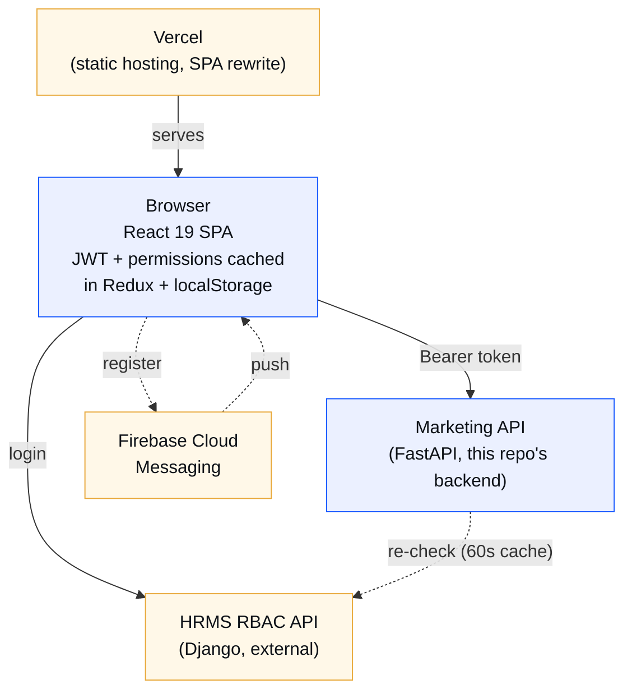

**Caption**: The frontend is a static SPA hosted on Vercel with no server-side rendering and no backend-for-frontend — once the JS bundle loads, it talks to `HRMS RBAC` and `Marketing API` directly from the browser, each on its own configured base URL. There is no proxy layer to add auth headers or hide either backend's existence; both base URLs are public in the shipped JS bundle by necessity (`VITE_*` env vars are inlined at build time, not runtime secrets).

> **Not obvious from the diagram**: the Marketing API does **not** independently issue or verify JWTs — it forwards the caller's HRMS token straight back to HRMS (`GET /user/info/`, `POST /check-permission/`) and caches the result in-process for 60 seconds per `(token, permission_code)` pair. A demoted user's access can persist for up to that window.
>
> `VITE_*` env vars are baked into the static build at Vercel build time — changing `VITE_API_BASE_URL` requires a redeploy, not just an env var change on a running server (there is no running server).

## 5. Data Flow
<!-- keywords: data flow, request lifecycle, sequence diagrams -->

### Flow A — Login and permission-gated page load
<!-- keywords: login flow, authentication flow, auth, jwt, session -->
1. `LoginPage.tsx` submits credentials → `store/slices/authSlice.ts`'s `login` thunk → `lib/hrms-rbac.ts`'s `hrmsRBACClient.login()` → HRMS RBAC `/login/`.
2. On success, the thunk stores `token`, `user`, `employee`, `roles`, `permissions` in Redux, mirrors them to `localStorage`, and separately fetches/stores the "marketing scope" (domain/region context) via `fetchAndStoreMarketingScope` → `lib/marketing-scope.ts` (localStorage cache used by pages for scope-aware defaults).
3. `App.tsx` renders the route tree inside `ProtectedRoute`, which reads `isAuthenticated` from Redux; most pages additionally gate individual buttons/actions with `useAppSelector(selectHasPermission('marketing.xxx'))` rather than blocking the whole route.
4. Every subsequent `marketingAPI.*` call (`lib/marketing-api.ts` → `lib/api.ts`'s `apiClient`) attaches `Authorization: Bearer <token>`. On any 401, `lib/api.ts` dispatches a `window` event `auth:token-expired`, which `store/index.ts` listens for and forwards into `store/middleware.ts`'s `authMiddleware`, forcing logout.

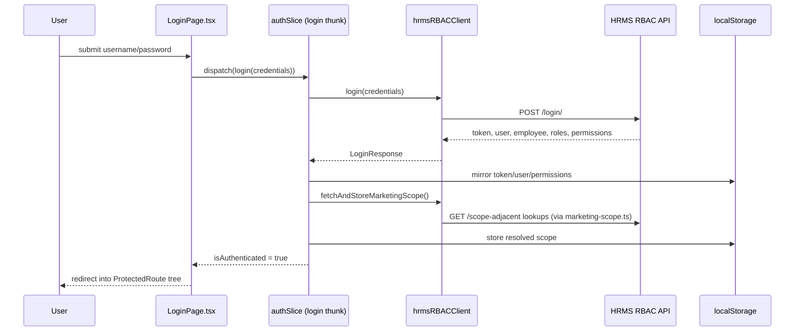

**Caption**: Two separate localStorage writes happen on login — one for the auth/permission state (read by `authSlice` selectors app-wide) and one for the "marketing scope" cache (read only by create-form pages for defaulting). They're independent caches with independent staleness risk; a stale scope cache doesn't log anyone out, it just mis-defaults a form field.

### Flow B — Creating a lead with a quote number (the "Inquiry 0" flow)
<!-- keywords: lead creation, create lead, inquiry 0, quote number, quote placeholder -->
1. `pages/LeadFormPage.tsx` build a `CreateLeadRequest` payload; if the user generated/typed a quote number but did **not** attach a file in the same step, `skip_quote_placeholder` is left `false`/unset.
2. `marketingAPI.createLead()` → `POST /api/leads/` → `au-marketing-api/app/routers/leads.py::create_lead`.
3. `require_permission("marketing.create_lead")` (FastAPI dependency, `app/dependencies.py`) validates the bearer token and permission against HRMS (or the 60s cache).
4. The router resolves domain/region from the linked contact/customer, assigns a lead number from a numbering `Series` if configured, and — new in this version — if a quote number was set and `skip_quote_placeholder` wasn't sent, auto-creates an `Activity` row with `inquiry_number=0`, `activity_type="system_quote"` (a placeholder log entry so the number can be attached to later without retyping it).
5. Response returns the created `Lead` (with joined `contact`/`customer`/`plant`); the frontend renders it and, on the enquiry log, the Inquiry 0 row renders with a "System" badge and an "Attach" action wired to `uploadLeadActivityAttachments`.

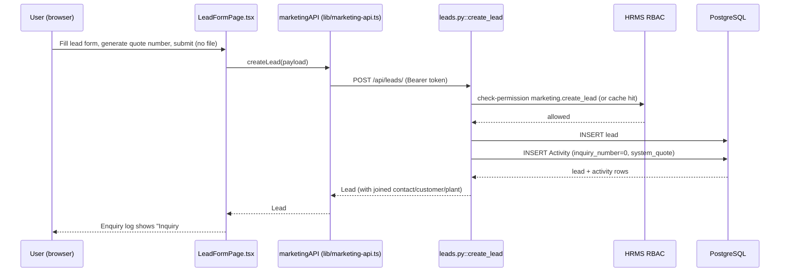

### Flow C — Role-scoped list query (e.g. Leads list)
<!-- keywords: scoping, role scoping, visibility, query filtering, rbac vs scope -->
1. `GET /api/leads/` hits `leads.py`'s list endpoint, gated by `require_permission("marketing.view_lead")`.
2. The handler calls `get_user_scope(db, user_id, user_data, employee_id)` (`app/scope.py`) which walks: is the caller a superuser? a domain head/coordinator? a region head? a supervisor? an assigned employee? — returning a `UserScope(scope_type, domain_ids, region_ids, ...)`.
3. `apply_scope_to_lead_query(query, Lead, scope, user_id)` adds `WHERE domain_id IN (...)` / `region_id IN (...)` / `OR created_by_employee_id = user_id OR assigned_to_employee_id = user_id` clauses depending on `scope_type` — an `employee` never sees another employee's leads unless assigned; a `region_head` sees the whole region regardless of creator.
4. Results are additionally decorated per-row with computed fields (`last_activity_date`, `quote_value`, `quotation_count`, `lost_reason`) before being returned as a `PaginatedResponse`.

### Flow D — Settings live-reload
<!-- keywords: settings, visibility settings, live reload, settings version -->
1. Any Marketing API response includes header `X-Marketing-Settings-Version` (set from the single-row `MarketingSettings.settings_version`).
2. `lib/api.ts` compares it against the last-seen value; on change it dispatches a `marketing:settings-version-changed` window event.
3. Settings-dependent UI (e.g. Domains visibility filtering) listens for that event and reloads, so an admin changing `Settings → Visibility` propagates to other open tabs/users without a manual refresh.

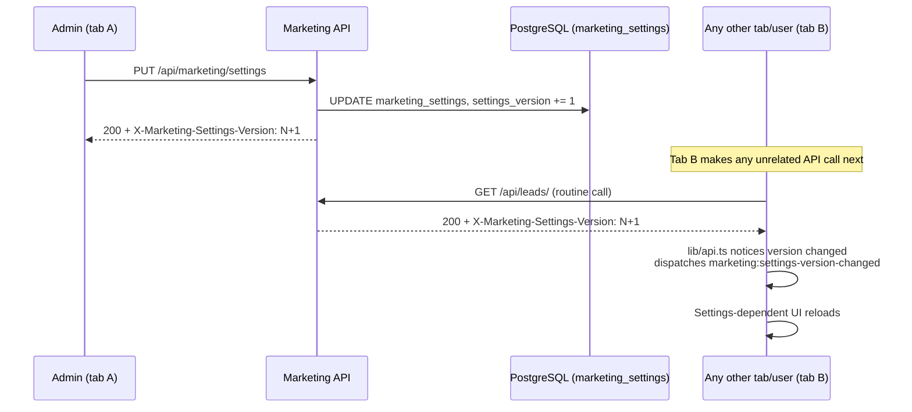

**Caption**: Propagation isn't a push — tab B only notices the version bump on its *next* unrelated API call, piggybacking the version check onto every response header. A tab that makes no calls for a while won't see the change until it does.

### Flow E — Web push registration and delivery
<!-- keywords: push notifications, firebase, fcm, web push, service worker -->
1. `App.tsx` calls `lib/firebase-push.ts`'s registration flow on load, if `VITE_FIREBASE_*` vars are set: requests browser notification permission, registers `public/firebase-messaging-sw.js` as a service worker, gets an FCM token.
2. `marketingAPI.registerNotificationDevice(token)` → `POST /api/notifications/devices/register` persists the token in `notification_devices`, keyed by `user_employee_id`.
3. Later, the backend scheduler (Backend Flow, §5) or a notification-creating router calls `push_notifications.send_web_push()`, which multicasts via Firebase Admin SDK to every stored token for that user.
4. The service worker receives the push and shows a browser notification even if the tab isn't focused; a foreground handler in the app also plays a Web Audio API beep as a fallback if the OS notification sound doesn't fire.

## 6. Key Modules / Files Reference (Frontend)
<!-- keywords: key modules, file reference, module responsibilities, where is this used -->

| File / Module | Responsibility | Depends on | Depended on by | Shown in |
|---|---|---|---|---|
| `lib/api.ts` | Base `APIClient`: fetch wrapper, Bearer injection, `ApiError`, 401→logout event, upload progress (XHR), settings-version header tracking | `VITE_API_BASE_URL`/`VITE_HRMS_RBAC_API_URL` env | `lib/marketing-api.ts`, `lib/hrms-rbac.ts` | §4 Architecture (Bearer token edge); §5 Flow A step 4; §5 Flow D |
| `lib/marketing-api.ts` | The `marketingAPI` singleton — 189 typed methods covering every business endpoint, plus every request/response TS interface (92 interfaces, 5 types) | `lib/api.ts` | Nearly every page — see dependency tiers below | §5 Flow B; Frontend module dependency graph (§6) |
| `lib/hrms-rbac.ts` | `hrmsRBACClient` — login, JWT, permissions/roles/user/employee lookups against HRMS; `resolveHrmsMediaUrl()` | `lib/api.ts` | `authSlice`, LoginPage, RolesPage, EmployeesPage, DSRPage, LiveActivityPage, MyTeamPage, SettingsPage | §5 Flow A sequence diagram; Frontend module dependency graph (§6) |
| `lib/firebase-push.ts` | FCM registration/token flow; no-ops if Firebase env vars unset | Firebase env vars, `lib/marketing-api.ts` (`registerNotificationDevice`) | `App.tsx` only (not imported by any page directly) | §4 Architecture (FCM node); §5 Flow E |
| `lib/marketing-scope.ts` | localStorage cache of the resolved domain/region scope | — | Many create-form pages (defaulting) | §5 Flow A step 2 |
| `lib/utils.ts` | `cn()` — `twMerge(clsx(...))` | clsx, tailwind-merge | Almost every component; zero intra-`lib/` imports (leaf module) | Frontend module dependency graph (§6) |
| `lib/api-cache.ts` | In-memory TTL cache (5 min default) | — | ReportsPage, MyTeamPage | — |
| `lib/auth-utils.ts` | Direct-localStorage auth checks; contains an explicit XSS-risk warning comment referencing a `SECURITY.md` that **does not exist** in the repo (see §12) | — | Route guards | §12 Security Notes (item 8/9) |
| `lib/paste-sanitizer.ts` | Global paste listener normalizing "fancy Unicode" text app-wide | — | Mounted once at app root | — |
| `lib/name-phone-utils.ts` | Parse/serialize "Mr. John Doe" / "+91 98765..." | `lib/country-codes.ts` | ~10 pages | Frontend module dependency graph (§6) |
| `store/slices/authSlice.ts` | Auth/permission state + selectors (`selectHasPermission` etc.) — the heaviest slice, touching 5 different `lib/` modules (`hrms-rbac`, `api`, `marketing-api`, `auth-utils`, `marketing-scope`) | `lib/hrms-rbac.ts`, `lib/api.ts`, `lib/marketing-api.ts`, `lib/auth-utils.ts`, `lib/marketing-scope.ts` | Every gated component | §5 Flow A sequence diagram; Frontend module dependency graph (§6); §12 Security Notes (item 8) |
| `store/slices/organizationPlantsSlice.ts` | Cache of plants per organization | `lib/marketing-api.ts` (type only) | `OrganizationFormPage.tsx` only | Frontend module dependency graph (§6) |
| `store/slices/dsrSlice.ts` | Cached DSR tasks | `lib/hrms-rbac.ts` (type only) | `components/ui/Navbar.tsx` only — no page imports it directly | Frontend module dependency graph (§6) |
| `store/middleware.ts` | Forces logout on `auth/tokenExpired` action | `authSlice` | `store/index.ts` | §4 Architecture (401 handling note) |
| `components/ProtectedRoute.tsx` | Route guard: auth + optional single/any/all permission props | `authSlice` selectors | `App.tsx` | §5 Flow A step 3 |
| `components/ui/CurrencyInput.tsx` | Indian-comma-formatted numeric input, cursor-position-preserving | `components/ui/Input.tsx` | 18 usages across 5 files: `DomainsPage.tsx`, `LeadsPage.tsx`, `OrderFormPage.tsx`, `EventDetailPage.tsx`, `LeadFormPage.tsx` | — |
| `components/ui/Select.tsx`, `DataTable.tsx`, `Modal.tsx` | Core reusable primitives used across nearly all pages | `lib/utils.ts` | Most pages | — |
| `hooks/usePresence.ts` | Presence heartbeat (30s + on route change) | `lib/marketing-api.ts` (`pingPresence`) | `DashboardLayout` | — |
| `constants.tsx` | Shared option lists (name prefixes, country codes, industries), `DEFAULT_LEAD_SERIES_STORAGE_KEY` | — | Many form pages | — |

**Note — duplicated component names**: `Badge`, `Breadcrumb`, `Button`, `Card`, `Input`, `Modal`, `Pagination`, `SegmentToggle`, `Select` all exist as **two independent implementations**, one under `components/ui/` and one under `UI/`. `UI/DatePicker.tsx` is the one exception — it just re-exports `components/ui/DatePicker.tsx`. Pages import from whichever path they were originally written against; this is not a bug, but it means "the Button component" is ambiguous without checking the import path.

**Note — three pages consume no `lib/` or `store/` code at all**: `FinancialsPage.tsx`, `InventoryPage.tsx`, and `QuotationsPage.tsx` pull only mock data from `useApp()` (`App.tsx`) — they are the odd ones out in an otherwise `marketing-api`-driven page set (see §13, all three are placeholder/orphaned).

### Frontend module dependency graph
<!-- keywords: dependency graph, module graph, import graph, what depends on what -->

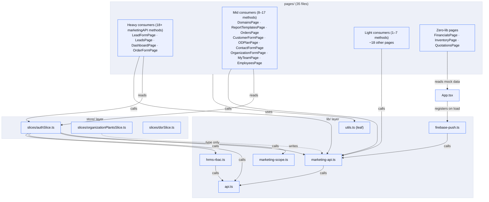

**Caption**: `marketing-api.ts` is the single real chokepoint of the frontend — every page except the 3 mock pages routes through it, and it itself has exactly one dependency (`api.ts`). `authSlice.ts` is the heaviest single file in the store layer, touching 5 different `lib/` modules; the other two slices are narrow (one type-only import each). `firebase-push.ts` is only ever wired up once, at `App.tsx`, never per-page.

## 7. Data Models (Frontend)
<!-- keywords: data models, typescript interfaces, redux store shape -->

The frontend has no local database — its "data models" are the TypeScript interfaces in `lib/marketing-api.ts` mirroring backend Pydantic schemas (92 top-level `interface`s, 5 `type`s). The most-used ones: `Lead`, `LeadActivity`, `LeadActivityAttachment`, `Order`, `OrderActivity`, `OrderActivityAttachment`, `Domain`, `Region`, `Organization`, `Contact`, `Customer`, `Plant`, `Series`, `Campaign`. See Backend §7 for the authoritative schema these mirror.

Redux store shape (`store/index.ts`):
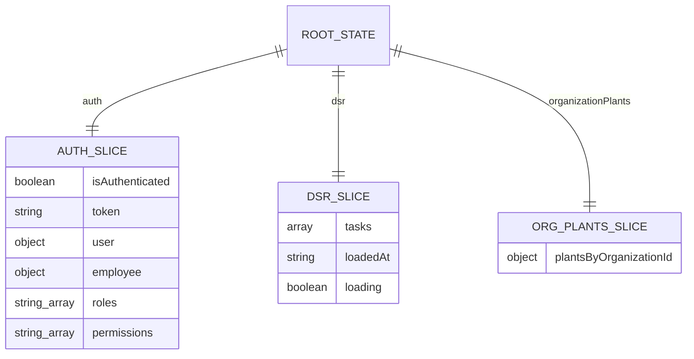

## 8. APIs / Endpoints (Frontend)
<!-- keywords: apis, endpoints, marketingapi methods, consumed endpoints -->

The frontend is purely a **consumer** of the endpoints documented in full under Backend §8 — it exposes none of its own. `lib/marketing-api.ts` wraps all 193 backend endpoints in typed methods (one method per endpoint, roughly), plus `lib/hrms-rbac.ts` wraps the HRMS RBAC endpoints (`/login/`, `/user/info/`, `/check-permission/`, `/employees/`, `/departments/`, `/designations/`, `/logout/`).

## 9. Environment & Config (Frontend)
<!-- keywords: env vars, environment variables, config, vite env -->

| Var | Required? | Purpose |
|---|---|---|
| `VITE_API_BASE_URL` | Yes (defaults to `http://localhost:8003` in `.env.example`) | Marketing API base URL |
| `VITE_HRMS_RBAC_API_URL` | Yes | HRMS RBAC API base URL |
| `VITE_FIREBASE_API_KEY` | No | Firebase web push — feature no-ops if unset. Not a secret by design (Firebase web config identifies the project, doesn't authorize privileged access) |
| `VITE_FIREBASE_AUTH_DOMAIN` | No | ″ |
| `VITE_FIREBASE_PROJECT_ID` | No | ″ |
| `VITE_FIREBASE_STORAGE_BUCKET` | No | ″ |
| `VITE_FIREBASE_MESSAGING_SENDER_ID` | No | ″ |
| `VITE_FIREBASE_APP_ID` | No | ″ |
| `VITE_FIREBASE_VAPID_KEY` | No | ″ |

`.env.example` matches exactly what's referenced in code — nothing missing either direction (verified by grep). Confirmed clean of any backend-only secret accidentally getting a `VITE_` prefix (see §12).

## 10. Setup & Run Instructions (Frontend)
<!-- keywords: setup, install, run, npm scripts, how to run -->

```bash
cp .env.example .env        # then fill in VITE_API_BASE_URL / VITE_HRMS_RBAC_API_URL
npm install
npm run dev                 # Vite dev server on :3000
npm run build                # tsc && vite build (typecheck is part of build)
npx tsc --noEmit             # typecheck only, faster than a full build
npm run test                 # Vitest watch mode
npm run test:run             # Vitest single run (CI)
npm run test:ui              # Vitest UI
npx vitest run path/to/file.test.ts   # single test file
```
No lint/format script exists — there is no ESLint/Prettier config in this repo. Deployment is Vercel — no explicit build/deploy script found in this repo beyond `vercel.json`'s rewrite rule, implying Vercel's default `npm run build` auto-detection is relied on.

## 11. External Integrations & Dependencies (Frontend)
<!-- keywords: integrations, third-party services, external apis -->

| Integration | Where | Notes |
|---|---|---|
| Marketing API | `lib/marketing-api.ts` / `lib/api.ts` | Primary business-data backend, direct browser calls |
| HRMS RBAC | `lib/hrms-rbac.ts` | Auth/roles/permissions, direct browser calls |
| Firebase Cloud Messaging | `lib/firebase-push.ts`, `public/firebase-messaging-sw.js` | Optional web push; silently disabled if env vars unset |
| OneSignal (legacy) | `lib/notification-permission.ts` | Requests browser notification permission via `window.OneSignalDeferred` after login — appears to be a legacy/parallel path alongside FCM, not removed |
| Vercel | `vercel.json` | Static hosting + SPA rewrite |

---

## Backend (`au-marketing-api`)
<!-- keywords: backend, fastapi app, python service, marketing api -->

## 4. Architecture Overview
<!-- keywords: architecture, system design, backend architecture, container topology -->

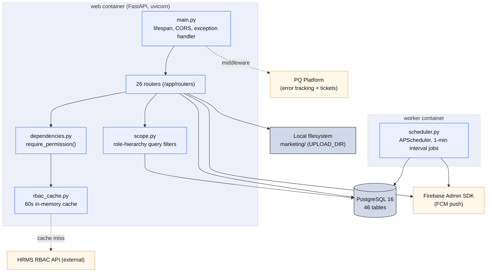

> **Not obvious from the diagram**: all 46 SQLAlchemy models live in one file (`app/models.py`, 1408 lines); schema is created primarily via `Base.metadata.create_all()` at startup plus a hardcoded list of `ALTER TABLE ... ADD COLUMN IF NOT EXISTS` statements — Alembic exists but is a secondary/catch-up mechanism (only 3 migrations exist, see §10).
>
> `require_permission(code)` is a dependency **factory** — every protected route declares its own permission string; a `super_admin`/staff user bypasses the check entirely.
>
> File uploads are stored on **local disk** under `UPLOAD_DIR` (currently `marketing/` per this deployment's `.env`, not the code default of `media/` — see §12 for why this matters), never S3.

### Deployment / infrastructure diagram
<!-- keywords: deployment, ci/cd, docker compose, ec2, github actions, infra -->

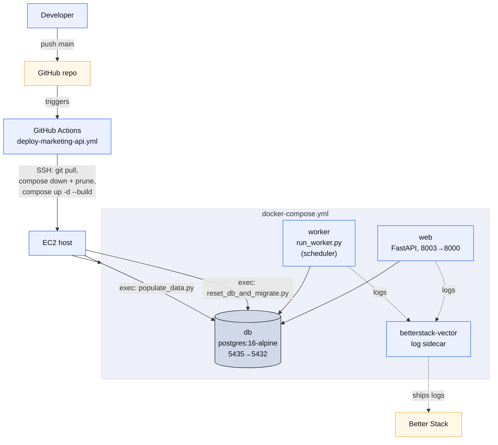

**Caption**: Deploy is push-to-main triggered, fully automated, no manual approval gate. The two `docker compose exec` steps after bring-up are the critical ones: `reset_db_and_migrate.py` — per its own script comment — drops the entire `public` schema (every table, including `alembic_version`) and rebuilds it from migrations, then `populate_data.py` reseeds reference/sample data. **This runs on every single push to `main`.** See §12 for why this is flagged as the top security/operational risk in this document, not a minor process note.

## 5. Data Flow (Backend)
<!-- keywords: data flow, backend flows, request lifecycle -->

### Flow — Permission check on every request
<!-- keywords: permission check, rbac, require_permission, auth dependency -->
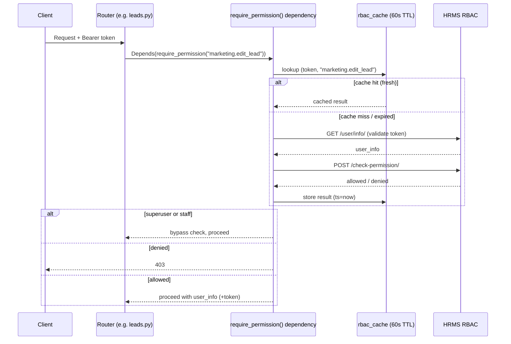

### Flow — Lead → Won → Order conversion
<!-- keywords: won, lost, order conversion, lead to order, closed value -->
1. `PUT /api/leads/{lead_id}` moves a lead to a status with `is_final=True`; requires `closed_value`, optionally a backdated `closed_at` (requires `marketing.create_lead` permission specifically, checked inline — not just `edit_lead`).
2. Frontend (or a follow-up call) then `POST /api/orders/` with `lead_id`, `domain_id`; `orders.py` auto-numbers via `ORDER_SERIES_CODE` if configured and creates the `Order` row linked back to the `Lead`.
3. Orders get their own independent `OrderActivity`/`OrderActivityAttachment` inquiry log (separate `inquiry_number` sequence from the originating lead's).

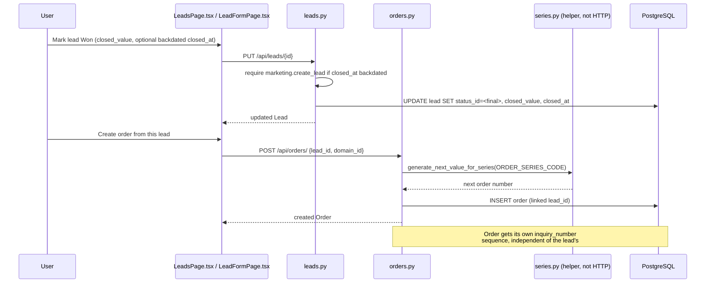

### Flow — Scheduled follow-up notification
<!-- keywords: scheduler, background job, follow-up, apscheduler, notification -->
1. `worker` container's `run_worker.py` starts `app/scheduler.py`'s `BackgroundScheduler`.
2. Every 1 minute, `run_follow_up_notifications` queries `Lead` rows where `next_follow_up_at <= now()` and status isn't final/lost.
3. For each, creates a `Notification` row for creator + assignee, calls `push_notifications.send_web_push()` (Firebase Admin, multicast to all `NotificationDevice` tokens for that user), then advances `next_follow_up_at` per `follow_up_reminder_type` (once/daily/weekly/monthly/status_duration).

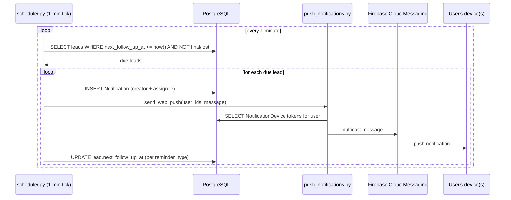

### Flow — Scheduled travel reminder (exhibition events)
<!-- keywords: travel reminder, events, scheduler, exhibition -->
1. Same `scheduler.py`, second 1-minute job: `send_travel_reminders`.
2. Finds active `ExhibitionEvent` rows where `travel_days_before > 0` and `travel_notification_sent == False`.
3. Computes `departure_date = start_date - travel_days_before`; if that's today, notifies every employee in `selected_employee_ids` (in-app `Notification` + FCM push), then sets `travel_notification_sent = True` so it never re-fires for that event.

### Flow — Quotation/attachment upload with auto-numbering
<!-- keywords: quotation upload, attachment, auto-numbering, series, revision -->
1. `POST /api/leads/{lead_id}/activities/{activity_id}/attachments` (creator-only) accepts one or more files plus per-file `attachment_types`, optional `quotation_numbers`, `series_code`, `is_revised`.
2. If `is_revised=true`, the router looks up the lead's existing base quotation number and assigns the next revision suffix — no series involved.
3. Otherwise, if a `series_code` is given, `generate_next_value_for_series()` (`series.py`) produces a fresh number per the series' pattern (supports `{lead.company}`/`{lead.company_slug}` placeholders).
4. Files are written to disk via `storage.py`'s `StorageManager` under `UPLOAD_DIR`, and `ActivityAttachment` rows are inserted with `is_quotation`, `quotation_number`, `quote_value`.
5. If the lead's status has `set_when_quotation_added=True`, the router can auto-transition the lead's status as a side effect of the upload.

### Flow — Event file upload with vendor revisioning
<!-- keywords: event file upload, vendor, revision, stall design -->
1. `POST /api/events/{event_id}/files` accepts a file, `file_type` (stall_design/banner_design/travel_ticket/local_travel_proof), and context (`vendor_id`, `employee_id`, or `entry_index` depending on type).
2. For `stall_design` specifically, the router auto-increments `revision_no` per vendor — repeated uploads for the same vendor create sequential revisions rather than overwriting.
3. File is written via `storage.py`, `EventFile` row inserted, linked back to the parent `ExhibitionEvent`.

## 6. Key Modules / Files Reference (Backend)
<!-- keywords: key modules, file reference, module responsibilities, core files -->

| File | Responsibility | Depends on | Depended on by | Shown in |
|---|---|---|---|---|
| `app/main.py` | App instantiation, CORS, lifespan (startup DB migration shims, HRMS connectivity check, PQ init, conditional scheduler start), global exception handler, router registration | All routers, `database.py`, `rbac.py`, `config.py`, `version.py` | Entry point (`uvicorn app.main:app`) | §4 Architecture (top of diagram); §4 Deployment diagram |
| `app/config.py` | `Settings` (pydantic-settings) — every env var | `.env` | Almost every module — zero internal `app.*` imports itself | §9 Environment & Config |
| `app/database.py` | SQLAlchemy engine, `SessionLocal`, `Base`, `get_db()` dependency | `config.py` | Every router, `models.py` | Backend module dependency graph (§6) |
| `app/models.py` | All 46 ORM models (1408 lines) | `database.py` | Every router | §7 Data Models (both ER diagrams) |
| `app/schemas.py` | 75 Pydantic request/response models (1397 lines) | — | 19 of 27 router files (the rest are GET-only/no-body) | §12 Security Notes (input validation, 🟢 item) |
| `app/rbac.py` | `HRMSRBACClient` — login/user-info/check-permission/employees/departments/designations/logout against HRMS | `config.py` | `dependencies.py`, `main.py`, `auth.py`, `employees.py`, `presence.py`, `leads.py`, `quotations.py`, `regions.py` | §5 Flow — Permission check sequence diagram |
| `app/rbac_cache.py` | In-process token→permission cache, 60s TTL, `asyncio.Lock`-guarded | `config.py` | `dependencies.py`, `auth.py` | §5 Flow — Permission check sequence diagram; §13 (60s-vs-5min gap) |
| `app/dependencies.py` | `require_permission`, `require_any_permission`, `get_current_user`, `get_authenticated_user`, `require_assign_dashboard_or_super_admin` | `models.py`, `schemas.py`, `settings_utils.py`, `database.py`, `rbac.py`, `rbac_cache.py`, `config.py` | Every router | §4 Architecture; §5 Flow — Permission check sequence diagram |
| `app/scope.py` | `get_user_scope`, `apply_scope_to_*_query`, `can_access_*` | `models.py` only — the narrowest core module | 15 of 26 routers (auth, contacts, customers, dashboard, domains, leads, organizations, orders, quotations, regions, saved_dashboards); **not** used by audit_logs, campaigns, employees, notifications, plants, report_templates, reports, schema, series, settings, tasks, tickets, whats_new | §5 Flow C (frontend-documented, backend-implemented); Backend module dependency graph (§6) |
| `app/scheduler.py` | APScheduler job definitions | `database.py`, `models.py`, `push_notifications.py`, `lead_display.py` | `run_worker.py`, conditionally `main.py` | §5 Flow — Scheduled follow-up + travel reminder sequence diagrams; §4 Deployment diagram |
| `app/push_notifications.py` | Firebase Admin wrapper, lazily initialized | `config.py` (`FIREBASE_SERVICE_ACCOUNT_PATH`) | `scheduler.py`, `events.py`, notification-creating routers | §5 Flow — Scheduled follow-up notification sequence diagram |
| `app/storage.py` | `StorageManager` — local filesystem read/write/delete for attachments | `config.py` (`upload_dir_path`) | `leads.py`, `orders.py`, `events.py`, `quotations.py` | §5 Flow — Quotation/attachment upload; §12 Security Notes (item 4) |
| `app/audit_utils.py` | `log_action()` — writes `AuditLog` rows | `database.py`, `models.py` | Most create/edit/delete/won actions across 14 routers (inline imports) | §7 Supporting tables (`AUDIT_LOG`) |
| `app/settings_utils.py` | Visibility-settings defaults + versioning | `models.py`, `schemas.py` | `settings.py`, `dependencies.py`, `dashboard.py`, `domains.py`, `regions.py`, `main.py` startup | §5 Flow D (Settings live-reload, frontend side) |
| `app/lead_display.py` | `lead_display_name()` formatting helper | — (only `TYPE_CHECKING`-guarded import of `models.Lead`) | `scheduler.py`, `leads.py`, `quotations.py`, `tasks.py`, `reports.py` | — |

**Lightest router** (fewest core dependencies): `tickets.py` — only `database`, `dependencies`, `models`. No `scope`, `rbac`, `schemas`, `storage`, or `audit_utils` at all. **Heaviest**: `leads.py`, using `database`, `dependencies`, `models`, `schemas`, `scope`, `rbac`, `rbac_cache`, `config`, `storage`, `audit_utils` (inline), `lead_display`, plus helper functions imported directly from `series.py`, `reports.py`, and `notifications.py`.

### Backend module dependency graph (routers → core layer)
<!-- keywords: dependency graph, module graph, router dependencies, import graph -->

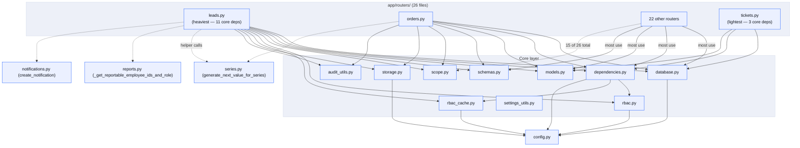

**Caption**: `scope.py` is deliberately narrow — it imports only `models.py`, nothing else — which is why it's safe for 15 of 26 routers to depend on without pulling in RBAC or storage concerns. The dashed inter-router edges are real function-level imports (not HTTP calls) — `leads.py` and `orders.py` both call `series.py`'s number-generation helper directly as a Python function, not via an internal API request.

## 7. Data Models / Database Schema (Backend)
<!-- keywords: data models, database schema, tables, sqlalchemy models, er diagram -->

**46 tables total.** Split into two diagrams for legibility — core business entities, then supporting/operational tables.

### Core business entities
<!-- keywords: core entities, lead, order, domain, region, contact, customer -->

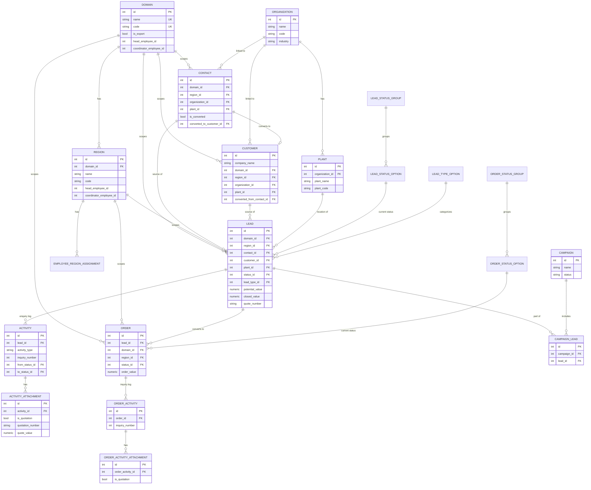

**Caption**: 21 of the 46 tables. This is the pipeline everything else in the app orbits — a `Lead` flows from a `Contact`/`Customer` through its `Activity` log to either an `Order` (converts) or stays open/lost, all scoped by `Domain`→`Region`. `ORGANIZATION`→`PLANT` is a separate hierarchy (physical company locations) that `CONTACT`/`CUSTOMER`/`LEAD` each optionally link into.

### Supporting & operational tables
<!-- keywords: targets, tasks, reports, dashboards, notifications, events, audit log, tickets, series -->

```mermaid
erDiagram
    DOMAIN ||--o{ DOMAIN_MONTHLY_TARGET : "has goal for"
    REGION ||--o{ REGION_MONTHLY_TARGET : "has goal for"
    DOMAIN ||--o{ MARKETING_EMPLOYEE : "cached in"
    REGION ||--o{ MARKETING_EMPLOYEE : "cached in"
    DOMAIN ||--o{ SAVED_DASHBOARD : scopes
    DOMAIN ||--o{ REPORT_TEMPLATE : scopes
    DOMAIN ||--o{ EXHIBITION_EVENT : scopes
    LEAD ||--o{ EMPLOYEE_TASK : "may relate to"
    LEAD_STATUS_GROUP ||--o{ EMPLOYEE_TASK : "duration source for"
    LEAD ||--o{ EXPECTED_ORDER_REPORT_LEAD : "included in"
    EXPECTED_ORDER_REPORT ||--o{ EXPECTED_ORDER_REPORT_LEAD : contains
    OD_PLAN_REPORT ||--o{ OD_PLAN_ENTRY : contains
    CONTACT ||--o{ OD_PLAN_ENTRY : "visit target"
    SAVED_DASHBOARD ||--o{ SAVED_DASHBOARD_ASSIGNMENT : "shared with"
    REPORT_TEMPLATE ||--o{ REPORT_TEMPLATE_ASSIGNMENT : "shared with"
    EXHIBITION_EVENT ||--o{ EVENT_FILE : has

    EMPLOYEE_MONTHLY_TARGET {
        int id PK
        int employee_id "not FK — HRMS ref"
        int year
        int month
        numeric target_amount
    }
    REGION_MONTHLY_TARGET {
        int id PK
        int region_id FK
        int year
        int month
        numeric target_amount
    }
    DOMAIN_MONTHLY_TARGET {
        int id PK
        int domain_id FK
        int year
        int month
        numeric target_amount
    }
    EMPLOYEE_TASK {
        int id PK
        int employee_id "not FK"
        string title
        date due_date
        string source
        int lead_id FK
        int lead_status_group_id FK
    }
    EXPECTED_ORDER_REPORT {
        int id PK
        int employee_id "not FK"
        int year
        int month
    }
    EXPECTED_ORDER_REPORT_LEAD {
        int id PK
        int report_id FK
        int lead_id FK
    }
    OD_PLAN_REPORT {
        int id PK
        int employee_id "not FK"
        int year
        int month
    }
    OD_PLAN_ENTRY {
        int id PK
        int report_id FK
        date plan_date
        string entry_type
        int contact_id FK
    }
    SAVED_DASHBOARD {
        int id PK
        string name
        json config
        int domain_id FK
        int created_by_employee_id "not FK"
    }
    SAVED_DASHBOARD_ASSIGNMENT {
        int id PK
        int dashboard_id FK
        int assignee_employee_id "not FK"
        string role
        bool can_edit
    }
    REPORT_TEMPLATE {
        int id PK
        string name
        json config
        int domain_id FK
    }
    REPORT_TEMPLATE_ASSIGNMENT {
        int id PK
        int template_id FK
        int assignee_employee_id "not FK"
        bool can_edit
    }
    MARKETING_EMPLOYEE {
        int id PK
        int hrms_employee_id UK
        string role
        int domain_id FK
        int region_id FK
        bool synced_from_hrms
    }
    MARKETING_SETTINGS {
        int id PK
        json config
        int settings_version
    }
    MARKETING_SETTINGS_AUDIT_LOG {
        int id PK
        int changed_by_employee_id "not FK"
        json old_config
        json new_config
    }
    CHANGELOG_VERSION {
        int id PK
        string version
        string release_date
        json sections
    }
    EXHIBITION_EVENT {
        int id PK
        int domain_id FK
        string type
        string status
        numeric budget
        json selected_employee_ids
        json local_travel_entries
        json gifting_entries
    }
    EVENT_FILE {
        int id PK
        int event_id FK
        string file_type
        int revision_no
        bool is_selected
    }
    AUDIT_LOG {
        int id PK
        int employee_id "not FK"
        string action
        string entity_type
        int entity_id "polymorphic, not FK"
    }
    SUPPORT_TICKET {
        int id PK
        int user_employee_id "not FK"
        string ticket_id "PQ Platform ref"
        string ticket_type
        int rating
    }
    USER_EMAIL_CONNECTION {
        int id PK
        int hrms_user_id UK
        string email
        text refresh_token
    }
    USER_NOTIFICATION_PREFERENCE {
        int id PK
        int user_employee_id UK
        int times_per_day
        string preferred_times
    }
    NOTIFICATION {
        int id PK
        int user_employee_id "not FK"
        string title
        int lead_id "not FK"
        timestamp read_at
    }
    NOTIFICATION_DEVICE {
        int id PK
        int user_employee_id "not FK"
        string fcm_token UK
        string platform
    }
    SERIES {
        int id PK
        string name
        string code UK
        string pattern
        int next_value
        string reset_period
    }
```

**Caption**: 25 of the 46 tables — the operational/support layer. Two patterns worth naming: (1) most `employee_id`/`user_employee_id` columns here are **plain integers referencing HRMS, not real foreign keys** — this schema has no local `employees` table to point at (except the separate `marketing_employees` cache, which itself isn't FK'd from these either); (2) `AUDIT_LOG.entity_id` is intentionally polymorphic (paired with `entity_type` as a string) rather than a real FK, since it points at rows across many different tables. `SERIES` and `CHANGELOG_VERSION` are the only two fully standalone tables in the whole schema — referenced by code (`series_code` string columns, `CHANGELOG.md` sync) rather than any FK.

### Lead and Order status state machines
<!-- keywords: state machine, status, won, lost, lead status, order status, campaign status, event status -->

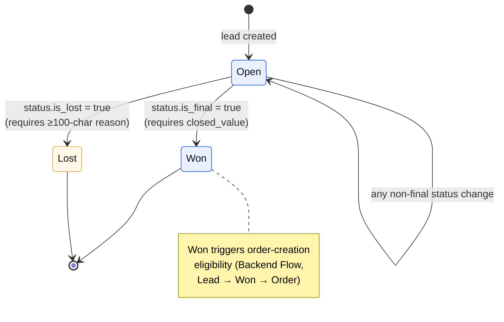

**Caption (Lead)**: `LeadStatusOption` rows are admin-configurable (no fixed enum in code) — "Open", "Won", "Lost" aren't literal database values, they're the *meaning* of the `is_final`/`is_lost` boolean flags an admin sets when defining a status. Any status without either flag set is functionally "open." A status can't be both `is_final` and `is_lost` in practice (checked as `is_final OR is_lost` for exclusion filters, never both together in the code paths reviewed).

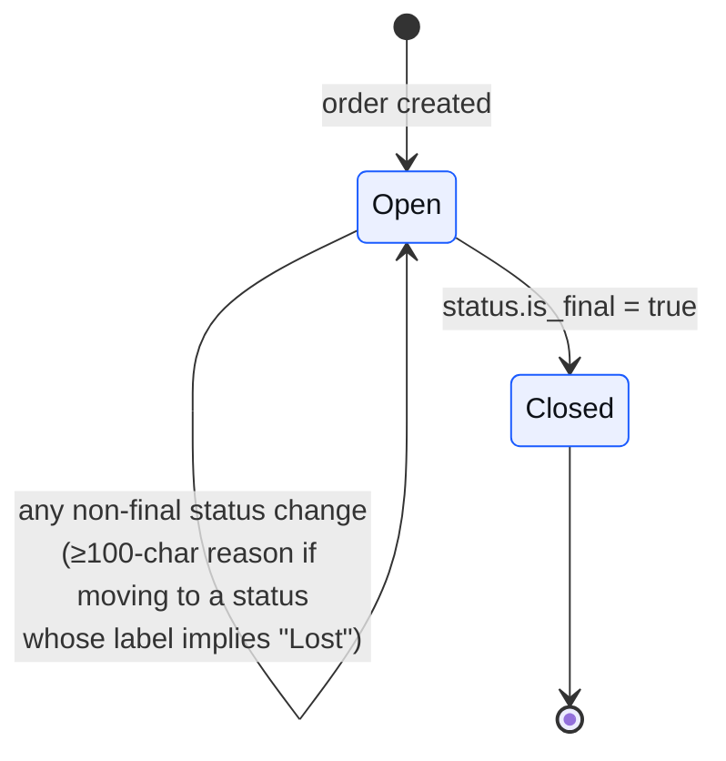

**Caption (Order)**: Simpler than Lead — `OrderStatusOption` has no `is_lost` flag at all, only `is_final`. The ≥100-char reason requirement is enforced by string-matching "lost" in the target status's label/code in `orders.py`, not a dedicated boolean column — a status named something that doesn't contain "lost" wouldn't trigger the reason requirement even if conceptually it means the order fell through.

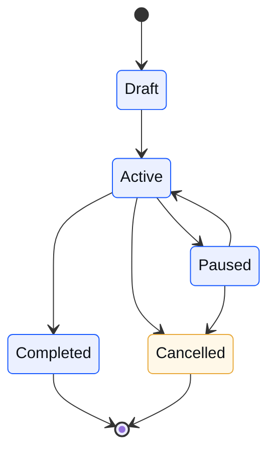

**Caption (Campaign)**: `CampaignStatus` (`app/models.py`) is a real Python `enum` — draft/active/paused/completed/cancelled — [CONFIRMED] unlike Lead/Order status, this one *is* a fixed set of values, not admin-configurable. [INFERRED] No router code was found enforcing which transitions are legal (e.g. nothing blocks `Draft → Completed` directly) — the diagram above shows the semantically sensible transitions, not a confirmed-enforced state machine; this is an absence-of-evidence conclusion, not a positive confirmation that no such check exists anywhere.

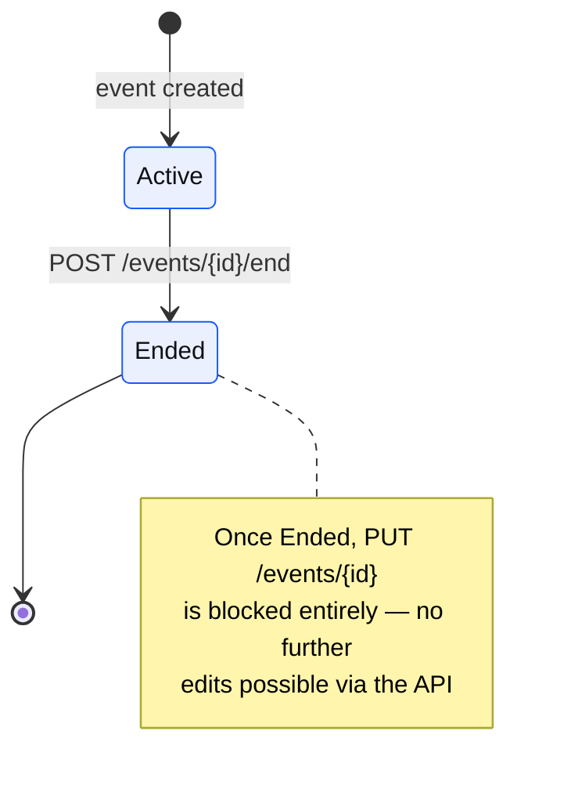

**Caption (Event)**: The simplest state machine in the app — two states, one explicit transition endpoint, and (unusually) the backend actively *enforces* it by rejecting further edits once `Ended`, rather than just tracking the flag passively like Lead/Order status do.

**Fragile note** [INFERRED — absence-of-evidence]: `space_booking_payment_status` (pending/partial/completed) is set once at event-creation time (defaults to `"pending"`) and **never updated by any backend code path found** — `PUT /events/{event_id}` doesn't touch it, confirmed by grepping every reference to the column in `app/routers/events.py`. The frontend computes the real-time status client-side from installment data (`totalPaid` vs `totalAmount` in `EventDetailPage.tsx`) and never writes it back. The DB column exists but is effectively decorative after creation — see §13.

## 8. APIs / Endpoints (Backend)
<!-- keywords: apis, endpoints, routes, rest api, all routers, permission requirements -->

**193 HTTP/WebSocket endpoints across 26 routers** (194 including the intentionally-commented-out `ai-generate-widget`). Full reference:

### `routers/auth.py` — mount `/api/auth`
| Method + Path | Purpose | Permission |
|---|---|---|
| POST `/login` | Login with HRMS credentials | none (public) |
| POST `/logout` | Logout, invalidate token | auth only |
| POST `/refresh-permissions` | Invalidate RBAC cache for current token | auth only |
| GET `/me` | Current user profile (`?refresh=1` forces HRMS reload) | auth only |
| GET `/scope` | Resolved marketing scope for prefilling forms | auth only |
| GET `/email-connection` | Gmail connect status | auth only |
| GET `/email/authorize-url` | Google OAuth2 authorization URL | auth only |
| GET `/email/callback` | OAuth callback, stores tokens | none — see §12, token travels via `state` query param |
| DELETE `/email` | Disconnect current user's connected email | auth only |

### `routers/settings.py` — mount `/api/marketing`
| Method + Path | Purpose | Permission |
|---|---|---|
| GET `/settings` | Get active marketing visibility settings (sets `X-Marketing-Settings-Version` header) | auth only — explicitly documented in code as intentional |
| PUT `/settings` | Update marketing visibility settings | `marketing.admin` |

### `routers/audit_logs.py` — mount `/api/audit-logs`
| Method + Path | Purpose | Permission |
|---|---|---|
| GET `/` | Paginated audit log list with filters | `marketing.admin` OR `marketing.view_reports` |

### `routers/whats_new.py` — mount `/api/whats-new`
| Method + Path | Purpose | Permission |
|---|---|---|
| GET `/` | List changelog versions, newest first | auth only |
| POST `/` | Create changelog version | `marketing.admin` |
| PUT `/{changelog_id}` | Update a changelog version | `marketing.admin` |
| DELETE `/{changelog_id}` | Delete a changelog version | `marketing.admin` |

### `routers/saved_dashboards.py` — mount `/api/saved-dashboards`
| Method + Path | Purpose | Permission |
|---|---|---|
| GET `/assignable-users` | List employees who can be assigned a dashboard | `marketing.assign_dashboard` OR `marketing.admin` |
| GET `` | List dashboards user created or is assigned to | `marketing.view_lead` |
| POST `` | Create a new saved dashboard | `marketing.create_dashboard` OR `marketing.admin` |
| GET `/{dashboard_id}` | Get one dashboard with executed widget data | `marketing.view_lead` + view-check |
| PATCH `/{dashboard_id}` | Update dashboard | `marketing.view_lead` + edit-check |
| DELETE `/{dashboard_id}` | Delete dashboard | creator-only or super admin |
| GET `/{dashboard_id}/assignments` | List assignments | `marketing.view_lead` + view-check |
| POST `/{dashboard_id}/assignments` | Assign dashboard to a user or role | assign perm or super admin |
| DELETE `/{dashboard_id}/assignments/{assignment_id}` | Remove an assignment | assign perm or super admin |
| POST `/preview-sql-template` | Preview a scoped SQL template safely | `marketing.view_lead` |
| POST `/execute-widget` | Execute a widget's data source (preset only; direct SQL disabled) | `marketing.view_lead` |

*(An `ai-generate-widget` endpoint exists in source but is fully commented out — inactive.)*

### `routers/report_templates.py` — mount `/api/report-templates`
| Method + Path | Purpose | Permission |
|---|---|---|
| GET `/assignable-users` | List employees assignable to a report template | assign perm or admin |
| GET `` | List templates user created or is assigned to | `marketing.view_lead` |
| POST `` | Create a report template | `marketing.create_dashboard` OR admin |
| GET `/{template_id}` | Get one template incl. executed `section_data` | `marketing.view_lead` + view-check |
| PATCH `/{template_id}` | Update template | `marketing.view_lead` + edit-check |
| DELETE `/{template_id}` | Delete template | creator-only or super admin |
| GET `/{template_id}/assignments` | List assignments | `marketing.view_lead` + view-check |
| POST `/{template_id}/assignments` | Assign report template to a user | assign-or-super-admin |
| DELETE `/{template_id}/assignments/{assignment_id}` | Remove a template assignment | assign-or-super-admin |

### `routers/schema.py` — mount `/api/schema`
| Method + Path | Purpose | Permission |
|---|---|---|
| GET `` | List all DB tables/columns/foreign keys | `marketing.view_lead` |

### `routers/quotations.py` — mount `/api/quotations`
| Method + Path | Purpose | Permission |
|---|---|---|
| GET `/` | List quotations, scoped by role | `marketing.view_lead` |
| GET `/lead-options` | Leads with ≥1 quotation | `marketing.view_lead` |
| GET `/filter-options` | Distinct industry / series values | `marketing.view_lead` |

### `routers/reports.py` — mount `/api/reports`
| Method + Path | Purpose | Permission |
|---|---|---|
| GET `/scope` | Which employees caller can report for | `marketing.view_report` OR `view_lead` |
| GET `/summary` | Report summary | `marketing.view_report` |
| POST `/expected-orders` | Create expected-order report | `marketing.create_report` |
| GET `/expected-orders` | List expected-order reports | `marketing.view_report` |
| GET `/od-plans` | List OD plan reports | `marketing.view_report` |
| GET `/od-plans/{year:int}/{month:int}` | Get one OD plan for a year/month | `marketing.view_report` |
| PUT `/od-plans/{year:int}/{month:int}` | Create/replace OD plan entries | `marketing.create_report` |

### `routers/dashboard.py` — mount `/api/dashboard`
| Method + Path | Purpose | Permission |
|---|---|---|
| GET `/target-stats` | Monthly target vs achieved | `marketing.view_lead` |
| PUT `/target` | Set employee monthly target | `marketing.view_lead` + scope check |
| PUT `/target/region` | Set/clear region monthly goal | `marketing.view_lead` + region-scope check |
| PUT `/target/domain` | Set/clear domain monthly goal | `marketing.view_lead` + domain-scope check |
| GET `/domain-target-summary` | Domain→Region→Employee target hierarchy | `marketing.view_lead` |
| GET `/scope-target-stats` | Aggregated scope-wide target vs achieved | `marketing.view_lead` |
| GET `/head-summary` | Region breakdown, hot cases, conversion ratio | `marketing.view_lead` |
| GET `/quotation-stats` | Region-wise quotation counts over time | `marketing.view_lead` |
| GET `/performer-of-month` | Top 5 performers this month | `marketing.view_lead` |

### `routers/tasks.py` — mount `/api/tasks`
| Method + Path | Purpose | Permission |
|---|---|---|
| GET `/today` | Today's tasks (auto-generates follow-ups) | `marketing.view_lead` |
| PATCH `/{task_id}/complete` | Mark a task complete | `marketing.view_lead` |
| POST `` | Create a manual task | `marketing.view_lead` |
| GET `/{task_id}` | Get a single task | `marketing.view_lead` |

### `routers/notifications.py` — mount `/api/notifications`
| Method + Path | Purpose | Permission |
|---|---|---|
| GET `/` | List notifications | `marketing.view_lead` |
| GET `/unread-count` | Unread count | `marketing.view_lead` |
| PATCH `/{notification_id}/read` | Mark one read | `marketing.view_lead` |
| PATCH `/read-all` | Mark all read | `marketing.view_lead` |
| GET `/preferences` | Get preferences (auto-creates) | `marketing.view_lead` |
| PUT `/preferences` | Update preferences | `marketing.view_lead` |
| POST `/devices/register` | Register FCM device token | `marketing.view_lead` |
| POST `/devices/unregister` | Unregister FCM token | `marketing.view_lead` |

### `routers/domains.py` — mount `/api/domains`
| Method + Path | Purpose | Permission |
|---|---|---|
| GET `/` | Paginated domain list (scoped) | `marketing.view_domain` |
| GET `/{domain_id}` | Get one domain | `marketing.view_domain` |
| POST `/` | Create domain | `marketing.create_domain` |
| PUT `/{domain_id}` | Update domain | `marketing.edit_domain` |
| DELETE `/{domain_id}` | Delete domain (cascades) | `marketing.delete_domain` |

### `routers/organizations.py` — mount `/api/organizations`
| Method + Path | Purpose | Permission |
|---|---|---|
| GET `/` | List organizations (scoped) | `marketing.view_organization` |
| GET `/{organization_id}` | Get one | `marketing.view_organization` |
| POST `/` | Create (optionally with plants) | `marketing.create_organization` |
| PATCH `/{organization_id}` | Update | `marketing.edit_organization` |
| DELETE `/{organization_id}` | Delete (+ plants) | `marketing.delete_organization` |
| GET `/{organization_id}/plants` | List plants | `marketing.view_organization` |
| POST `/{organization_id}/plants` | Add plant | `marketing.create_plant` |
| PATCH `/{organization_id}/plants/{plant_id}` | Update plant | `marketing.edit_plant` |
| DELETE `/{organization_id}/plants/{plant_id}` | Remove plant | `marketing.delete_plant` |

### `routers/regions.py` — mount `/api/regions`
| Method + Path | Purpose | Permission |
|---|---|---|
| GET `/` | Paginated region list (scoped) | `marketing.view_region` |
| GET `/{region_id}` | Get one | `marketing.view_region` |
| POST `/` | Create region | `marketing.create_region` |
| PUT `/{region_id}` | Update | `marketing.edit_region` |
| DELETE `/{region_id}` | Delete | `marketing.delete_region` |
| GET `/assignments/` | List employee↔region assignments | `marketing.view_region` OR `view_domain` |
| POST `/assign-employee` | Assign employee to region | assign perm or view perms + region-head check |
| GET `/assignments/{employee_id}` | Assignments for one employee | `marketing.view_region` OR `view_domain` |
| PUT `/assignments/{assignment_id}` | Update assignment | assign perm + region-head check |
| DELETE `/assignments/{assignment_id}` | Deactivate assignment | assign perm + region-head check |

### `routers/series.py` — mount `/api/series`
| Method + Path | Purpose | Permission |
|---|---|---|
| GET `/` | List numbering series | `marketing.admin`/`create_contact`/`create_customer`/`create_lead` |
| GET `/{series_id}` | Get one | `marketing.admin` |
| POST `/` | Create series | `marketing.admin` |
| PUT `/{series_id}` | Update series | `marketing.admin` |
| DELETE `/{series_id}` | Delete series | `marketing.admin` |
| POST `/{series_id}/generate-next` | Generate & commit next value by ID | `marketing.admin` |
| POST `/generate-next` | Generate & commit next value by code | `marketing.admin` OR `create_lead` |

### `routers/contacts.py` — mount `/api/contacts`
| Method + Path | Purpose | Permission |
|---|---|---|
| GET `/` | List contacts (scoped) | `marketing.view_contact` |
| GET `/search` | Search by email/phone/name/company | `marketing.view_contact` |
| GET `/{contact_id}` | Get one | `marketing.view_contact` |
| POST `/` | Create contact | `marketing.create_contact` |
| PUT `/{contact_id}` | Update | `marketing.edit_contact` |
| DELETE `/{contact_id}` | Delete (fails if converted) | `marketing.delete_contact` |
| POST `/{contact_id}/convert-to-customer` | Convert to customer | `marketing.create_customer` |

### `routers/customers.py` — mount `/api/customers`
| Method + Path | Purpose | Permission |
|---|---|---|
| GET `/` | Paginated customer list (scoped) | `marketing.view_customer` |
| GET `/search` | Search by company/linked contact | `marketing.view_customer` |
| GET `/{customer_id}` | Get one | `marketing.view_customer` |
| POST `/` | Create (optionally with plants) | `marketing.create_customer` |
| PUT `/{customer_id}` | Update | `marketing.edit_customer` |
| DELETE `/{customer_id}` | Delete | `marketing.delete_customer` |

### `routers/plants.py` — mount `/api/plants`
| Method + Path | Purpose | Permission |
|---|---|---|
| GET `/` | List plants by `contact_id` or `customer_id` | `marketing.view_contact` |

### `routers/employees.py` — mount `/api/employees`
| Method + Path | Purpose | Permission |
|---|---|---|
| GET `/` | Paginated employee list (proxied from HRMS) | `marketing.view_domain` |
| GET `/departments/` | Departments (HRMS) | `marketing.view_domain` |
| GET `/designations/` | Designations (HRMS) | `marketing.view_domain` |
| GET `/local/` | Paginated local cached employees | `marketing.view_domain` |
| GET `/local/{employee_id}` | Get one local employee | `marketing.view_domain` |
| PUT `/local/{employee_id}` | Update local employee record | `marketing.edit_region` |
| POST `/sync` | Sync from HRMS into local cache | `marketing.admin` |

### `routers/leads.py` — mount `/api/leads`
| Method + Path | Purpose | Permission |
|---|---|---|
| GET `/` | Paginated lead list, scoped, filterable | `marketing.view_lead` |
| GET `/statuses/` | List lead statuses | `marketing.view_lead` |
| POST `/statuses/` | Create lead status | `marketing.create_lead` |
| GET `/statuses/{status_id}` | Get one status | `marketing.view_lead` |
| PUT `/statuses/{status_id}` | Update status | `marketing.edit_lead` |
| DELETE `/statuses/{status_id}` | Delete status | `marketing.delete_lead` |
| GET `/status-groups/` | List status groups | `marketing.view_lead` |
| POST `/status-groups/` | Create status group | `marketing.create_lead` |
| GET `/status-groups/{group_id}` | Get one group | `marketing.view_lead` |
| PUT `/status-groups/{group_id}` | Update group | `marketing.edit_lead` |
| DELETE `/status-groups/{group_id}` | Delete group | `marketing.delete_lead` |
| GET `/types/` | List lead types | `marketing.view_lead` |
| POST `/types/` | Create type | `marketing.create_lead` |
| GET `/types/{type_id}` | Get one type | `marketing.view_lead` |
| PUT `/types/{type_id}` | Update type | `marketing.edit_lead` |
| DELETE `/types/{type_id}` | Delete type | `marketing.delete_lead` |
| GET `/through/` | List "lead through" options | `marketing.view_lead` |
| GET `/{lead_id}/activities/` | List enquiry log | `marketing.view_lead` + access check |
| POST `/{lead_id}/activities/` | Add enquiry log entry | `marketing.edit_lead` + access check |
| PUT `/{lead_id}/activities/{activity_id}` | Update activity (creator-only) | `marketing.edit_lead` |
| DELETE `/{lead_id}/activities/{activity_id}` | Delete activity (creator-only) | `marketing.edit_lead` |
| POST `/{lead_id}/activities/{activity_id}/attachments` | Upload quotation/attachment files | `marketing.edit_lead` (creator-only) |
| GET `/{lead_id}/activities/{activity_id}/attachments/{attachment_id}/download` | Download attachment | `marketing.view_lead` |
| POST `/{lead_id}/activities/{activity_id}/attachments/{attachment_id}/replace` | Replace attachment file | `marketing.edit_lead` (creator-only/super admin) |
| DELETE `/{lead_id}/activities/{activity_id}/attachments/{attachment_id}` | Delete attachment | `marketing.edit_lead` (creator-only) |
| GET `/{lead_id}` | Get single lead | `marketing.view_lead` |
| POST `/` | Create lead | `marketing.create_lead` |
| PATCH `/{lead_id}/series` | Set/change lead number series | `marketing.edit_lead` (+`marketing.admin` to change existing) |
| PUT `/{lead_id}` | Update lead | `marketing.edit_lead` + access check |
| PATCH `/{lead_id}/follow-up` | Schedule/clear follow-up reminder | `marketing.edit_lead` |
| DELETE `/{lead_id}` | Delete lead (cascades) | `marketing.delete_lead` + access check |

### `routers/orders.py` — mount `/api/orders` (reuses lead permissions per its own docstring)
| Method + Path | Purpose | Permission |
|---|---|---|
| GET `/status-groups/` | List order status groups | `marketing.view_lead` |
| POST `/status-groups/` | Create group | `marketing.create_lead` |
| GET `/status-groups/{group_id}` | Get one | `marketing.view_lead` |
| PUT `/status-groups/{group_id}` | Update | `marketing.edit_lead` |
| DELETE `/status-groups/{group_id}` | Delete | `marketing.delete_lead` |
| GET `/statuses/` | List order statuses | `marketing.view_lead` |
| POST `/statuses/` | Create status | `marketing.create_lead` |
| GET `/statuses/{status_id}` | Get one | `marketing.view_lead` |
| PUT `/statuses/{status_id}` | Update | `marketing.edit_lead` |
| DELETE `/statuses/{status_id}` | Delete | `marketing.delete_lead` |
| GET `/` | Paginated order list (scoped) | `marketing.view_lead` |
| POST `/` | Create order | `marketing.create_lead` |
| GET `/{order_id}` | Get one order | `marketing.view_lead` |
| PUT `/{order_id}` | Update order (≥100 chars if moving to Lost-like status) | `marketing.edit_lead` |
| DELETE `/{order_id}` | Delete order | `marketing.delete_lead` |
| GET `/{order_id}/activities/` | List inquiry log | `marketing.view_lead` |
| POST `/{order_id}/activities/` | Add inquiry log entry | `marketing.edit_lead` |
| PUT `/{order_id}/activities/{activity_id}` | Update activity (creator-only) | `marketing.edit_lead` |
| DELETE `/{order_id}/activities/{activity_id}` | Delete activity (creator-only) | `marketing.edit_lead` |
| POST `/{order_id}/activities/{activity_id}/attachments` | Upload attachments | `marketing.edit_lead` (creator-only) |
| GET `/{order_id}/activities/{activity_id}/attachments/{attachment_id}/download` | Download attachment | `marketing.view_lead` |
| DELETE `/{order_id}/activities/{activity_id}/attachments/{attachment_id}` | Delete attachment (creator-only) | `marketing.edit_lead` |

### `routers/campaigns.py` — mount `/api/campaigns`
| Method + Path | Purpose | Permission |
|---|---|---|
| GET `/` | Paginated campaign list | `marketing.view_campaign` |
| GET `/{campaign_id}` | Get one | `marketing.view_campaign` |
| POST `/` | Create campaign | `marketing.create_campaign` |
| PUT `/{campaign_id}` | Update | `marketing.edit_campaign` |
| DELETE `/{campaign_id}` | Delete | `marketing.delete_campaign` |

### `routers/events.py` — mount `/api/events`
| Method + Path | Purpose | Permission |
|---|---|---|
| GET `/` | Paginated event list | `marketing.view_events` |
| GET `/{event_id}` | Get one (+ grouped files) | `marketing.view_events` |
| POST `/` | Create event | `marketing.create_events` |
| PUT `/{event_id}` | Update; blocked once ended | `marketing.edit_events` |
| DELETE `/{event_id}` | Delete event | `marketing.delete_events` |
| POST `/{event_id}/end` | Mark event ended | `marketing.edit_events` |
| POST `/{event_id}/files` | Upload event file | `marketing.edit_events` |
| GET `/{event_id}/files/{file_id}/download` | Download file | `marketing.view_events` |
| DELETE `/{event_id}/files/{file_id}` | Delete file | `marketing.edit_events` |

### `routers/tickets.py` — mount `/api/tickets`
| Method + Path | Purpose | Permission |
|---|---|---|
| GET `/` | Current user's recent tickets | `marketing.view_domain` |
| POST `/` | Create ticket (synced to PQ Platform) | `marketing.view_domain` |
| POST `/feedback` | Submit rating feedback (synced to PQ) | `marketing.view_domain` |

### `routers/presence.py` — mount `/api/presence`
| Method + Path | Purpose | Permission |
|---|---|---|
| POST `/ping` | Heartbeat marking caller active | auth only |
| GET `/active` | REST fallback active-user list | `presence.view_users` |
| WS `/ws` | Live push of active users | `presence.view_users`, checked inline via query-param token — see §12 for the log-exposure risk this creates |

## 9. Environment & Config (Backend)
<!-- keywords: env vars, environment variables, settings, config -->

| Var | Default | Required? | Purpose |
|---|---|---|---|
| `APP_NAME` | `"Marketing API"` | No | Display name |
| `DEBUG` | `False` | No | Debug flag |
| `VERSION` | `"1.1.6"` (hardcoded fallback — actual served version comes from `CHANGELOG.md`'s topmost heading) | No | App version string |
| `DATABASE_URL` | `""` | **Yes** | Postgres connection string |
| `HRMS_RBAC_API_URL` | `https://hrms.encryptedbar.com/api/rbac` | Yes (effectively) | HRMS RBAC base URL |
| `HRMS_API_TIMEOUT` | `10` | No | HRMS HTTP timeout (seconds) |
| `RBAC_CACHE_TTL_SECONDS` | `60` | No | Permission-cache TTL — see §13, docs elsewhere say "5-min" |
| `SECRET_KEY` | `""` | No | **Vestigial** — never referenced anywhere else in `app/`; see §12 |
| `ACCESS_TOKEN_EXPIRE_MINUTES` | `30` | No | Declared but not observed in active use |
| `CORS_ORIGINS` | 7 hardcoded origin strings, one duplicated (6 distinct) [UNVERIFIED whether "7" or "6" is the intended count — flagged, not resolved] | No | Allowed CORS origins |
| `LOG_LEVEL` | `"INFO"` | No | Log level |
| `BETTER_STACK_SOURCE_TOKEN` | `""` | No (Vector sidecar only) | Log-shipping token |
| `BETTER_STACK_INGESTING_HOST` | `""` | No (Vector sidecar only) | Log ingest host |
| `LEAD_SERIES_CODE` | `""` | No | Default numbering series for auto lead numbers |
| `ORDER_SERIES_CODE` | `""` | No | Default numbering series for auto order numbers |
| `UPLOAD_DIR` | `<api_root>/media` | No | Local upload directory — **this deployment overrides it to `marketing`, see §12** |
| `MAX_ATTACHMENT_SIZE_MB` | `20` | No | Max upload size |
| `CREDENTIALS_JSON_PATH` | `<api_root>/credentials.json` | No | Google OAuth client credentials path — **file is git-tracked, see §12** |
| `FRONTEND_SETTINGS_URL` | `http://localhost:5173/settings` | No | Redirect target after Gmail OAuth |
| `BACKEND_PUBLIC_URL` | `""` | No | Public URL of this API |
| `FIREBASE_SERVICE_ACCOUNT_PATH` | `""` | No | Firebase service-account JSON path — **file is git-tracked, see §12** |
| `GROQ_API_KEY` | `""` | No | Groq AI key — feature currently inactive |
| `GROQ_MODEL` | `"llama-3.1-405b-reasoning"` | No | Groq model name (unused) |
| `PQ_API_KEY` | non-empty literal default in code | No | **Hardcoded default — see §12** |
| `PQ_BASE_URL` | `https://crm.beforth.in` | No | PQ Platform base URL |
| `PQ_CRM_TICKETS_URL` | `https://crm.beforth.in/products/4/tickets/` | No | PQ Platform tickets URL |
| `PQ_PRODUCT_ID` | `4` | No | PQ Platform product ID |
| `POPULATE_DASHBOARD_ASSIGNEE_IDS` | `""` | No | Comma-separated employee IDs for a seed script |
| `RUN_SCHEDULER_IN_WEB` | unset/falsy | No | If truthy, `web` also runs the scheduler in-process |

## 10. Setup & Run Instructions (Backend)
<!-- keywords: setup, install, run, docker compose, deploy, alembic -->

```bash
# Docker Compose (primary path)
cd au-marketing-api
cp .env.example .env            # set HRMS_RBAC_API_URL, DATABASE_URL, etc.
docker compose up --build -d
curl http://localhost:8003/health     # NOTE: docker-compose.yml maps 8003:8000;
                                        # QUICK_START.md's examples say :8001 — that doc is stale, trust docker-compose.yml

# Manual (no Docker)
python3 -m venv venv && source venv/bin/activate
pip install -r requirements.txt
cp .env.example .env
createdb marketing_db
alembic upgrade head
uvicorn app.main:app --reload --port 8003

# Worker (scheduler) — only needed if not using docker-compose's `worker` service
python run_worker.py

# Tests
pytest                          # per pytest.ini: testpaths=tests, asyncio_mode=auto
```

**Production deploy** is automatic on push to `main` via `.github/workflows/deploy-marketing-api.yml` — SSH to an EC2 host (secrets: `EC2_HOST`, `EC2_USER`, `EC2_SSH_KEY`, `EC2_SSH_PORT`), `git pull`, `docker compose down`, prune, `docker compose up -d --build`, then:
```bash
docker compose exec -T web python scripts/reset_db_and_migrate.py   # ⚠️ drops the entire public schema, see §12
docker compose exec -T web python scripts/populate_data.py          # reseeds reference + sample data
```
**There is no manual approval gate and no staging environment referenced in the workflow** — every merge to `main` is a live, unattended production deploy that also wipes and reseeds the database.

## 11. External Integrations & Dependencies (Backend)
<!-- keywords: integrations, third-party services, external apis, sdks -->

| Integration | Where | Notes |
|---|---|---|
| HRMS RBAC | `app/rbac.py`, `app/rbac_cache.py`, `app/dependencies.py` + most routers | Core auth backbone — see §5 |
| Firebase Admin SDK (FCM) | `app/push_notifications.py` | Lazy-init from `FIREBASE_SERVICE_ACCOUNT_PATH`; silently disabled if missing |
| PQ Platform (crm.beforth.in) | `app/main.py` (global error-tracking middleware), `app/routers/tickets.py` | Ticket/feedback sync + automatic error tracking |
| Groq AI | `app/routers/saved_dashboards.py` | **Inactive** — AI widget-generation endpoint fully commented out |
| Google OAuth2 (Gmail connect) | `app/routers/auth.py`, `CREDENTIALS_JSON_PATH` | Per-user "Connect email" feature |
| Better Stack (via Vector sidecar) | `docker-compose.yml`'s `betterstack-vector` service | Log aggregation, not called directly from app code |
| GitHub Actions + EC2 | `.github/workflows/deploy-marketing-api.yml` | CI/CD — see §10/§12 |
| AWS/S3 | None | `config.py` allows `AWS_*` env vars via `extra="ignore"` but no code actually uses them — all storage is local filesystem (`app/storage.py`) |
| OneSignal | None (backend side) | No backend integration; only referenced on the frontend (legacy, see Frontend §11) |

---

## 12. Security Notes
<!-- keywords: security, vulnerabilities, secrets, credentials, auth gaps, risk -->

*(Whole repo — this section covers both frontend and backend findings.)*

### 🔴 Critical
<!-- keywords: critical, urgent, production risk -->

1. **CI/CD resets the production database on every push to `main`.** `.github/workflows/deploy-marketing-api.yml` runs `scripts/reset_db_and_migrate.py` on every deploy — per that script's own inline comment, it "drops public schema (all tables + alembic_version), runs migrations from scratch," then reseeds with `scripts/populate_data.py`. No manual approval gate, no staging environment in the workflow. If this repo is ever used for a real production deployment (not just demo/pre-launch), **every merge to `main` currently destroys all live data** — every lead, order, customer, contact, everything. This needs to be either intentional-and-documented-as-such, or fixed before this pipeline touches real data.

2. **Three secret-bearing files are tracked in backend git history**, since the very first commit (2026-02-13) — [CONFIRMED] via `git log --follow`: `Marketing-api.pem` ([INFERRED] very plausibly the actual SSH deploy key, given the CI workflow deploys via SSH — not confirmed by comparing key fingerprints against the GitHub Actions `EC2_SSH_KEY` secret, which isn't readable from the repo), `credentials.json` (Google OAuth client credentials), `firebase-service-account.json` (Firebase Admin service-account key). Anyone with read access to this repo — or a leaked clone — has these credentials. Rotate all three and remove them from history (`git rm --cached` at minimum; a full history rewrite if the repo is ever made more widely accessible).

3. **A single low-entropy database password is reused across 3 locations**, 2 of them git-tracked: `docker-compose.yml` (`POSTGRES_PASSWORD`, hardcoded literal, not a `${}` ref), and the same literal value in both `.env` (gitignored, fine) and **`.env.example`** (git-tracked — a real password, not a `changeme`-style placeholder, ships in the example file everyone clones).

### 🟡 Worth fixing
<!-- keywords: medium priority, cleanup -->

4. **`UPLOAD_DIR=marketing` isn't gitignored** — ongoing leak of uploaded attachment PDFs into git history, still open as of this scan. Full detail in Known Gaps (§13).

5. **WebSocket presence endpoint puts a live bearer token in a URL query string.** `/api/presence/ws` can't use an `Authorization` header (browsers don't support that on WS handshakes), so the token is passed as `?token=...` and validated inline. Unlike the OAuth `email/callback` endpoint's one-time, short-lived `code`/`state` (the same query-string pattern, but lower stakes), this is the user's live, reusable session token — sent on every reconnect, exposed to server access logs, any reverse proxy/CDN logs, and browser history. The REST fallback `/api/presence/active` correctly uses a header-based Bearer token; only the WS path has this exposure.

6. **`PQ_API_KEY` has a real, non-empty default value hardcoded directly in `app/config.py`**, unlike every other secret-shaped setting in that file (all others default to `""`).

7. **`python-multipart==0.0.12`** (backend, `requirements.txt`) — an older 0.0.x release; python-multipart's 0.0.x line has had multiple security advisories across its history. Worth a manual advisory check against the exact pinned version before treating it as settled either way.

8. **Two parallel frontend auth-state implementations both write the same localStorage keys.** `context/AuthContext.tsx` (orphaned/unused, §13) and `store/slices/authSlice.ts` (the one actually used) both independently read/write `auth_token`/`auth_user_data`-style keys, alongside direct reads in `lib/api.ts`. More surface area touching the same XSS-sensitive storage than necessary — not a live vulnerability by itself, but worth cleaning up alongside removing the dead `AuthContext.tsx`.

9. **`lib/auth-utils.ts`'s XSS-risk comment references a `SECURITY.md` that doesn't exist anywhere in the frontend repo.** Either write that file or drop the dangling reference.

### 🟢 Confirmed clean / working as intended
<!-- keywords: confirmed safe, no issue found, verified secure -->

- **No endpoint with write/delete/admin/export capability was found relying on auth-only (no permission check).** Every auth-only endpoint (login, logout, own-profile, own-scope, own-email-connection, OAuth callback, presence ping, `GET /marketing/settings`, changelog read) is legitimately public-to-any-logged-in-user by design, not an oversight — `GET /marketing/settings`'s auth-only access is even explicitly documented as intentional in a code comment.
- **No `VITE_`-prefixed frontend env var accidentally exposes a backend-only secret.** Grepped for `VITE_.*SECRET/KEY/TOKEN/PASSWORD` — only matches are Firebase web config, which is public-by-design (identifies the project, doesn't authorize privileged access).
- **Input validation is uniformly Pydantic-based.** No raw `request.json()`/`request.body()`/bare-`dict`-body handling found anywhere in `app/routers/*.py` — 75 `BaseModel` classes in `schemas.py` are the consistent validation layer. One field (`saved_dashboards.py`'s `data_source: Dict[str, Any]`) is looser-typed than the rest, likely intentional for a polymorphic SQL-vs-preset field, worth knowing about but not urgent.
- **No other hardcoded `password=`/`api_key=`/`secret=`/`token=` literals** found in either repo's source beyond the items above — everything else resolves through `os.getenv(...)` with empty-string defaults.

## 13. Known Gaps / TODOs / Fragile Areas
<!-- keywords: known gaps, todos, fragile, incomplete, orphaned, dead code, tech debt -->

*(Whole repo — no literal `TODO`/`FIXME`/`HACK` comments were found in either the frontend or backend source; the items below come from reading the actual behavior, not code markers. Items already covered in §12 Security Notes aren't repeated here.)*

- **A real incident, still open, not hypothetical.** This deployment's backend `.env` sets `UPLOAD_DIR=marketing`, but `.gitignore` only excludes `uploads/` and `media/` — not `marketing/`. Three uploaded PDFs were accidentally committed on 2026-08-06 (`b114af2`); a follow-up commit (`7bf7942`, reusing the same commit message rather than its own) deleted those 3 files from the tip, but **`.gitignore` was never actually fixed** — confirmed still missing a `marketing/` entry as of this scan. Worse, `git ls-tree -r HEAD` shows **4 other PDFs already tracked** under `marketing/activity_attachments/` from before this incident was even noticed (ids 203, 205, 207, 240) — this has been silently happening for longer than the one incident that got caught. Needs: add `marketing/` to `.gitignore`, and separately decide whether to purge the now-tracked binaries from history.
- **`RBAC_CACHE_TTL_SECONDS` default is 60 seconds, not 5 minutes.** Some project documentation (CLAUDE.md, README) describes the HRMS permission cache as "5-min" — the actual configured default in `config.py` is 60s. Worth reconciling the docs or the config, whichever is intentional.
- **Two component libraries with the same names.** `components/ui/` and `UI/` both define independently-implemented `Badge`, `Button`, `Card`, `Input`, `Modal`, `Select`, `Pagination`, `Breadcrumb`, `SegmentToggle`. Not broken, but a real footgun — "the Button component" depends entirely on which path a file imports from, and the two can silently drift in styling/behavior.
- **`context/AuthContext.tsx` is dead code.** A full parallel `AuthProvider`/`useAuth()` implementation that nothing in the app imports — the app uses `store/slices/authSlice.ts` exclusively. Likely a pre-Redux-migration leftover. Also independently writes the same sensitive localStorage keys `authSlice.ts` does — see §12.
- **`pages/QuotationsPage.tsx` is orphaned.** Not routed anywhere in `App.tsx`; `EnquiryQuotationsPage.tsx` is what actually serves `/quotations`. The old file appears to be superseded, unused demo content left in the tree.
- **`FinancialsPage.tsx` and `InventoryPage.tsx` are placeholder/demo pages** — both render hardcoded static data (`LEDGER_DATA`, `STOCK_DATA`), not wired to any real backend endpoint.
- **AI dashboard widgets / report templates are a half-shipped feature.** The `report_templates`/`saved_dashboards` tables, routers, and frontend pages exist and mostly work, but the actual AI-generation piece (Groq-backed SQL/widget generation) is commented out on the backend. `ai_dashboard_restoration.md` at the frontend repo root documents how to re-enable it if needed — treat the commented blocks as intentionally parked, not dead code to delete.
- **Schema is not purely Alembic-managed.** Tables are created via `Base.metadata.create_all()` at every startup, plus a hardcoded list of `ALTER TABLE IF NOT EXISTS` statements in `main.py`'s lifespan handler for columns added after initial launch. Only 3 real Alembic migrations exist. This works but means Alembic's migration history doesn't fully reflect the actual schema history.
- **Test coverage is a smoke test only, on both sides.** Frontend: 2 files in `src/test/`, no real component/page tests. Backend: `tests/test_main.py` only exercises `/health` and `/` — none of the 26 routers, RBAC/permission logic, or scope-filtering logic have automated test coverage.
- **The lead/order numbering-sequence gotcha (fixed 2026-08-06, worth remembering)**: `next_inquiry` for enquiry-log entries used to be computed as `COUNT(*) + 1` over *all* activity rows for a lead — including invisible internal `lead_edit` audit rows — which silently inflated visible inquiry numbers. It's now computed as `MAX(inquiry_number) + 1`. If similar "count all rows" patterns appear elsewhere, check for the same class of bug.
- **Legacy OneSignal push path (`lib/notification-permission.ts`) coexists with Firebase Cloud Messaging** on the frontend, with no code comment explaining whether OneSignal is still actively used or was meant to be fully replaced by FCM.
- **`space_booking_payment_status` is write-once, not kept in sync.** [INFERRED] Set at event creation (default `"pending"`), never updated by any backend code path found — the frontend computes the real-time value client-side from installment data instead. The DB column can silently drift from what the UI actually shows.
- **Stray/orphaned root-level clutter**: `error_button.txt` (frontend) is a UTF-16 TypeScript compiler error dump, not real content. `metadata.json` (frontend) references a legacy app name ("BeForth") [INFERRED] from what looks like an original AI-scaffold template and isn't read by any build step found. `.opencode/` is a second AI tool's workspace coexisting with `CLAUDE.md`. None of these are harmful, just noise in the tree.
- **`scripts/` (17 files) and `.server-operator/` (`.serop` files) are undocumented operational tooling** — `scripts/reset_db_and_migrate.py` and `scripts/populate_data.py` are load-bearing (invoked by CI, see §10/§12) but [UNVERIFIED] the other 15 scripts and all 3 `.serop` files weren't individually audited in this pass — named in §3 only.

## 14. How to Extend
<!-- keywords: how to extend, add endpoint, add page, add feature, patterns to copy, conventions -->

Patterns to copy for the most common types of change in this codebase — copy the existing file's structure rather than inventing a new one.

**Add a new backend endpoint**: pick the router file matching the entity (or add a new router file mirroring an existing simple one, e.g. `tickets.py` for a minimal example). Follow `leads.py`'s pattern for anything scope-sensitive: `require_permission("marketing.xxx")` dependency, `get_user_scope()` + `apply_scope_to_*_query()` from `scope.py` if the data needs row-level filtering, a Pydantic request/response pair in `schemas.py`. Register the router in `main.py` if it's new. Then add the matching typed method + interface to `lib/marketing-api.ts` on the frontend — this is the step most likely to be forgotten, and nothing will type-error to remind you since the two are hand-synced, not generated from each other.

> **EXAMPLE:** the "Inquiry 0" feature (§5 Flow B) followed exactly this pattern end-to-end: a new `activity_type="system_quote"` value needed no schema migration (just a new string in an existing column), the auto-create logic was added directly inside `leads.py::create_lead` rather than a new endpoint (because it's a side effect of an existing write, not a new resource), and the frontend change was two parts — a `skip_quote_placeholder` field added to the existing `CreateLeadRequest` interface in `lib/marketing-api.ts`, plus new rendering logic in `LeadFormPage.tsx` for the `inquiry_number === 0` case. No new router, no new table — the smallest change that fit the existing shape.

**Add a new frontend page**: copy the closest existing page's shape — most list pages follow the pattern in `LeadsPage.tsx` (table/kanban + a paired `*FormPage.tsx`), simpler read-only pages follow `SchemaPage.tsx`'s pattern (single `marketing-api.ts` call, no store slice needed). Register the route in `App.tsx`; only add a `requiredPermission` prop there if the whole page should 403 outright — the established pattern for partial gating (some buttons visible, others not) is per-action `useAppSelector(selectHasPermission(...))` checks copied from a similar existing page, not a new route-level gate.

**Add a background job**: follow `scheduler.py`'s existing two jobs (`run_follow_up_notifications`, `send_travel_reminders`) — a plain function taking a DB session, registered with `BackgroundScheduler` on a fixed interval. No job queue, no retry framework, no dead-letter handling exists in this codebase; a new job that needs those semantics would be introducing a new pattern, not following one.

**Add a new external integration**: follow `push_notifications.py`'s lazy-init pattern — a module-level client that initializes on first use from a `config.py` setting, no-ops (logs + returns) if the required env var/credential file is missing, rather than raising at import time. This is why Firebase, Groq, and PQ Platform can all be individually absent in a dev environment without breaking startup.

**Add a table**: add the SQLAlchemy model to `models.py` (the whole schema lives in this one file — don't start a second models file). `Base.metadata.create_all()` picks up new tables automatically on next startup; you do not strictly need an Alembic migration for a brand-new table (though the project would benefit from moving toward Alembic-only schema changes given the drift already documented in §13). For a new column on an *existing* table already in production, follow the pattern in `main.py`'s lifespan handler (`ALTER TABLE ... ADD COLUMN IF NOT EXISTS`) if you want zero-migration-file changes to keep working as they currently do, or write a real Alembic migration if you want to start moving away from that pattern — pick one and be consistent, don't mix approaches for the same column.

## 15. Glossary
<!-- keywords: glossary, terminology, domain terms, definitions, acronyms -->

| Term | Meaning |
|---|---|
| **Domain** | Top level of the org hierarchy — a business vertical/division, each with a head and coordinator. |
| **Region** | Sits under a Domain; has its own head, coordinator, and assigned employees. |
| **Domain head / Region head / Supervisor / Region coordinator / Employee** | The 5-level role hierarchy controlling row-level visibility (distinct from RBAC action permissions). |
| **Scope** | The computed set of domain_ids/region_ids (or "created by me / assigned to me" fallback) a given user's queries are filtered to — see `app/scope.py`. |
| **RBAC permission** (e.g. `marketing.edit_lead`) | An action-level gate, checked against HRMS, independent of scope. |
| **Visibility Settings** | A separate, admin-curated, per-fiscal-quarter allow-list controlling only whether *historical* numbers are *displayed* on the Domains tab — not an authorization mechanism, must never gate a write. |
| **Enquiry log** (aka "Inquiry log") | The UI name for a Lead's or Order's `Activity`/`OrderActivity` history — every logged interaction, status change, or attached file. |
| **Inquiry number** | A per-lead (or per-order) sequential number assigned to each enquiry-log entry, shown as "Inquiry #N". |
| **Inquiry 0** | A special system-generated enquiry-log entry (`inquiry_number=0`, `activity_type="system_quote"`) auto-created when a lead gets a quote number without an attached file yet — a placeholder to attach the quotation to later without retyping the number. |
| **Quote number** vs **Lead number** (`series`) | Two independent numbering-series-generated identifiers on a Lead — the lead's own reference number, and a separate document number specifically for its quotation. |
| **Numbering Series** (`series` table) | A configurable pattern (e.g. `LEAD-{0:5}`) that generates sequential IDs for leads, orders, or quotes; can reset per period. |
| **Won / Lost** | Terminal lead statuses (`is_final`/`is_lost` flags on `LeadStatusOption`) — Won requires a closed value; Lost requires a ≥100-character reason. |
| **OD Plan** | "Outdoor Duty" plan — a monthly travel/visit itinerary report. |
| **Expected Order Report** | A monthly submission of hot leads expected to close, due before month-end. |
| **DSR** | Daily Status Report — a rollup of a day's leads/orders/HRMS tasks. |
| **PQ Platform** | The external CRM/error-tracking/ticketing service at crm.beforth.in that this app's support-ticket and error-tracking features integrate with. |
| **HRMS** | The separate, external Django-based system of record for employees, auth, and RBAC permissions — not part of this repo. |
| **Marketing scope** (frontend term) | The localStorage-cached domain/region context (`lib/marketing-scope.ts`) used to prefill create forms — distinct from the backend's `UserScope`. |
| **CLAUDE.md** | The instructions file for AI coding agents working in this repo — read before making changes; this document (`PROJECT_OVERVIEW.md`) is meant to complement, not replace, it. |

## Changes since last version (2026-08-07 major expansion)
<!-- keywords: changelog, changes, revision history, diff -->

Both repos re-scanned; neither had any new commits (frontend still at `69e1de5`, backend still at `7bf7942`) — this pass is a major structural expansion and correction on top of the existing content, not a re-derivation from a changed codebase.

**Added**:
- AI Navigation block (top of document).
- Shared Diagram Legend section.
- New §12 Security Notes (13 findings, ranked Critical/Worth fixing/Confirmed clean) — including the CI/CD production-database-reset finding, 3 tracked secret files, reused DB password, WS token-in-URL exposure, and 5 smaller items.
- New §14 How to Extend (5 patterns: endpoint, page, background job, integration, table).
- Full second ER diagram covering the 25 supporting/operational tables not in the original core diagram (targets, tasks, reports, dashboards, marketing_employees, settings, changelog, events, audit, tickets, email/notification tables, series).
- 4 new `stateDiagram-v2` diagrams (Lead, Order, Campaign, Event status machines) plus a fragile-area note on `space_booking_payment_status` never being kept in sync.
- 5 new `sequenceDiagram`s (login flow, settings live-reload, web push registration narrative, lead→won→order conversion, scheduled follow-up job) — previously only 2 sequence diagrams existed in the whole document.
- 1 deployment/infrastructure `flowchart` (CI/CD → EC2 → docker-compose topology).
- 2 module-dependency `graph TD` diagrams (frontend pages/lib/store layering, backend routers/core layering), backed by real grepped import data, not inferred from file names.
- §3 folder structure: `scripts/`, `.server-operator/`, `.github/workflows/`, `ai-context/`, `.opencode/`, `vercel.json`, and the 3 tracked secret files now listed.
- Vercel (frontend) and GitHub Actions/EC2 (backend) added to both Tech Stack and External Integrations tables.

**Corrected** (verification pass, 8 items): table count 41→46 (in §3, §4 diagram, §6, §7 header — the detailed table list itself was already correct, only summary numbers were stale); endpoint count 188→193 (§8 header, §7 frontend cross-reference); `CurrencyInput` usage count ~14→18 with the 5 exact files named; OD-plan route paths now show FastAPI's `{year:int}/{month:int}` typing; `CORS_ORIGINS` "7 origins" footnoted as 6 distinct (1 duplicate); §3's store folder tree line corrected — `dsrSlice.ts`/`organizationPlantsSlice.ts` live in `store/slices/`, not flat under `store/`.

**Removed**: nothing structurally — no prior section or diagram was found to be wrong enough to delete, only undercounted or missing detail.

**Verification pass outcome**: ~370 references checked against source; 362 confirmed correct as-is, 8 corrected (listed above), 2 flagged ambiguous rather than firmly right/wrong (`CORS_ORIGINS` distinct-vs-total count; live HRMS runtime behavior for `is_superuser`/`is_staff`, which can only be confirmed by a real HRMS call, not static reading).

**Not verified this pass**: the 15 scripts in `scripts/` beyond `reset_db_and_migrate.py`/`populate_data.py`, and the 3 `.serop` files in `.server-operator/`, are named in §3 but not individually audited — flagged as unverified rather than guessed at.
