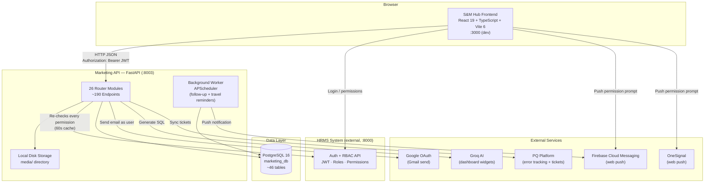
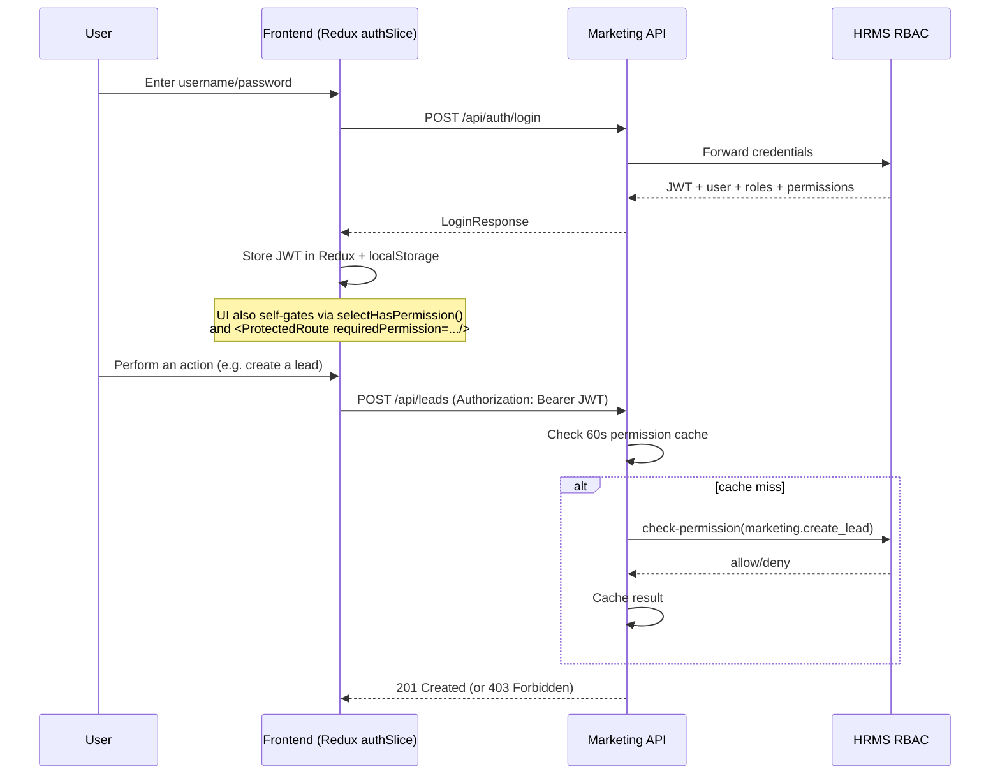

# S&M Hub — Project Overview

S&M Hub is Aureole Group's internal Sales & Marketing platform: a React single-page app backed by a standalone FastAPI microservice, covering the full sales lifecycle — leads, quotations, orders, contacts/organizations/customers, sales-territory hierarchy (domains & regions), exhibitions/roadshows, team performance & targets, and daily status reports. It authenticates against a separate company-wide HRMS system rather than owning its own user/permission store, so access control always reflects the same roles and permissions used elsewhere in the organization.

This document is the entry point into `/docs`. See also:
- [`ARCHITECTURE.md`](./ARCHITECTURE.md) — diagram-first map of what connects to what: system landscape, integrations, auth flow, data layer, deployment
- [`USER_GUIDE.md`](./USER_GUIDE.md) — for end users (salespeople, sales managers, admins)
- [`DEVELOPER_GUIDE.md`](./DEVELOPER_GUIDE.md) — for engineers working on the codebase
- [`CHANGELOG_TEMPLATE.md`](./CHANGELOG_TEMPLATE.md) — blank Keep a Changelog template for future releases

> **Note:** Both repos already had substantial docs before this `/docs` folder was written — root `README.md`, `CLAUDE.md`, `design.md`, `UI_COMPONENTS_LIBRARY.md`, `HRMS_RBAC_AND_PERMISSIONS.md` (frontend) and `README.md`, `QUICK_START.md`, `REQUIRED_PERMISSIONS.md` (backend, in `au-marketing-api/`). This `/docs` folder doesn't replace them — it's a single, consolidated pass covering both repos together, split for a technical vs. non-technical audience, and correcting a couple of inaccuracies found in the existing diagrams (see Known Limitations in the Developer Guide).

## Key features

- **Lead pipeline** — kanban board with configurable statuses/stages, drag-to-change-status, Won/Lost flows with backdating and audit trail, quotation attachments with automatic revision numbering
- **Orders** — generated from Won leads, kanban + table views, fulfilment inquiry log
- **Contacts, Organizations & Customers** — a CRM layer with contact→customer conversion, multi-plant (site) support per organization
- **Domains & Regions** — configurable sales-territory hierarchy with per-level target/goal tracking (employee → region → domain), role assignment (head/coordinator/employee/supervisor)
- **Events & Exhibitions** — budget tracking across space booking, stall/banner design, travel, hotel, gifting, with a spend-vs-budget analysis tab
- **Numbering Series** — a configurable, pattern-based auto-numbering engine reused across leads, orders, quotations, contacts, and customers
- **Dashboards & Report Templates** — drag-and-resize widget dashboards and admin-built, SQL-backed custom reports, both assignable to specific people/roles
- **DSR (Daily Status Reports)**, **Outdoor (OD) Plans**, **Expected Order** monthly forecasting
- **Notifications** — in-app + web push (both Firebase Cloud Messaging and OneSignal are wired up)
- **RBAC via HRMS** — every permission check is re-validated server-side against the external HRMS system, not just trusted from the frontend

## Tech stack

| Layer | Technology |
|---|---|
| Frontend framework | React 19 + TypeScript 5.7 |
| Frontend build tool | Vite 6 |
| Frontend styling | Tailwind CSS 3.4 |
| Frontend state | Redux Toolkit 2.5 (global app state) + Zustand 5 (calendar-local state) |
| Frontend routing | React Router 6.28 |
| Frontend testing | Vitest 4.1 + React Testing Library |
| Backend framework | FastAPI 0.115 (Python) |
| Backend ORM | SQLAlchemy 2.0 + Alembic 1.14 (migrations) |
| Backend validation | Pydantic v2.9 |
| Database | PostgreSQL 16 |
| Background jobs | APScheduler 3.10 (runs as a dedicated worker container) |
| Backend testing | pytest 8.3 + pytest-asyncio |
| Auth/permissions | External HRMS RBAC service (JWT + permission codes) |
| File storage | Local disk (`media/` directory), served via authenticated download endpoints |
| Push notifications | Firebase Cloud Messaging + OneSignal (both active) |
| Other integrations | Google OAuth (Gmail "Connect email"), Groq AI (dashboard widget generation), PQ Platform (error tracking + support tickets), Better Stack (log shipping) |
| Containerization | Docker Compose (db, web, worker, log sidecar) |
| Deployment | Backend: GitHub Actions → EC2 via SSH. Frontend: static SPA build (`vercel.json` present for SPA rewrites) |

## Architecture

The frontend talks to **two backends directly from the browser** — there is no BFF/proxy layer. The Marketing API is a separate microservice from HRMS and does not own authentication; it re-validates every permission check against HRMS on each request (with a short server-side cache).



### Login / permission flow



## Quick start

Prerequisites: Node.js (for the frontend), Python 3.11 + Docker (for the backend). This starts the backend stack via Docker Compose and the frontend dev server directly.

```bash
# 1. Clone (frontend repo; the backend is a nested git repo inside it)
git clone <frontend-repo-url> au-marketing-fe
cd au-marketing-fe
git submodule update --init --recursive   # or: cd au-marketing-api && git pull

# 2. Backend — copy env template and start the Docker stack
cd au-marketing-api
cp .env.example .env
# Edit .env: at minimum set SECRET_KEY, and confirm HRMS_RBAC_API_URL points
# at an HRMS instance you can actually reach (see Developer Guide).
docker compose up -d --build
# API now running at http://localhost:8003 (docs at /docs)

# 3. Frontend — install and run the dev server
cd ..
cp .env.example .env
# Edit .env: VITE_API_BASE_URL should point at the backend above (default :8003)
npm install
npm run dev
# App now running at http://localhost:3000
```

For full local-setup detail (env var reference, running without Docker, running tests, seeding data), see the [Developer Guide](./DEVELOPER_GUIDE.md#local-setup).
